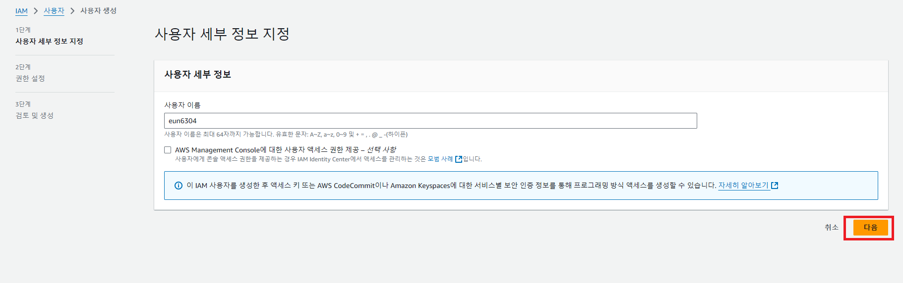
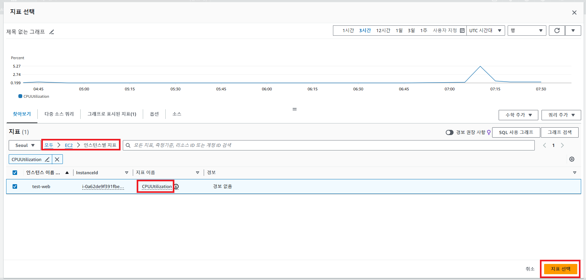

# AWS EC2
> 가장 먼저 생겨나고 범용적인 서비스 중 하나. 독립된 컴퓨터 한 대를 주는 서비스와 같다.
운영 체제와 보안 키 페어를 설정하고 인스턴스를 생성하면 컴퓨터 한 대를 만들어 내는 것과 같다.

## 1. AWS 계정 생성 및 IAM 설정
### 1.1. 계정 생성
  * 계정은 쉽게 생성할 수 있다.
  * 신용카드 정보가 필요하다.

### 1.2. 프리 티어
  * 새로 생성한 계정에서 자동으로 활성화
  * 매월 정해진 최대 사용량까지 일부 AWS 서비스를 무료로 체험

### 1.3. IAM 사용자 생성
  * 사용자 그룹과 권한을 만들어 관리하는 것
  * 사용자를 생성하여 관리형 정책 `AdministratorAccess`를 부여
  * 루트 계정 대신 이 사용자로 로그인한다.
  ---
  
  * 사용자 생성
     
     
     
     


  * 사용자 생성 뒤 콘솔에 로그인 할 수 있도록 액세스 활성화 시켜야 함.
     
     
     
  

  * 사용자 그룹 생성
     
   

  * 다중 인증 MFA 추가 (선택)
     
   
   

## 2. EC2 인스턴스 시작하기
* EC2 서비스로 이동: AWS 콘솔에서 EC2 서비스를 선택하고 "인스턴스 시작" 버튼을 클릭한다.


* **AMI 선택**: EC2는 다양한 OS 이미지(AMI, Amazon Machine Image)를 제공한다.
  * "이미지"란, 어플리케이션 실행에 필요한 프로그램 본체+라이브러리+관련 미들웨어(필요한경우)+OS/네트워크 설정값 등을 모아서 하나의 객체로 만든 것이다. 
  * `Amazon Linux 2`: AWS에서 제공하는 기본 OS로 많은 실습이 가능.


* **인스턴스 유형 선택**: `t2.micro`는 프리 티어에 포함되어 무료로 사용할 수 있는 기본 옵션이다.
  * 인스턴스 패밀리 + 인스턴스 세대. 인스턴스 크기 표기법을 사용한다.
  * 범용 : `t2, t3, t4g, m5, m6g` 웹 서버, 개발/테스트 환경 등에 적합
  * 컴퓨팅 최적화 : `c5, c6g`  CPU 집약적 작업에 최적화
  * 메모리 최적화 : `r5, r6g, x1, x2g, z1d` 메모리 집약적인 애플리케이션
  * 스토리지 최적화 : `i3, i4g, d2, d3` 스토리지 집중형 애플리케이션
  * 가속화 컴퓨팅 : `p3, p4, g4, g5, f1` 그래픽 렌더링, 머신 러닝, 과학적 계산
  * vCPU와 아키텍처, 메모리 크기 등의 차이가 있다.


* 키 페어 생성 : 인스턴스의 안전한 로그인을 위해 추가
* pem 파일이 다운받아지면 저장해 놓는다


* `VPC` : 퍼블릭 클라우드 환경에서 사용할 수 있는 고객 전용 사설 네트워크. 기본값 선택.
* `서브넷` : VPC 안에서 EC2 인스턴스들을 모은 상위 집합. 가용 영역 하나 당 하나의 서브넷 있음. 선택하지 않으면 기본 서브넷에 자동으로 배치
* `퍼블릭 IP` : 인스턴스가 인터넷에 직접 액세스할 수 있음. 기본 서브넷에서 자동으로 할당.
* `보안 그룹` : 인스턴스로 들어오거나(Inbound) 나가는(Outbound) 트래픽들을 직접 설정하여 제어


* 스토리지 구성 : 여러 파일들을 저장할 공간. `EBS`라고 부름. 일종의 하드디스크.

>인스턴스 생성 완료


## 3. EC2 인스턴스 접속 및 환경 설정
* Docker에서 실행 중인 Linux 서버에서 `SSH 접속`하기
    #### **호스트에서 컨테이너로 파일 복사하기**
    호스트에서 Docker 컨테이너로 SSH 키 파일을 복사하려면 다음 명령어를 사용:.
    ```bash
    docker cp D:\aws\test-web-key.pem my_ubuntu:/root/test-web-key.pem
    ```

    #### **SSH 키 파일 권한 설정**
    ```bash
    chmod 400 /root/test-web-key.pem
    ```

    #### **EC2 인스턴스에 SSH로 접속**
    ```bash
    ssh -i /root/test-web-key.pem ec2-user@43.203.212.193
    ```


* `환경 설정`:
  * 업데이트 및 패키지 설치: `sudo yum update -y`로 최신 보안 패치 및 패키지 업데이트.
  * Apache 웹 서버 설치: `sudo yum install httpd -y`를 통해 Apache를 설치하고, `sudo systemctl start httpd`로 시작.
  * 웹 서버 테스트: 웹 브라우저에서 EC2 퍼블릭 IP로 접속해 Apache 기본 페이지 확인.
    * /var/www/html에 index.html 문서가 존재해야 함.

## 4. EC2 인스턴스의 모니터링 및 로깅 설정
* `CloudWatch 설정`:
  * **기본 메트릭 확인** : EC2 대시보드에서 CPU 사용량, 네트워크 트래픽 등의 메트릭을 모니터링할 수 있다.
  
  
  

  * **알람 설정** : CPU 사용률이 일정 수준 이상이 되면 알람을 생성하도록 설정하여 알림을 받을 수 있다.
  
  
  
  
  
  
  
  이후 경보 생성 버튼 클릭하면 데이터 수집 후 경보가 표시된다.
* **시스템 로그 확인** : sudo tail -f /var/log/messages로 실시간 로그 확인.

## 5. EC2 인스턴스의 스냅샷 및 볼륨 관리
* **EBS 볼륨 추가** : AWS 콘솔에서 EBS 볼륨을 생성하고 EC2 인스턴스에 연결한다.
볼륨 포맷 후 마운트하여 사용할 수 있다.
  
  
  
  
  
  
* **스냅샷 생성** : EBS 볼륨의 백업을 위해 스냅샷을 생성하여 복구 시 사용할 수 있다.
  
  
## 6. 고가용성 및 확장성 구성
* `Auto Scaling 설정`: 특정 조건에 따라 EC2 인스턴스를 자동으로 늘리거나 줄이는 Auto Scaling을 설정.
  
  

  다음 단계를 진행하려면 인스턴스 시작 템플릿을 만들어야 함. 기존 인스턴스 셋팅과 똑같이 진행.
  
  
  
  
  
  
  이 다음으로는 "다음"버튼을 계속 누르고 생성하면 됨.
* `로드 밸런서 설정`: Elastic Load Balancer를 설정하여 여러 EC2 인스턴스에 부하를 분산시킨다.
  * Elastic Load Balancing의 작동 방식
  1. 클라이언트가 애플리케이션에 요청을 보낸다.
  2. 로드 밸런서의 리스너는 구성한 프로토콜 및 포트와 일치하는 요청을 수신한다.
  3. 수신 리스너는 지정된 규칙에 따라 수신 요청을 평가하고, 해당되는 경우 요청을 적절한 대상 그룹으로 라우팅한다. HTTPS 리스너를 사용하여 TLS 암호화 및 복호화 작업을 로드 밸런서로 오프로드할 수 있다.
  4. 하나 이상의 대상 그룹에 있는 정상 대상은 로드 밸런싱 알고리즘과 리스너에서 지정한 라우팅 규칙을 기반으로 트래픽을 수신한다.
  
  
  
  
  
  

## 7. 인스턴스 정리 및 종료
* 종료하기 전에 백업: 인스턴스를 종료하기 전에 필요하면 AMI 이미지나 스냅샷을 생성한다.
* 인스턴스 종료: 실습이 끝나면 EC2 인스턴스를 종료하거나 삭제하여 불필요한 비용 발생을 방지한다.