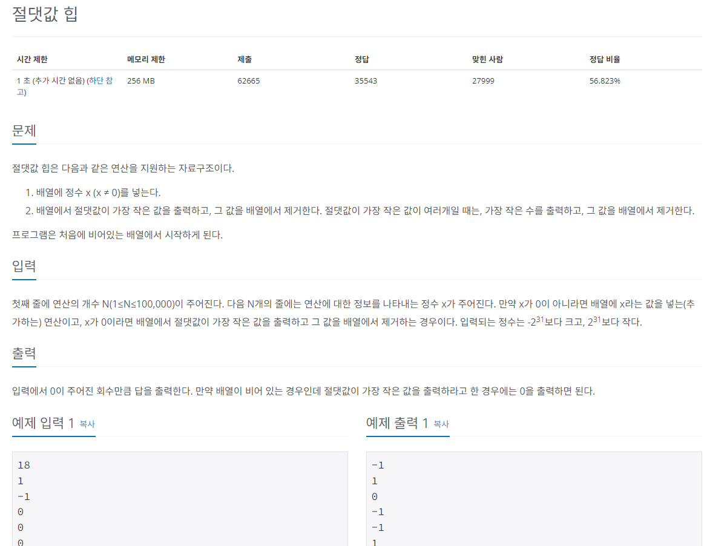

## 문제
   
[백준 온라인 저지 11286번](https://www.acmicpc.net/problem/11286)

## 핵심 아이디어
### 1. 시간 복잡도
* N의 최대 범위 100,000
* O(nlogn)으로 해결할 수 있음.
* 우선순위 큐의 정렬을 쓸 수 있음.

### 2. 우선순위 큐
* 절댓값과 관련된 정렬이 필요함.
* 우선순위 큐의 정렬 기준을 직접 정의해야 함.


## 풀이 스킬
### 1. x = 0일때
* 큐가 비어있을 때는 0을 출력.
* 큐가 비어있지 않을 때는 절댓값이 최소인 값을 출력.
* 절댓값이 같다면 음수를 우선하여 출력.

### 2. x = 1일때
* push로 큐에 새로운 값 추가.
* 우선순위 큐 정렬 기준으로 자동 정렬.

## 정답
```
from queue import PriorityQueue
import sys
print = sys.stdout.write
input = sys.stdin.readline
N = int(input())
myQueue = PriorityQueue()

for i in range(N):
  request = int(input())
  # 정수가 0일 때 답을 출력해야 함.
  if request == 0:
    # 배열이 비어 있는 경우 0을 출력하면 됨.
    if myQueue.empty():
      print('0\n')
    else:
      # 배열에서 절댓값이 가장 작은 값을 출력함.
      # 가장 작은 수를 pop
      temp = myQueue.get()
      # 가장 작은 수의 값
      print(str((temp[1])) + '\n')
  else:
    # 절댓값을 기준으로 정렬하고 같으면 음수 우선 정렬하도록 구성
    # 정수의 절댓값과 정수 원래 값을 쌍으로 큐에 저장
    myQueue.put((abs(request), request))
```