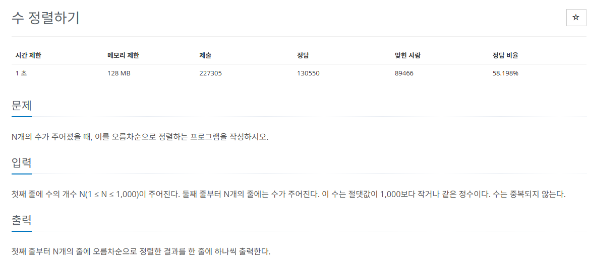
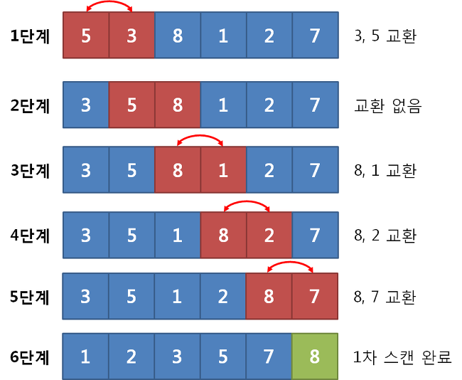

## 문제
   
[백준 온라인 저지 2750번](https://www.acmicpc.net/problem/2750)

### 1. 버블 정렬
`버블 정렬`은 인접한 두 요소를 비교하여 의도한 순서가 될 때까지 교체하는 정렬 알고리즘이다.
* 시간 복잡도 O(n^2)
* 루프를 돌면서 인접한 데이터 간의 swap 연산으로 진행
  

## 정답
```
N = int(input())
A = [0] * N

for i in range(N):
  A[i] = int(input())

for i in range(N-1):
  for j in range(N-1-i): # 루프를 돌 때마다 맨 끝 인덱스가 빠짐
    if A[j] > A[j+1]:
      temp = A[j]
      A[j] = A[j+1]
      A[j+1] = temp

for i in range(N):
  print(A[i])
```