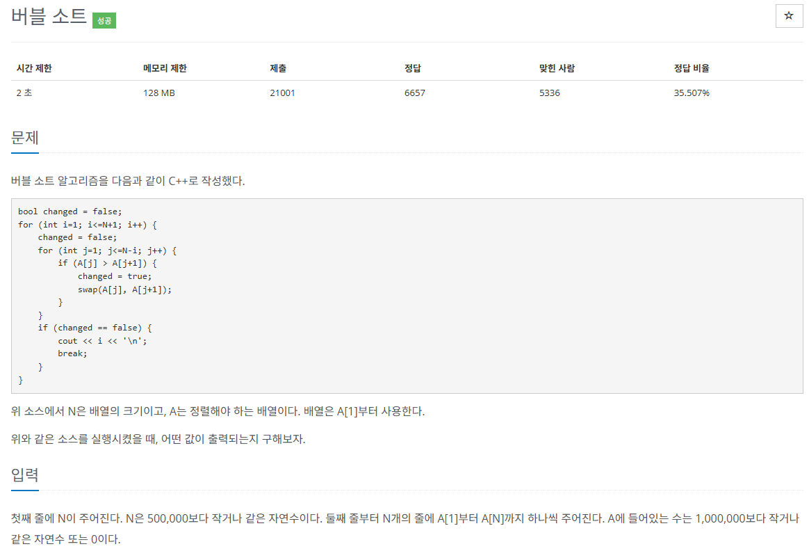

## 문제
   
[백준 온라인 저지 1377번](https://www.acmicpc.net/problem/1377)

### 1. 문제 분석하기
* 값이 출력된다?
  * change == false 라는 것
  * change == true 로 바뀌지 않았다는 것
  * 안쪽 for문이 실행되지 읺았다는 것
* 안쪽 for문이 실행되지 않았다는 것은?
  * 어떠한 루프 중 한 번도 swap이 일어나지 않았다는 것
  * 버블 정렬이 끝났다는 것
* 버블 정렬이 끝난 후 i의 값은?
  * 안쪽 for문이 수행된 수 만큼
* 즉, 데이터의 정렬 전 index와 정렬 후 index를 비교해 왼쪽으로 가장 많이 이동한 값을 찾으면 된다.

## 2. 풀이 스킬
#### 1) sort() 함수로 배열을 정렬한다.
#### 2) 각 데이터마다 정렬 전 index 값에서 정렬 후 index 값을 빼고 최댓값을 찾는다.

## 정답
```
N = int(input())
A = []

for i in range(N):
  A.append((int(input()), i)) # 데이터, index 순으로 저장

Max = 0
sorted_A = sorted(A)

for i in range(N):
  if Max < sorted_A[i][1] - i:
    Max = sorted_A[i][1] - i

print(Max + 1) # swap이 일어나지 않는 반복문이 한 번 더 실행되니까 1 더하기
```