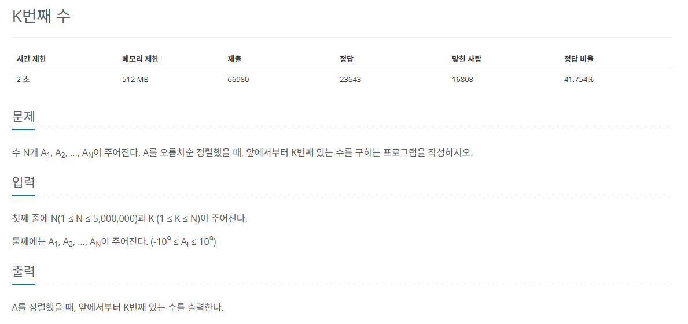
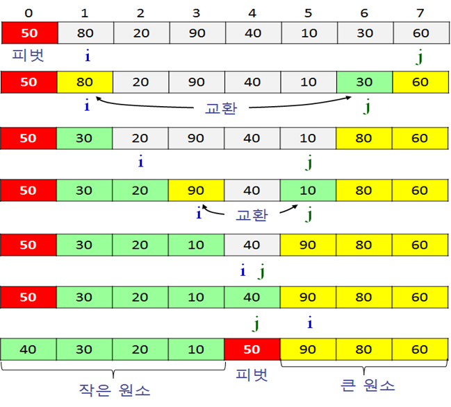

## 문제
   
[백준 온라인 저지 11004번](https://www.acmicpc.net/problem/11004)

### 1. 퀵 정렬
`퀵 정렬`은 기준값(pivot)을 선정해 해당 값보다 작은 데이터와 큰 데이터로 분류하는 것을 반복해 정렬하는 알고리즘.
* 평균 시간 복잡도 O(nlogn), 최악 시간 복잡도(O(n^2))
* pivot을 중심으로 계속 데이터를 2개의 집합으로 나누면서 정렬하는 것이 핵심
  

* pivot 값보다 작은 값들은 왼쪽, 큰 값들은 오른쪽에 배치
* 배열이 두 부분으로 나뉘면 두 배열에서 각각 새로운 피벗을 만들어서 두 개의 배열로 다시 쪼갠다.
* `분할 정복`의 원리
  * pivot을 중심으로 `분할`
  * pivot을 기준으로 작은 값과 큰 값을 나열하는 `정복`
  * 모든 결과를 `결합`

### 2. 과정
#### 1) 데이터를 분할하는 pivot을 설정한다.
#### 2) pivot을 기준으로 다음 과정을 반복하여 2개의 집합으로 분리한다.
* start가 가리키는 데이터가 pivot이 가리키는 데이터보다 작으면 start를 오른쪽으로 1칸 이동
* end가 가리키는 데이터가 pivot이 가리키는 데이터보다 크면 end를 왼쪽으로 1칸 이동
* start가 가리키는 데이터가 pivot이 가리키는 데이터보다 크고, end가 가리키는 데이터가 pivot이 가리키는 데이터보다 작으면 start와 end를 swap하고 start는 오른쪽, end는 왼쪽으로 1칸씩 이동한다.
* start와 end가 만날 때까지 위 과정을 반복한다.
* start와 end가 만나면 만난 지점에서 가리키는 데이터와 pivot이 가리키는 데이터를 비교하여 pivot이 크면 만난 지점의 오른쪽에, 작으면 왼쪽에 pivot이 가리키는 데이터를 삽입한다.
#### 3) 분리 집합에서 각각 다시 pivot을 선정한다.
#### 4) 분리 집합이 1개 이하가 될 때까지 과정을 반복한다.

### 3. 풀이 스킬
* pivot을 정하는 방법
  * pivot == K: K번째 수를 찾은 것이므로 알고리즘을 종료한다.
  * pivot > K: pivot의 왼쪽 부분에 K가 있으므로 왼쪽(S ~ pivot - 1)만 정렬을 수행한다.
  * pivot < K: pivot의 오른쪽 부분에 k가 있으므로 오른쪽(pivot + 1 ~ E)만 정렬을 수행한다.
* 배열의 중간 위치를 pivot으로 설정한다.
* 맨 앞의 값과 pivot을 swap한다.
  * i, j 이동을 편하게 하기 위해
  * i, j는 pivot을 제외한 그룹에서 왼쪽, 오른쪽 끝으로 정한다.

## 정답
```
N, K = map(int, input().split())
A = list(map(int, input().split()))

def swap(i, j):
    global A
    temp = A[i]
    A[i] = A[j]
    A[j] = temp

def quickSort(S, E, K):
    global A
    # 분할 하여 부분집합을 계속 정렬하기 때문에 재귀 함수
    if S < E:
        pivot = partition(S, E)
        if pivot == K: # K번째 수가 pivot이면 더는 구할 필요 없음. 이미 중간값이기 때문?
            return
        elif K < pivot: # K가 pivot보다 작으면 왼쪽 그룹만 정렬. pivot의 왼쪽 그룹에 K가 있음.
            quickSort(S, pivot - 1, K)
        else: # K가 pivot보다 크면 오른쪽 그룹만 정렬
            quickSort(pivot + 1, E, K)

def partition(S, E):
    global A

    if S + 1 == E: # 데이터가 두 개면 바로 비교하여 정렬
        if A[S] > A[E]:
            swap(S, E)
        return E

    M = (S + E) // 2 # 데이터가 여러개면 중앙값 구해서 정렬 시작
    swap(S,M)
    pivot = A[S]
    i = S + 1 # 맨 앞 제외 뒤 부분집합의 맨 왼쪽
    j = E # 맨 앞 제외 뒤 부분집합의 맨 오른쪽

    while i <= j:
        while pivot < A[j] and j > 0:
            # end가 가리키는 데이터가 pivot이 가리키는 데이터보다 크면 end를 왼쪽으로 1칸 이동
            # 피벗보다 작은 수가 나올 때까지 j 감소
            j = j -1
        while pivot > A[i] and i < len(A) - 1:
            # start가 가리키는 데이터가 pivot이 가리키는 데이터보다 작으면 start를 오른쪽으로 1칸 이동
            # 피벗보다 큰 수가 나올 때까지 i 증가
            i = i + 1
        # 이동이 다 끝나면
        if i <= j:
            # 피벗보다 i가 크고, 피벗보다 j가 작음
            swap(i, j)
            i = i + 1 # i 오른쪽으로 이동
            j = j - 1 # j 왼쪽으로 이동
        # i == j 피벗의 값을 양쪽으로 분리한 가운데에 오도록 설정하기
        # i == j 값과 피벗의 값을 교체
        A[S] = A[j]
        A[j] = pivot
        # i == j 값이 pivot이 됨.
        return j

quickSort(0, N - 1, K - 1)
print(A[K - 1])
```