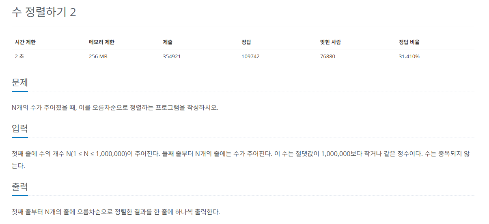

## 문제
   
[백준 온라인 저지 2751번](https://www.acmicpc.net/problem/2751)

### 1. 병합 정렬
`병합 정렬`은 분할 정복 방식을 사용해 데이터를 분할하고 분할한 집합을 정렬하며 합치는 알고리즘.
* 시간 복잡도 O(nlogn)
* 하나의 리스트를 두 개의 균등한 크기로 분할
* 분할된 부분 리스트들을 정렬
* 정렬된 부분 리스트들을 하나로 합치면서 전체를 정렬
  