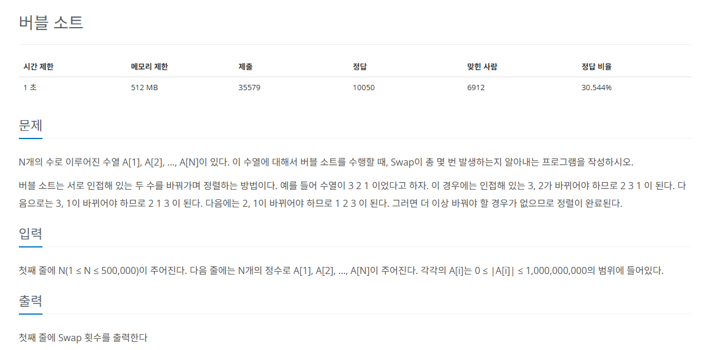

## 문제
   
[백준 온라인 저지 1517번](https://www.acmicpc.net/problem/1517)

### 1. 과정
* 제목은 버블 정렬이지만, N의 최대 범위가 크므로 O(nlogn)으로 해결해야 한다.
* 병합 정렬을 진행하지만, 정렬 과정에서 index가 이동한 거리를 result에 저장해야 함.
  * 두 그룹을 병합하는 과정에서 5번째 인덱스가 맨 앞으로 간다면 버블 정렬에서 swap을 네 번 한 것과 같음.

### 3. 결과
```
result = 0
def merge_sort(s, e):
    global result
    if e - s < 1: return # 최소 단위로 쪼개지면 끝

    # (e - s)는 s와 e 사이의 차이를 나타냅니다.
    # (e - s) / 2는 그 차이를 절반으로 나누어, s로부터 중간값까지의 거리를 계산합니다.
    # s + (e - s) / 2는 s에서 그 절반만큼 더한 값으로, 중간값을 구합니다.
    m = int(s + (e - s) / 2)
    merge_sort(s, m)
    merge_sort(m+1, e) # 재귀로 쪼개기
    for i in range(s, e + 1):
        tmp[i] = A[i] # 원본 건들지 않고 tmp 배열 사용

    k = s # 임시값 k : 임시 정렬 배열에 저장할 자릿값
    index1 = s
    index2 = m + 1
    while index1 <= m and index2 <= e:
        # 두 그룹으로 나누어 index1은 왼쪽 그룹 내에서, index2는 오른쪽 그룹 내에서
        if tmp[index1] > tmp[index2]:
            # index2가 더 작으니까 임시 정렬 배열에 index2값 추가
            A[k] = tmp[index2]
            # 이동하는 index값 추가
            result = result + index2 - k
            k += 1 # 임시 정렬 배열에 하나 추가했으니까 자리수도 1 추가
            index2 += 1
        else:
            A[k] = tmp[index1]
            k += 1
            index1 += 1
    while index1 <= m: # 한쪽 그룹이 모두 선택된 후 남아있는 값 정리
        A[k] = tmp[index1]
        k += 1
        index1 += 1
    while index2 <= e:
        A[k] = tmp[index2]
        k += 1
        index2 += 1

N = int(input())
A = list(map(int, input().split()))
A.insert(0, 0)
tmp = [0] * int(N + 1)
merge_sort(1, N)
print(result)
```