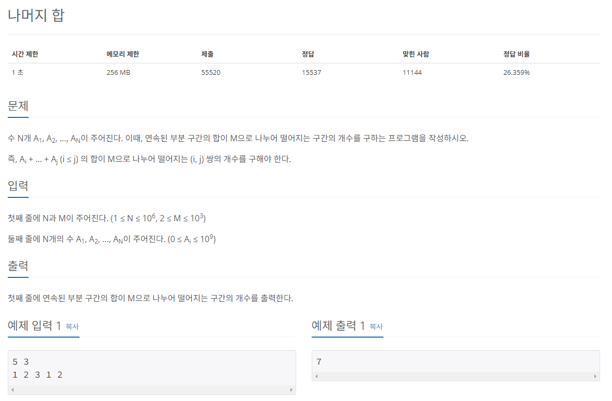

## 문제
   
[백준 온라인 저지 10986번](https://www.acmicpc.net/problem/10986)

## 핵심 아이디어
### 1. (A + B) % C = ((A % C) + (B % C)) % C
* 특정 구간 수들의 나머지 연산을 더해 나머지 연산을 한 값과 이 구간 합의 나머지 연산을 한 값은 동일하다.
* 구간 합 배열을 구하면 0 부터 연속된 부분의 모든 합이 저장된다.

### 2. S[i] - S[j]
* 구간 합 배열을 이용한 식 S[i] - S[j]는 원본 리스트의 j + 1부터 i까지의 구간 합이다.

### 3. S[i] % M = S[j] % M
* 두 값은 같으니까 S[i] - S[j]은 0이다.
* 따라서 (S[i] - S[j]) % M = 0이다.
* 구간 합 배열의 원소들을 % M 연산한다.
* 값이 같은 쌍을 찾으면 j + 1 부터 i까지 구간이 M으로 나누어떨어지는 쌍이 된다.

## 풀이 스킬
### 1. 구간 합 배열의 원소를 나머지 연산한 배열
* 여기서 0인 원소의 개수를 세어 정답에 더한다.
* 원본 리스트의 0부터 i까지 구간 합이 M으로 나누어 떨어지기 때문이다.

### 2. 원소 값이 같은 2개의 원소를 뽑는 쌍
* nC2로 구한다.
* nC2 = (n * (n-1)) / 2
* 이 연산을 쉽게 하기 위해 나머지의 값을 인덱스로 하여 해당 인덱스의 값을 증가시키는 식으로 구간 합 배열의 나머지를 저장한다.

## 정답
```
import sys
input = sys.stdin.readline
n, m = map(int, input().split())
A = list(map(int, input().split()))
S = [0] * n # 합 배열 초기화
C = [0] * m # 나머지 배열 초기화 : 나머지 값을 인덱스로 할 것이기 때문에 크기도 나머지만큼
S[0] = A[0] // 합 배열 첫 번째 값은 똑같다.
answer = 0

for i in range(1, n):
  S[i] = S[i-1] + A[i] # 합 배열 구하는 공식

for i in range(n):
  remainder = S[i] % m # 합 배열의 모든 값에 % 연산 수행
  if remainder == 0: # 0 ~ i까지의 구간 합 자체가 0일때 정답에 더하기
    answer += 1
  C[remainder] += 1 # 나머지 값을 인덱스로 하는 위치에 값 증가

for i in range(m):
  # 나머지가 같은 인덱스 중 2개를 뽑는 경우의 수를 더하기
  if C[i] > 1:
    answer += (C[i] * (C[i] -1) // 2) # // 연산을 해야 정수형으로 나옴
```