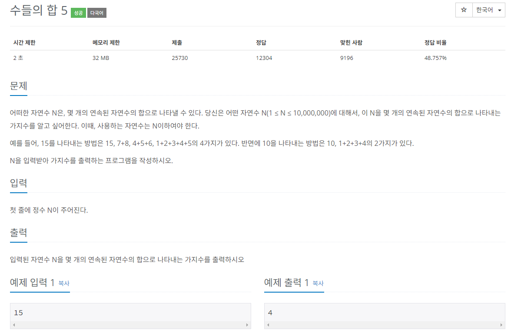

## 문제
   
[백준 온라인 저지 2018번](https://www.acmicpc.net/problem/2018)

## 핵심 아이디어
### 1. 투 포인터
* 리스트에 순차적으로 접근해야 할 때 두 개의 점의 위치를 기록하면서 처리하는 알고리즘
* 정렬되어 있는 두 리스트의 합집합을 구할 때도 사용됨.
* 병합 정렬에도 사용됨.

### 2. 투 포인터 이동 원칙
* sum > N: sum = sum - start_index; start_index++;
  * start_index를 1 증가시키면 연속된 수에서 맨 왼쪽 값을 빼는 것임.
* sum < N: end_index++; sum = sum + end_index++;
  * end_index를 1 증가시키면 연속된 자연수의 범위를 오른쪽으로 한 칸 더 확장하는 것임.
* sum == N: end_index++; sum = sum + end_index++; count++;
  * sum이 N과 같을 때는 경우의 수를 1 증가시키고, end_index를 오른쪽으로 이동시킴.

## 풀이 스킬
### 1. 결과 변수를 1로 초기화
* N이 15일 때 숫자 15만 뽑는 경우의 수를 미리 넣고 초기화

### 2. end_index가 N이 될 때까지 반복함.
* while end_index != N 으로 반복문을 돌림.

## 정답
```
n = int(input())
count = 1
start_index = 1
end_index = 1
sum = 1 # 자연수니까 1부터 시작

while end_index != n:
  if sum == n:
    count += 1
    end_index += 1
    sum += end_index
  elif sum > n:
    sum -= start_index
    start_index += 1
  else:
    end_index += 1
    sum += end_index

print(count)
```