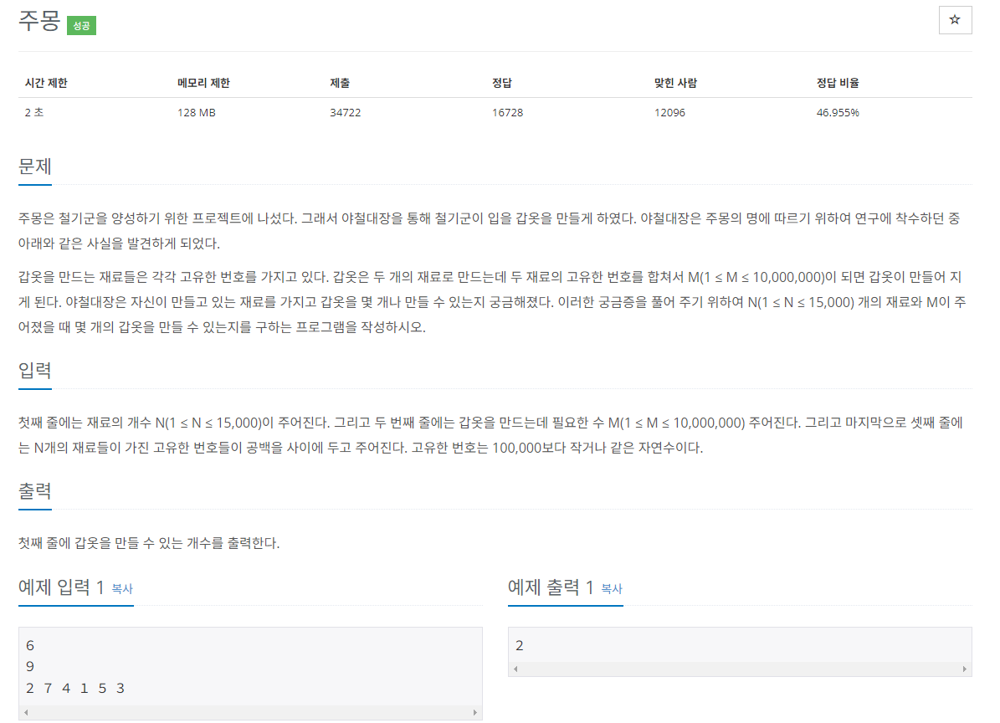

## 문제
   
[백준 온라인 저지 1940번](https://www.acmicpc.net/problem/1940)

## 핵심 아이디어
### 1. 투 포인터
* 리스트에 순차적으로 접근해야 할 때 두 개의 점의 위치를 기록하면서 처리하는 알고리즘
* 정렬되어 있는 두 리스트의 합집합을 구할 때도 사용됨.
* 병합 정렬에도 사용됨.

### 2. 투 포인터 이동 원칙
* A[i] + A[j] > M: j--;
  * 번호의 합이 M보다 크므로 큰 번호 index를 내림.
* A[i] + A[j] < M: i++;
  * 번호의 합이 M보다 작으므로 작은 번호 index를 올림.
* A[i] + A[j] == M: i++; j--; count++;
  * 양쪽 포인터를 모두 이동시키고 count를 증가시킨다.
  * 고유한 번호라서 count 되면 둘 다 이동시켜야 함.

## 풀이 스킬
### 1. 재료 데이터를 리스트 A에 저장한 후 오름차순 정렬

### 2. 투 포인터 i, j를 양쪽 끝에 위치
* 숫자를 두 개만 골라야함.
* 양쪽 끝에 위치시킨 포인터로 두 숫자의 합을 구함.
* 합의 크기를 비교하며 포인터를 이동함.

### 3. 반복문은 i < j일 동안 까지 돌림.
* i와 j가 만날 때까지 수행함.

## 정답
```
import sys
input = sys.stdin.readline
N = int(input())
M = int(input())
A = list(map(int, input().split()))
A.sort()
count = 0
i = 0
j = N - 1

while i < j: # 투 포인터 이동 원칙 따라 포인터를 이동하며 처리
  if A[i] + A[j] < M:
    i += 1
  elif A[i] + A[j] > M:
    j += 1
  else:
    count += 1
    i += 1
    j -= 1

print(count)
```