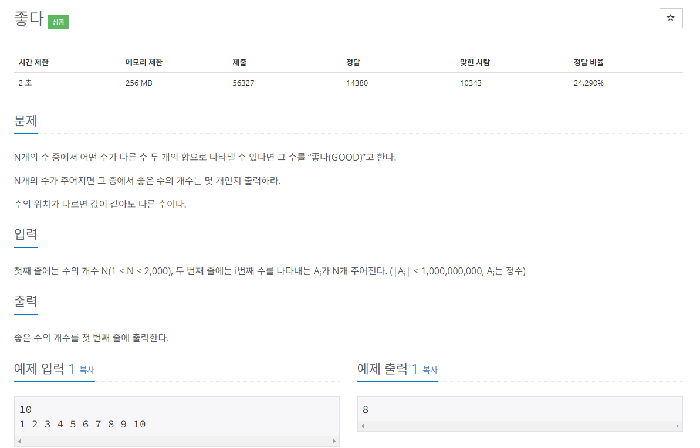

## 문제
   
[백준 온라인 저지 1253번](https://www.acmicpc.net/problem/1253)

## 풀이 스킬
### 1. 자기 자신을 포함하면 안 됨.
* 다른 두 수의 합으로 표현되어야 좋은 수임.

### 2. 수를 입력받아 리스트에 저장한 후 정렬

### 3. 판별 대상이 되는 수를 K라고 지정하고 투 포인터 처리를 함.
* A[i] + A[j] > K: j--; A[i] + A[j] < K: i++;
* A[i] + A[j] == K: count++; 프로세스 종료
* 리스트 내의 모든 수에 대하여 반복. K가 N이 될 때까지 반복하면 됨. 즉 for k in range(N)을 하면 됨.

## 정답
```
import sys
input = sys.stdin.readline
N = int(input())
Result = 0
A = list(map(int, input().split()))
A.sort()

for k in range(N):
  find = A[k] # 찾고자 하는 값
  i = 0
  j = N - 1
  while i < j:
    if A[i] + A[j] == find: # find는 서로 다른 두 수의 합이어야 함을 체크
      if i != k and j != k : 
        Result += 1
        break
      elif i == k:
        i += 1
      elif j == k:
        j -= 1
    elif A[i] + A[j] < find:
      i += 1
    else:
      j -= 1

print(Result)

```