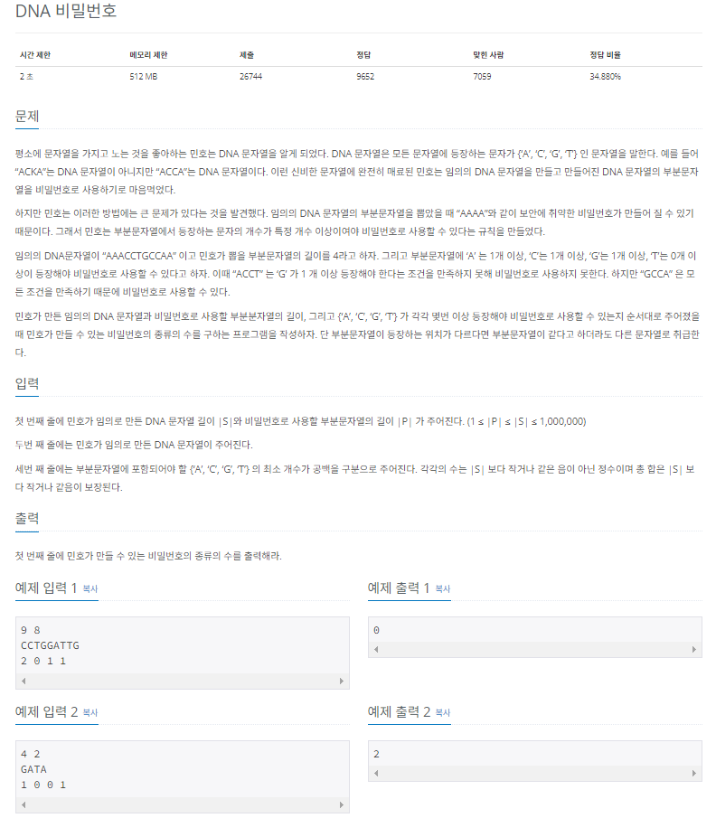
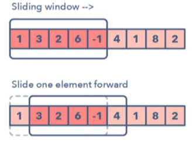

## 문제
   
[백준 온라인 저지 12891번](https://www.acmicpc.net/problem/12891)

## 핵심 아이디어
### 1. 슬라이딩 윈도우
* 고정 사이즈의 윈도우가 이동하면서 윈도우 내에 있는 데이터를 이용해 문제를 풀이하는 알고리즘
* 투 포인터는 구간의 넓이가 조건에 따라 변하는 반면, 슬라이딩 윈도우는 항상 구간의 넓이가 고정되어 있음.
* 슬라이딩 윈도우에서는 부분 배열의 크기를 알고 있기 때문에, 포인터가 두 개일 필요가 없다.
* 투 포인터와 비슷하게 제일 앞의 요소를 제거, 제일 마지막의 다음요소를 포함하는 과정을 이용한다.



### 2. 정답 판별 로직을 최소화
* 유효한 비밀번호를 검사할 때, 기존 검사 결과에 새로 들어온 문자열, 제거되는 문자열만 반영하여 확인하는 것

## 풀이 스킬
### 1. 리스트 S와 비밀번호 체크 리스트를 저장
* 리스트 S

|C|C|T|G|G|A|T|T|G|
|-|-|-|-|-|-|-|-|-|

* 비밀번호 체크 리스트

|A|C|G|T|
|-|-|-|-|
|2|0|1|1|

### 2. 윈도우 구간에 포함된 문자를 보고 상태 리스트를 만든다.
* 리스트 S의 P부분 문자열(슬라이딩 윈도우)

|<span style="color:red">***C***</span>|<span style="color:red">***C***</span>|<span style="color:red">***T***</span>|<span style="color:red">***G***</span>|<span style="color:red">***G***</span>|<span style="color:red">***A***</span>|<span style="color:red">***T***</span>|<span style="color:red">***T***</span>|G|
|-|-|-|-|-|-|-|-|-|

* 현재 상태 리스트

|A|C|G|T|
|-|-|-|-|
|1|2|2|3|

* 비밀번호 체크 리스트

|A|C|G|T|
|-|-|-|-|
|2|0|1|1|

### 3. 윈도우를 한 칸씩 이동하며 현재 상태 리스트 업데이트
* 빠지는 문자열, 신규 문자열만 업데이트 하면 됨.
* 업데이트 한 후에는 비밀번호 체크 리스트와 비교하여 비밀번호 유효성 판단

### 4. 실제 문자열과 관련된 리스트 처리를 어떻게 할 것인가?
* 더해진 값을 보고 현재 상태를 처리하는 함수, 제거된 값을 보고 현재 상태를 처리하는 함수를 각각 만듦.
* 이를 슬라이딩 윈도우 반복문을 돌며 처리함.

### 5. 비밀번호 유효성 검사를 보다 빠르게 할 수 있는 방법이 있을까?
* A, C, G, T 를 각각 체크해서 충족하면 checkSecret을 1 증가시킴.
* checkSecret이 4가 되는지만 보면 됨.
* 만약에 충족 조건이 0인 문자가 있으면 미리 checkSecret을 1 증가시킴.

## 정답
```
checkList = [0] * 4
myList = [0] * 4
checkSecret = 0

# 함수 정의
def myadd(c): # 새로 들어온 문자를 처리하는 함수
  global checkList, myList, checkSecret
  if c == 'A':
    myList[0] += 1 # 일단 들여보내고,
    # 들여보냈더니, 필요한 해당 문자 개수랑 현재 상태가 같다.
    if myList[0] == checkList[0]:
      checkSecret += 1 # A의 개수를 충족했으니 secret 1 추가
  elif c == 'C':
    myList[1] += 1
    if myList[1] == checkList[1]:
      checkSecret += 1
  elif c == 'G':
    myList[2] += 1
    if myList[2] == checkList[2]:
      checkSecret += 1
  elif c == 'T':
    myList[3] += 1
    if myList[3] == checkList[3]:
      checkSecret += 1

def myremove(c): # 제거되는 문자를 처리하는 함수
  global checkList, myList, checkSecret
  if c == 'A':
    # 곧 내보낼건데, 만약 현재 상태가 문자 개수 충족 상태였으면 secret 1 감소
    if myList[0] == checkList[0]:
      checkSecret -= 1
    myList[0] -= 1 # 제거함.
  elif c == 'C':
    if myList[1] == checkList[1]:
      checkSecret -= 1
    myList[1] -= 1
  elif c == 'G':
    if myList[2] == checkList[2]:
      checkSecret -= 1
    myList[2] -= 1
  elif c == 'T':
    if myList[3] == checkList[3]:
      checkSecret -= 1
    myList[3] -= 1

S, P = map(int, input().split())
Result = 0
A = list(input())
checkList = list(map(int, input().split()))

for i in range(4): # 충족 조건 0인 문자 미리 체크
  if checkList[i] == 0:
    checkSecret += 1

for i in range(P): # 초기 P부분 문자열 처리 부분
  myadd(A[i]) # 맨 처음이니까 더하기만 하면 됨.
  if checkSecret == 4: # 4 자릿수와 관련된 크기가 모두 충족될 때 유효한 비밀번호
    Result += 1

for i in range(P, S): # P = 8, S = 10 이라면
  j = i - P # i는 8이고 j는 0이다.
  # 0 ~ 7 맨 처음 윈도우는 위에서 처리함.
  myadd(A[i]) # 윈도우 한 칸 이동해서 8번째 원소 들여옴
  myremove(A[j]) # 0번째 원소 삭제함.
  if checkSecret == 4: # 4 자릿수와 관련된 크기가 모두 충족될 때 유효한 비밀번호
    Result += 1

print(Result)
```