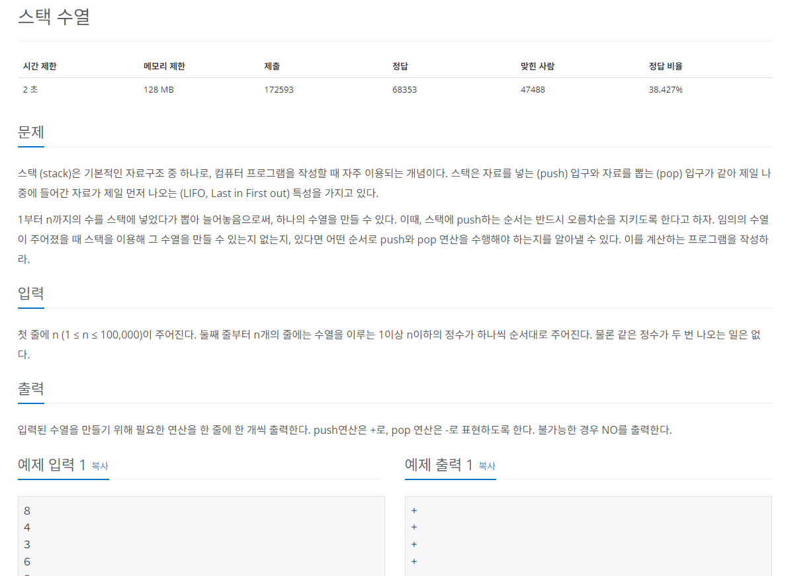
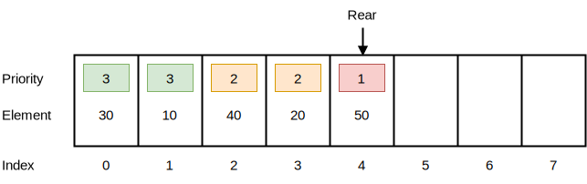

## 문제
   
[백준 온라인 저지 1874번](https://www.acmicpc.net/problem/1874)

## 핵심 아이디어
### 1. 스택
* 삽입과 삭제 연산이 `후입선출(LIFO)`로 이뤄지는 자료 구조
* 삽입과 삭제가 `한 쪽에서만` 일어남

  

* 위치
  * top : 삽입과 삭제가 일어나는 위치를 뜻한다.

* 연산(리스트 이름이 s일 때)
  * `s.append(data)` : top 위치에 새로운 데이터를 삽입하는 연산이다.
  * `s.pop()` : top 위치에 현재 있는 데이터를 삭제하고 확인하는 연산이다.
  * `s[-1]` : top 위치에 현재 있는 데이터를 단순 확인하는 연산이다.

* `깊이 우선 탐색(DFS)`, 백트랙킹 종류의 코딩 테스트에 효과적

### 2. 큐
* 삽입과 삭제 연산이 `선입선출(FIFO)`로 이뤄지는 자료 구조
* 먼저 들어온 데이터가 먼저 나감.
* 삽입과 삭제가 `양방향`에서 이루어진다.

   

* 위치
  * rear : 큐에서 가장 끝 데이터를 가리키는 영역이다.
  * front : 큐에서 가장 앞의 데이터를 가리키는 영역이다.

* 연산(리스트 이름이 s일 때)
  * `s.append(data)` : rear 부분에 새로운 데이터를 삽입하는 연산이다.
  * `s.popleft()` : front 부분에 있는 데이터를 삭제하고 확인하는 연산이다.
  * `s[0]` : 큐의 맨 앞(front)에 있는 데이터를 확인할 때 사용하는 연산이다.

* `너비 우선 탐색(BFS)` 종류의 코딩 테스테 효과적

### 3. 우선순위 큐
 * 값이 들어간 순서와 상관 없이 우선순위가 높은 데이터가 먼저 나오는 자료구조
 * 큐 설정에 따라 front에 항상 최댓값 혹은 최솟값이 위치

  


## 풀이 스킬
### 1. 1부터 자연수를 증가시키며 주어진 숫자와 비교
 * 스택에 넣는 값은 오름차순 정렬
### 2. 현재 수열 값 >= 자연수
 * 현재 수열 값이 자연수보다 크거나 같을 때까지 자연수를 1씩 증가시키며 push
   * 현재 값(4) 가 될 때까지 1, 2, 3, 4 를 스택에 append()
   * result = + + + +
 * push가 끝나면 수열을 출력하기 위해 마지막 1회만 pop
   * 4 꺼내기 위해 pop
   * result = + + + + -

### 3. 현재 수열 값 < 자연수
 * 현재 수열 값보다 자연수가 크다면 pop으로 스택에 있는 값을 꺼낸다.
 * 꺼낸 값이 수열 값이 더 크다면 no
```
예시를 통한 설명
수열 [1, 2, 5, 3]을 만들고 싶다고 가정해 봅시다.

처음에 1을 스택에 넣고, 꺼내서 수열에 추가 (+, -)
2를 스택에 넣고, 꺼내서 수열에 추가 (+, -)
5를 스택에 넣고, 꺼내서 수열에 추가 (+, -)
이후, 수열에서 다음으로 3이 필요합니다. 하지만 3은 이미 스택에 5가 쌓여있기 때문에 5보다 작습니다. 즉, 한번 5를 꺼낸 이후에는 더 작은 숫자인 3을 꺼낼 수 없기 때문에 주어진 수열을 스택으로 표현할 수 없다는 의미입니다.
```

 * 현재 수열 값이라면 그대로 조건문을 빠져나옴

#### 4. push는 현재 수열 값 >= 자연수일 때만 수행하지만, pop은 모든 조건에서 수행함.
 

## 정답
```
N = int(input())
A = [0] * N

for i in range(N):
  A[i] = int(input())

stack = []
num = 1
result = True
answer = ""

for i in range(N):
  su = A[i]
  if su >= num:
  # 현재 수열값 >= 오름차순 자연수 : 값이 같아질 때까지 append() 수행
    while su >= num:
      stack.append(num)
      num += 1
      answer += "+\n"
    # push가 끝나서 수열을 출력하기 위해 pop 한 번 함
    stack.pop()
    answer += "-\n"
  else:
  # 현재 수열값 < 오름차순 자연수 : pop()을 수행해 수열 원소를 꺼냄
  n = stack.pop()
  # 스택의 가장 위의 수가 만들어야 하는 수열의 수보다 크면 수열을 출력할 수 없음
  # 이미 만들어야 하는 수열의 수보다 큰 수가 수열에 들어갔기 때문..
  if n > su:
    print("NO")
    result = False
    break
  else:
    answer += "-\n"

if result:
  print(answer)
```