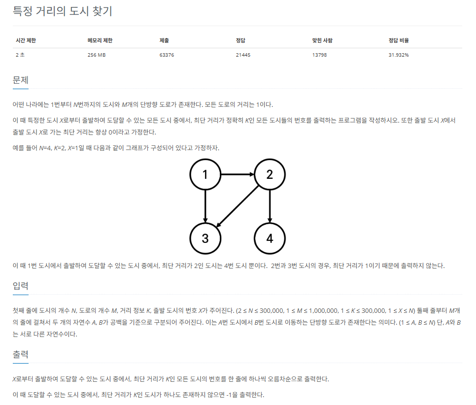

## 문제
   
[백준 온라인 저지 18352번](https://www.acmicpc.net/problem/18352)

### 1. 문제 분석하기
* **모든 도로의 거리가 1**이므로 `가중치가 없는 인접 리스트`로 그래프를 표현
* 도시의 개수가 300,000 도로의 최대 크기가 1,000,000이므로 `BFS 탐색`을 수행하면 됨.

### 2. 과정
#### 1) 인접 리스트로 도시와 도로 데이터의 그래프를 구현
#### 2) BFS 탐색 알고리즘으로 탐색을 수행하면서 각 도시로 가는 최단 거릿값을 방문 리스트에 저장
#### 3) 탐색 종료 후 방문 리스트에서 값이 K와 같은 도시의 번호를 출력한다.

## 결과
```python
from collections import deque

# 노드의 수, 에지의 수, 목표 거리, 시작점
N, M, K, X = map(int, input().split())
A = [[] for _ in range(N + 1)]
answer = []
# -1로 초기화
visited = [-1] * (N + 1)

# BFS 탐색 함수 구현

def BFS(v):
    queue = deque()
    # 큐 자료구조에 시작 노드 삽입
    queue.append(v)
    # visited 리스트에 현재 노드 방문 기록
    # 거리 저장 형태로 1 증가
    visited[v] += 1
    while queue:
        now_Node = queue.popleft()
        for i in A[now_Node]:
            if visited[i] == -1:
                # 현재 노드까지의 거리를 구하기 위해 visited[now_Node] + 1을 함
                visited[i] = visited[now_Node] + 1
                queue.append(i)

for _ in range(M):
    S, E = map(int, input().split())
    A[S].append(E)

BFS(X)

for i in range(N + 1):
    # 방문 거리가 K인 노드의 숫자를 정답 리스트에 더하기
    if visited[i] == K:
         answer.append(i)

if not answer:
    print(-1)
else:
    answer.sort()
    for i in answer:
        print(i)
```