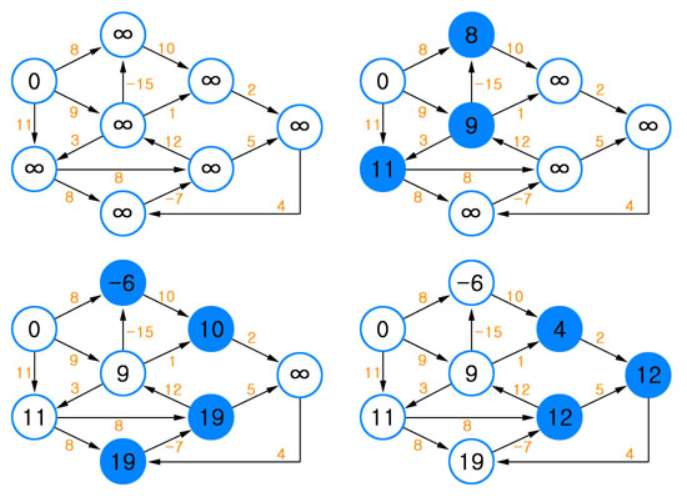
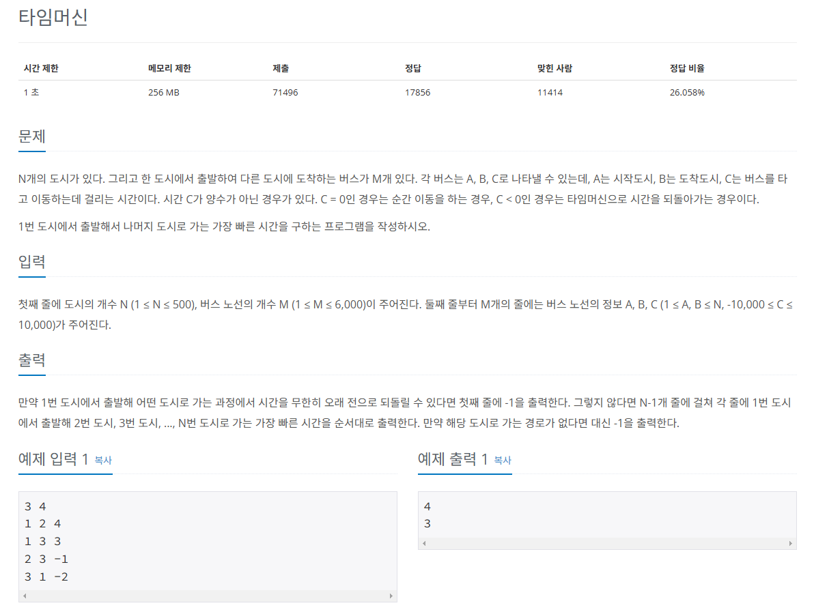
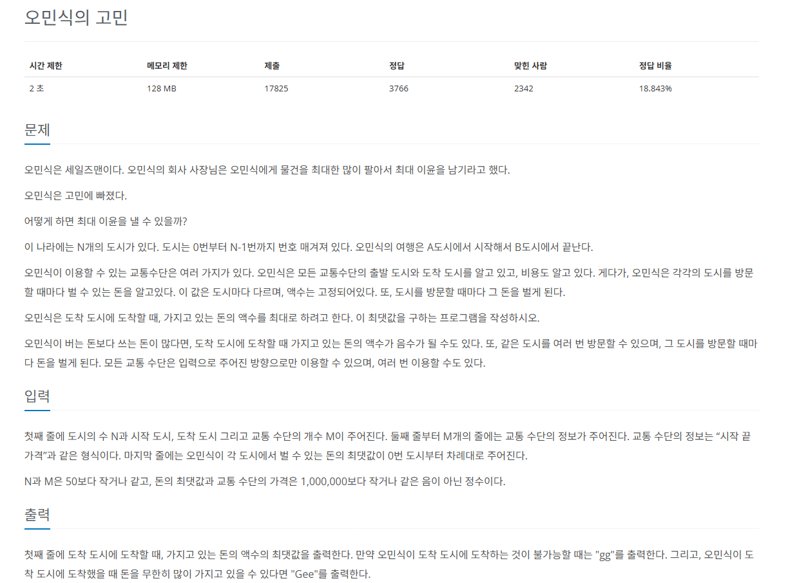

# 벨만-포드
그래프에서 `최단 거리`를 구하는 알고리즘

* 기능 : **특정 출발 노드**에서 **다른 모든 노드**까지의 `최단 경로` 탐색
* 특징 : 
* **음수 가중치 에지**가 있어도 수행할 수 있음
* 전체 그래프에서 **음수 사이클**의 존재 여부를 판단할 수 있음
* 시간 복잡도 (노드 수 : V, 에지 수 : E): O(VE)



## 벨만-포드의 핵심 이론

1. `에지 리스트`로 그래프를 구현하고 `최단 경로 리스트` 초기화하기
* **에지를 중심으로 동작**하므로 그래프를 `에지 리스트`로 구현한다.
* `최단 경로 리스트`를 **출발 노드는 0**, **나머지 노드는 무한대**로 초기화한다.

2. 모든 에지를 확인해 `정답 리스트` 업데이트 하기
* `최단 거리 리스트`에서 **업데이트 반복 횟수**는 `노드 개수 - 1` 이다.
  * 노드 개수가 N이고 음수 사이클이 없을 때 특정 두 노드의 최단 거리를 구성할 수 있는 에지의 최대 개수는 N-1이기 때문
* 모든 에지 `E = (s, e, w)`에서 다음 조건을 만족하면 업데이트를 실행
* **업데이트 반복 횟수가 K번**이라면 해당 시점에 정답 리스트의 값은 **시작점에서 K개의 에지를 사용했을 때 각 노드에 대한 최단 거리**
* 업데이트 조건과 방법

>  D[s] != 무한대 이며 D[e] > D[s] + w 일 때 D[e] = D[s] + w로 리스트의 값을 업데이트 한다.

* **음수 사이클이 없을 때** `N - 1번 에지 사용 횟수`를 반복하면 출발 노드와 모든 노드 간의 최단 거리를 알려 주는 정답 리스트가 완성

3. 음수 사이클 유무 확인하기
* 음수 사이클 유무를 확인하기 위해 **모든 에지를 한 번씩 다시 사용**해 업데이트되는 노드가 발생하는지 확인한다.
  * 만약 업데이트되는 노드가 있다면 음수 사이클이 있다는 뜻
  * 2단계에서 도출한 정답 리스트가 무의미하고 **최단 거리를 찾을 수 없는 그래프**라는 뜻이 된다.
  * **음수 사이클이 존재하면** 이 사이클을 무한하게 돌수록 가중치가 계속 감소하므로 **최단 거리를 구할 수 없다**.

## 문제


[백준 온라인 저지 11657번](https://www.acmicpc.net/problem/11657)

### 1. 문제 분석하기
* 시작점 및 다른 노드와 관련된 최단 거리를 구하는 문제
* 특이한 점은 **에지**에 해당하는 **이동하는 시간**이 `양수가 아닌 0 또는 음수`가 가능
* `에지가 음수`가 가능할 때는 `벨만-포드` 알고리즘

### 2. 과정
1. `에지 리스트`에 에지 데이터를 저장한 후 거리 리스트를 초기화한다. **최초 시작점**에 해당하는 거리 리스트값은 **0**으로 초기화
2. `벨만-포드` 알고리즘 수행 과정

     1. 모든 에지와 관련된 정보를 가져온 후 다음 조건에 따라 거리 리스트의 값을 업데이트한다.
     * `출발 노드`가 **방문한 적이 없는 노드(출발 노드 거리 == INF)**일 때 값을 업데이트하지 않는다.
     * `출발 노드`의 **거리 리스트값 + 에지 가중치 < 종료 노드의 거리 리스트값**일 때 종료 노드의 거리 리스트값을 업데이트한다.
     2. `노드 개수 - 1`번만큼 1을 반복한다.
     3. `음수 사이클 유무`를 알기 위해 **모든 에지에 관해 다시 한번 1을 수행**한다. 이때 한 번이라도 값이 업데이트되면 음수 사이클이 존재한다고 판단한다.
3. 음수 사이클이 존재하면 -1, 존재하지 않으면 거리 리스트의 값을 출력한다. 단, 거리 리스트의 값이 INF일 경우에는 -1을 출력한다.
  
## 결과
```python
# 노드 개수, 에지 개수
N, M = map(int, input().split())

# 에지 정보 저장 리스트
edges = []

# 거리 리스트, 충분히 큰 수로 초기화
distance = [sys.maxsize] * (N + 1)

# 에지 데이터 저장
for i in range(M):
    start, end, time = map(int, input().split())
    edges.append((start, end, time))

# 벨만 포드 수행
# 거리 리스트에 출발 노드 0으로 초기화
distance[1] = 0

# 노드 개수 - 1
for _ in range(N-1):
    # 에지 개수만큼 반복
    for start, end, time in edges:
        # 현재 에지 데이터 가져오기
        # 출발 노드가 무한대가 아니고 종료 노드값 > 출발 노드값 + 에지 가중치:
        if distance[start] != sys.maxsize and distance[end] > distance[start] + time:
            # 업데이트 수행
            distance[end] = distance[start] + time

# 음수 사이클 확인
mCycle = False

# 음수 사이클 존재 여부 확인
# 에지 개수만큼 반복
for start, end, time in edges:
    # 현재 에지 데이터 가져오기
    # 출발 노드가 무한대가 아니고 종료 노드값 > 출발 노드값 + 에지 가중치:
    # 업데이트 가능 : 음수 사이클 존재
    if distance[start] != sys.maxsize and distance[end] > distance[start] + time:
        mCycle = True

# 음수 사이클 미존재
if not mCycle:
    # 거리 리스트 출력
    for i in range(2, N+1):
        if distance[i] != sys.maxsize:
            print(distance[i])
        else:
            print(-1)
else:
    print(-1)
```

## 문제


[백준 온라인 저지 1219번](https://www.acmicpc.net/problem/1219)

### 1. 문제 분석하기
* `벨만-포드` 알고리즘의 원리를 바탕으로 요구사항에 따라 **내부 로직을 바꿔야 함**.
* 기존 `벨만-포드`는 최단 거리를 구하는 알고리즘, 이 문제에서는 `도착할 때 돈의 액수를 최대`로 하고 싶기 때문에 **업데이트 방식을 반대로 변경해야 함**.
* **돈을 무한히 많이 버는 케이스가 있다**고 하는 것을 바탕으로 음수 사이클이 아닌 `양수 사이클`을 찾도록 변경
* 예외 처리
  * 양수 사이클이 있어도 출발 노드에서 **이 양수 사이클을 이용해 도착 도시에 가지 못할 때**
* **에지의 업데이트**를 N - 1번이 아닌 `충분히 큰 수(도시 개수 N의 최대치 = 100)`만큼 추가로 돌리면서 업데이트를 수행
  * 에지를 충분히 탐색하면서 **양수 사이클에서 도달할 수 있는 모든 노드**를 **양수 사이클에 연결된 노드로 업데이트**하기 위함.

### 2. 과정

1. `에지 리스트`에서 **에지 데이터를 저장**하고, **거리 리스트값을 초기화**한다.
* **각 도시에서 벌 수 있는 돈의 최댓값**을 `배열(CityMoney)`에 저장
* **최초 시작점에 해당하는 거리 리스트값**은 `cityMoney[시작점]` 값으로 초기화

2. 다음 순서에 따라 **변형된** `벨만-포드` 알고리즘을 수행한다.

   1. 모든 에지와 관련된 정보를 가져와 다음 조건에 따라 거리 리스트의 값을 업데이트한다.

      1-a. `시작 도시`가 **방문한 적이 없는 도시일 때(시작 노드 == MIN)** 업데이트하지 않는다. 

      1-b. `시작 도시`가 **양수 사이클과 연결된 도시일 때(도착 도시 == MAX) 도착 도시도 양수 사이클과 연결된 도시로 업데이트**한다.

      1-c. `도착 도시값 < 시작 도시값 + 도착 도시 수입 - 에지 가중치`일 때 더 많이 벌 수 있는 새로운 경로로 도착한 것이므로 값을 업데이트한다.
   2. 노드보다 충분히 많은 값(N + 100)으로 1을 반복한다.
   3. 도착 도시의 값에 따라 결과를 출력한다.
      1. 도착 도시의 값이 MIN이고, 도착하지 못할 때 'gg'를 출력한다.
      2. 도착 도시의 값이 MAX이고, 무한히 많이 벌 수 있을 때 'Gee'를 출력한다.
      3. 이외에는 도착 도시의 값을 출력한다.
   
## 결과
```python
# 노드 개수, 에지 개수, 시작 도시, 종료 도시
N, sCity, eCity, M = map(int, input().split())

# 에지 리스트
edges = []

# 최단거리 리스트 초기화
# 충분히 작은 수로 초기화
distance = [-sys.maxsize] * N

# 에지 개수만큼 반복
# 에지 리스트에 에지 정보를 저장
for _ in range(M):
     start, end, price = map(int, input().split())
     edges.append((start, end, price))

# 각 도시에서 버는 수입 저장
cityMoney = list(map(int, input().split()))

# 변형된 벨만-포드 수행
# 거리 리스트에 출발 노드 cityMoney[출발 노드]로 초기화
distance[sCity] = cityMoney[sCity]

# 양수 사이클이 전파되도록 충분히 큰 수로 반복
for i in range(N+101):
    # 에지 개수만큼 반복
    for start, end, price in edges:
        # 출발 노드가 미방문
        if distance[start] == -sys.maxsize:
            continue
        # 출발 노드가 양수 사이클에 연결된 노드
        # 종료 노드를 양수 사이클에 연결된 노드로 업데이트
        elif distance[start] == sys.maxsize:
            distance[end] = sys.maxsize
        # 더 많은 돈을 벌 수 있는 새로운 경로가 있는 경우 값 업데이트
        # 더 많은 수입을 얻는 경로가 새로 발견될 때
        elif distance[end] < distance[start] + cityMoney[end] - price:
            distance[end] = distance[start] + cityMoney[end] - price
            # 노드 개수 - 1 반복 이후 업데이트
            if i >= N-1:
                distance[end] = sys.maxsize

# 도착 도시의 값에 따른 결과 출력
if distance[eCity] == -sys.maxsize: # 도착 불가능
    print("gg")
elif distance[eCity] == sys.maxsize: # 양수 사이클 -> 무한대로 돈을 벌 수 있는 경우
    print("Gee")
else:
    print(distance[eCity])
```