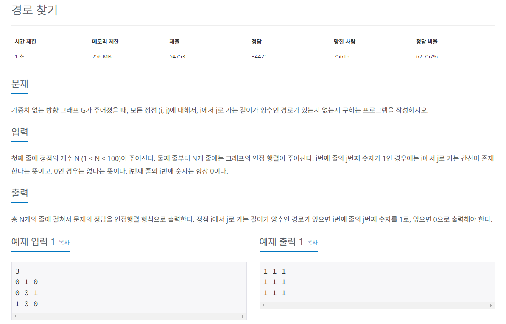
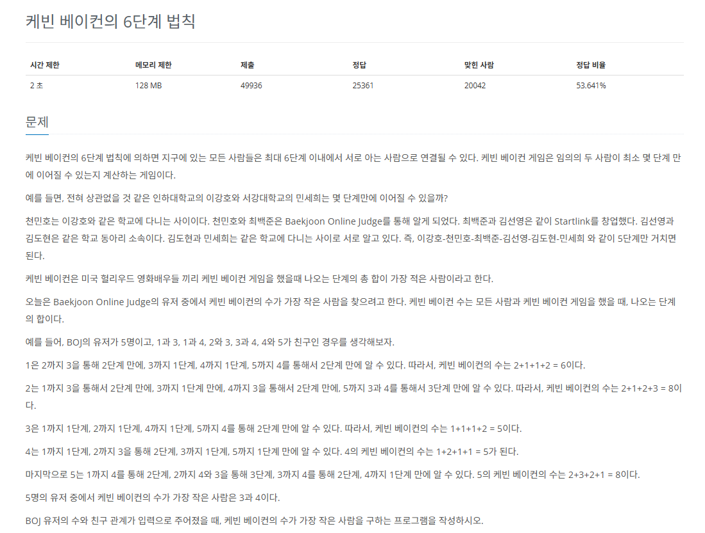

# 플로이드-워셜
그래프에서 `최단 거리`를 구하는 알고리즘

* 기능 : **모든 노드 간의** `최단 경로` 탐색
* 특징 : 
* **음수 가중치 에지**가 있어도 수행할 수 있음
* **동적 계획법**의 원리를 이용해 알고리즘에 접근
* 시간 복잡도 (노드 수 : V, 에지 수 : E): O(V^3)


## 플로이드-워셜의 핵심 이론

>A 노드에서 B 노드가지 최단 경로를 구했다고 가정했을 때 최단 경로 위에 K 노드가 존재한다면 그것을 이루는 부분 경로 역시 최단 경로라는 것

* 플로이드-워셜 점화식
```python
D[S][E] = Math.min(D[S][E], D[S][K] + D[K][E])
```

1. 리스트를 선언하고 초기화하기
* `D[S][E]`는 **노드 S에서 노드 E까지의 최단 거리를 저장하는 리스트**
* **S와 E의 값이 같은 칸은 0, 다른 칸은 무한**으로 초기화
* `S == E`는 **자기 자신에게 가는 데 걸리는 최단 경로값**을 의미하기 때문

2. 최단 거리 리스트에 그래프 데이터 저장하기
* **출발 노드**는 `S`, **도착 노드**는 `E`, **에지의 가중치**는 `W`라고 했을 때 `D[S][E] = W`로 에지의 정보를 리스트에 입력
* `플로이드-워셜` 알고리즘은 그래프를 `인접 행렬`로 표현
  
3. 점화식으로 리스트 업데이트하기
* **기존에 구했던 점화식**을 `3중 for문`의 형태로 반복하면서 리스트의 값을 업데이트한다.
* `플로이드-워셜` 알고리즘 로직
```python
for 경유지 K에 관해 (1~N) # N :노드 개수
    for 출발 노드 S에 관해 (1~N)
        for 도착 노드 E에 관해 (1~N)
            D[S][E] = Math.min(D[S][E], D[S][K] + D[K][E])
```
* **완성된 리스트**는 **모든 노드 간의 최단 거리**를 알려 준다.
* 시간 복잡도가 빠른 편이 아님
  * 문제에서 **노드 개수의 범위**가 다른 그래프에 비해 적게 나타남
  
## 문제


[백준 온라인 저지 11404번](https://www.acmicpc.net/problem/11404)

### 1. 문제 분석하기

* `모든 도시에 쌍`과 관련된 `최솟값`을 찾아야 하는 문제
* **시작점을 지정하지 않고**, **모든 노드와 관련된 최소 경로**를 구하는 `플로이드-워셜` 알고리즘
* 도시의 최대 개수 100개, O(N^3)의 시간 복잡도로도 가능함

### 2. 과정

1. 인접 행렬 초기화
* **연결 도시가 같으면(i == j) 0**, **아니면 충분히 큰 수**
* 주어진 버스 비용 데이터값을 인접 행렬에 저장

2. `플로이드-워셜` 알고리즘을 수행한다.
* 점화식을 활용한 `3중 for`문으로 모든 중간 경로 탐색
* `플로이드-워셜` 점화식
```python
Math.min(distance[S][E], distance[S][K] + distance[K][E])
```

3. 정답 리스트를 그대로 출력하되, 문제의 요구사항에 따라 두 도시가 도달하지 못할 때는 0, 아닐 때는 리스트의 값을 출력한다.

## 결과
```python
# 도시 개수, 노선 개수
N = int(input())
M = int(input())

# 노선 데이터를 저장하는 인접 행렬
# 충분히 큰 값으로 초기화
distance = [[sys.maxsize for j in range(N+1)] for i in range(N+1)]

# 1~N만큼 반복
# 인접 행렬에 시작 도시와 종료 도시가 같은 자리에 0 저장
for i in range(1, N+1):
    distance[i][i] = 0

# M만큼 반복
# 노선 데이터를 distance 행렬에 저장
for i in range(M):
    s, e, v = map(int, input().split())
    if distance[s][e] > v:
        distance[s][e] = v

# 플로이드-워셜
# 3중 for문의 순서가 중요함. k가 가장 바깥쪽
# k -> N만큼 반복
# i -> N만큼 반복
# j -> N만큼 반복
for k in range(1, N+1):
    for i in range(1, N+1):
        for j in range(1, N+1):
            if distance[i][j] > distance[i][k] + distance[k][j]:
                distance[i][j] = distance[i][k] + distance[k][j]

for i in range(1, N+1):
    for j in range(1, N+1):
        # 리스트값이 최초 초기화하기에 충분한 큰 수일 경우 0 출력
        if distance[i][j] == sys.maxsize:
            print(0, end=' ')
        else:
            print(distance[i][j], end=' ')
    print()
```

## 문제


[백준 온라인 저지 11403번](https://www.acmicpc.net/problem/11403)

### 1. 문제 분석하기
* 모든 노드 쌍에 대해 경로가 있는지 확인하는 방법 `플로이드-워셜`
* 최단 거리를 구하는 문제가 아니기 때문에 최단 거리 업데이트 하는 부분만 수정

### 2. 과정

1. 입력 데이터를 인접 행렬에 저장
2. 변경된 `플로이드-워셜` 알고리즘 수행
* S와 E가 **모든 중간 경로(K) 중 1개라도 연결돼 있다면** S와 E는 연결 노드로 저장
3. 알고리즘으로 변경된 인접 행렬을 출력

## 결과
```python
# 인접 행렬의 크기
N = int(input())
# 노선 데이터를 저장하는 인접 행렬
distance = [[0 for i in range(N)] for j in range(N)]

# 인접 행렬 데이터 저장
for i in range(N):
    distance[i] = list(map(int, input().split()))

# 변형된 플로이드-워셜 수행
# 3중 for문의 순서가 중요함. k가 가장 바깥쪽
for k in range(N):
    # i ~ j 간의 가능한 모든 경로를 탐색
    for i in range(N):
        for j in range(N):
            if distance[i][k] == 1 and distance[k][j] == 1:
                distance[i][j] = 1
                # k를 거치는 모든 경로 중 1개라도 연결된 경로가 있다면
                # i와 j는 연결 노드로 취급

# distance 리스트 출력
for i in range(N):
    for j in range(N):
        print(distance[i][j], end=' ')
    print()
```

## 문제


[백준 온라인 저지 1389번](https://www.acmicpc.net/problem/1389)

### 1. 문제 분석하기
* BFS 알고리즘으로 해결할 수 있는 문제
* 유저의 최대 수가 작기 때문에 `플로이드-워셜`로 해결할 수 있음.
* 아이디어
  * 1번째로 사람들이 **직접적인 친구 관계를 맺은 상태를 비용 1**로 계산
  * 즉, 가중치를 1로 정한 후 인접 행렬에 저장
  * `플로이드-워셜`은 **모든 쌍과 관련된 최단경로**이므로 `한 row 값`은 **이 row의 index값에서 다른 모든 노드와 관련된 최단 경로**를 나타냄
  * **i번째 row의 합이 i번째 사람의 케빈 베이컨의 수**

### 2. 과정

1. `인접 행렬을 생성`한 후, 자기 자신이면(i == j)`0`, 아니면 `충분히 큰 수`로 인접 행렬의 값을 초기화
* 주어진 친구 관계 정보를 인접 행렬에 저장
* i와 j가 친구라면 distance[i][j] = 1, distance[j][i] = 1로 값을 업데이트

2. 점화식을 이용해 `플로이드-워셜` 알고리즘을 수행하여 3중 for문으로 만든 모든 중간 경로를 탐색
* 플로이드-워셜 점화식
```python
Math.min(D[S][E], D[S][K] + D[K][E])
```

3. **케빈 베이컨의 수(각 행의 합)**를 비교해 `가장 작은 수`가 나온 행 번호를 정답으로 출력한다. 같은 수가 있을 때는 더 작은 행 번호를 출력한다.

## 결과
```python
# 유저 수, 친구 관계 수
N, M = map(int, input().split())
# 친구 관계 데이터를 저장하는 인접 행렬
# 충분히 큰 수로 초기화
distance = [[sys.maxsize for j in range(N+1)] for i in range(N+1)]

# 시작 도시와 종료 도시가 같으면 0
for i in range(1, N+1):
    distance[i][i] = 0

# M만큼 반복
# 친구 관계 데이터를 distance 행렬에 저장
# 친구 관계는 서로 관계를 맺는 것이므로 양방향 에지로 저장하고 가중치를 1로 함
for i in range(M):
    s, e = map(int, input().split())
    distance[s][e] = 1
    distance[e][s] = 1

# 3중 for문의 순서가 중요함
# k가 가장 바깥쪽이 돼야 함
for k in range(1, N+1):
    for i in range(1, N+1):
        for j in range(1, N+1):
            # distance[i][j]보다 distance[i][k] + distance[k][j]가 작으면 업데이트
            if distance[i][j] > distance[i][k] + distance[k][j]:
                distance[i][j] = distance[i][k] + distance[k][j]

# 충분히 큰 수로 초기화
Min = sys.maxsize

# 정답 변수 -1로 초기화
Answer = -1

# 리스트의 행별로 값을 합치기
for i in range(1, N+1):
    temp = 0
    for j in range(1, N+1):
        temp += distance[i][j]
    # 가장 작은 케빈 베이컨의 수를 지닌 i 찾기
    # i의 케빈 베이컨의 수
    if Min > temp:
        Min = temp
        Answer = i

print(Answer)
```