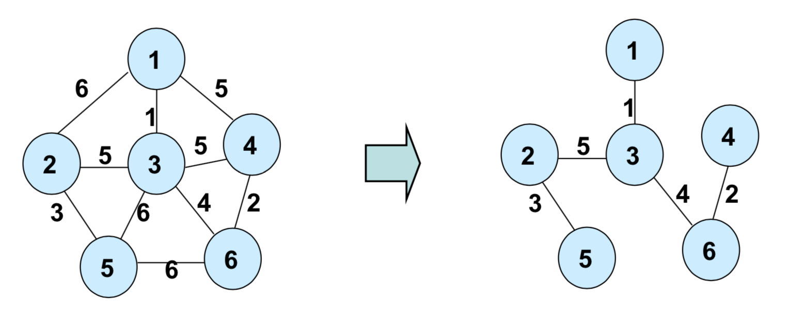
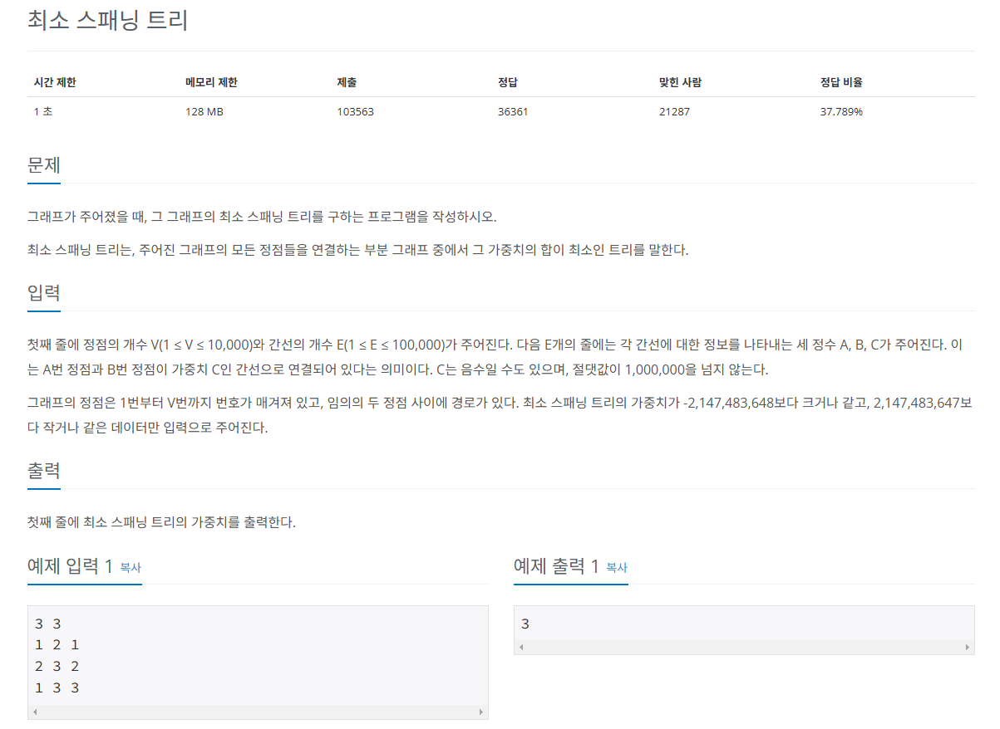
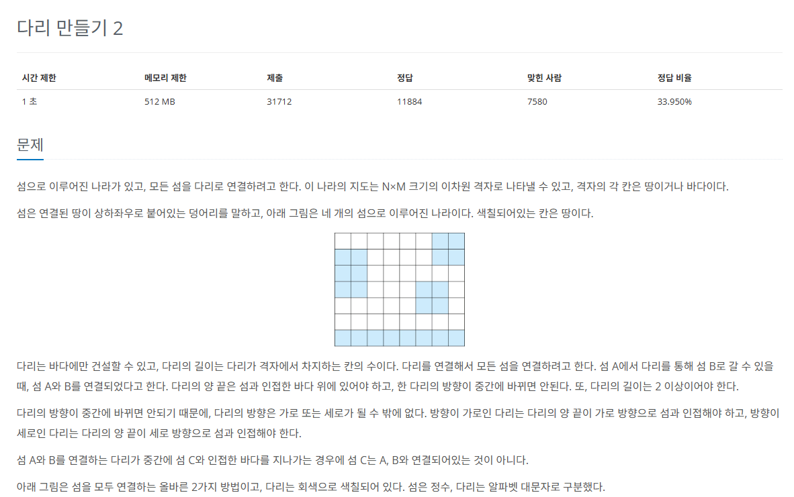

# 최소 신장 트리
그래프에서 모든 노드를 연결할 때 사용된 `에지들의 가중치의 합을 최소`로 하는 트리

* `최소 신장 트리`의 특징
  * 사이클이 포함되면 가중치의 합이 최소가 될 수 없으므로 **사이클은 포함하지 않는다**.
  * `N개의 노드`가 있으면 최소 신장 트리를 구성하는 `에지의 수는 항상 N-1개`다.



## 최소 신장 트리의 핵심 이론

1. `에지 리스트`로 그래프를 구현하고 `유니온 파인드` 리스트 초기화하기
* `최소 신장 트리`는 **데이터를 노드가 아닌 에지 중심으로 저장**하므로 인접 리스트가 아닌 `에지 리스트`의 형태로 저장한다.
* 일반적으로 **노드 변수 2개**와 **가중치 변수**로 구성
* 사이클 처리를 위한 `유니온 파인드 리스트`도 **인덱스값**으로 함께 초기화
2. 그래프 데이터를 `가중치 기준`으로 정렬하기
* 에지 리스트에 담긴 그래프 데이터를 가중치 기준으로 오름차순 정렬
3. **가중치가 낮은 에지부터** 연결 시도하기
  * 바로 연결하지 않고 이 에지를 연결했을 때 **그래프에 사이클 형성 유무**를 `find 연산`을 이용해 확인
  * **사이클이 형성되지 않을 때**만 `union 연산`을 이용해 두 노드를 연결
4. 과정 3 반복
* **전체 노드의 개수가 N개이면** 연결한 에지의 개수가 `N - 1`이 될 때까지 과정 3을 반복한다.
5. 총 에지 비용 출력하기

>에지를 기주으로 하는 알고리즘이기 때문에 에지 리스트 이용
>사이클이 존재하면 안 되기 때문에 사이클 판별 알고리즘인 유니온 파인드 사용
  
## 문제


[백준 온라인 저지 1197번](https://www.acmicpc.net/problem/1197)

### 1. 문제 분석하기
* `최소 신장 트리`의 핵심 이론을 이용하여 풀기

### 2. 과정

1. 에지 리스트에 에지 정보를 저장한 후 **부모 노드 데이터 초기화**
* 사이클 생성 유무를 판단하기 위해 **유니온 파인드용 부모 노드도 초기화**
* 우선순위 큐를 사용해 자동 정렬
  
2. `크루스칼 알고리즘` 수행 
* 현재 미사용 에지 중 **가중치가 가장 작은 에지를 선택**하고, 이 에지를 연결했을 때 **사이클의 발생 유무 판단**
* 사이클이 발생하면 생략하고, 발생하지 않으면 에지값을 더함

3. 과정 2에서 에지를 더한 회수가 `'V(노드 개수) - 1'` 될 때까지 반복하고, 반복이 끝나면 에지의 가중치를 모두 더한 값을 출력한다.

## 결과
```python
from queue import PriorityQueue
# 노드 수, 에지 수
N, M = map(int, input().split())
# 에지 정보를 저장할 우선순위 큐
pq = PriorityQueue()
# 대표 노드 저장 리스트
parent = [0] * (N+1)
for i in range(N+1):
    parent[i] = i

# pq에 에지 정보 저장
for i in range(M):
    s, e, w = map(int, input().split())
    # 제일 앞 순서로 정렬되므로 가중치를 제일 앞 순서로 함
    pq.put((w, s, e))

# find 연산
def find(a):
    # a가 대표 노드면 리턴
    if a == parent[a]:
        return a
    else:
        # a의 대표 노드 값을 find(parent[a])값으로 저장
        # 재귀 함수 형태
        parent[a] = find(parent[a])
        return parent[a]

# union 선언
def union(a, b):
    # a와 b의 대표 노드 찾기
    a = find(a)
    b = find(b)
    # 두 원소의 대표 노드끼리 연결
    if a != b:
        parent[b] = a

# MST 진행
useEdge = 0
result = 0

# 사용한 에지 수가 노드 수 - 1이 될 때까지
# MST는 항상 N - 1의 에지를 사용함
while useEdge < N - 1:
    # 큐에서 에지 정보 가져오기
    w, s, e = pq.get()
    # 에지 시작점과 끝점의 부모 노드가 다르면
    # 연결해도 사이클이 생기지 않으면
    if find(s) != find(e):
        union(s, e)
        # 에지의 가중치를 정답에 더하기
        result += w
        # 사용한 에지 수 1 증가
        useEdge += 1

print(result)
```
## 문제


[백준 온라인 저지 17472번](https://www.acmicpc.net/problem/17472)

### 1. 문제 분석하기
* 데이터의 크기는 작은 편이라 시간 복잡도에 제약은 크지 않음
* 몇 단계로 나누어서 생각해야 함

1. 주어진 지도에서 **섬으로 표현된 값**을 **각각의 섬마다 다르게** 표현해야 함
2. 그 이후 **각 섬의 모든 위치**에서 **다른 섬으로 연결할 수 있는 에지**가 있는지 확인해 `에지 리스트`를 만듬
3. 이후에는 `최소 신장 트리`를 적용하면 문제를 해결할 수 있음.
   
### 2. 과정

1. 지도의 정보를 **2차원 리스트에 저장**하고 **섬으로 표시된 모든 점**에서 `BFS`를 실행해 섬을 구분한다.
* **상하좌우 네 방향**으로 탐색
* **방문한 적이 없고 바다가 아닐 때 같은 섬**으로 인식한다.

2. 모든 섬에서 **상하좌우로 다리를 지어** 다른 섬으로 연결할 수 있는지 확인한다.
* 연결할 곳이 **현재 섬**이면 탐색 중단
* **바다**라면 탐색 계속 수행
* **다른 섬을 만났을 때 다리의 길이가 2 이상**이면 이 다리를 `에지 리스트`에 추가
   * 1번 섬에서 2번 섬으로 다리길이 4 -> `1 2 4`
   * 2번 섬에서 3번 섬으로 다리길이 3 -> `2 3 3`
  
3. 전 단계에서 수집한 모든 **에지를 오름차순 정렬**해 `최소 신장 트리 알고리즘`을 수행한다. 알고리즘이 끝나면 `사용한 에지의 합`을 출력한다.

## 결과
```python
import copy
from collections import deque
from queue import PriorityQueue

# 네 방향 탐색을 위한 상수
dr = [0, 1, 0, -1] 
dc = [1, 0, -1, 0]

# 행렬의 크기
N, M = map(int, input().split())
# 맵 정보 저장 리스트
myMap = [[0 for j in range(M)] for i in range(N)]
# visited(BFS 시 방문 여부 저장 리스트)
visited = [[False for j in range(M)] for i in range(N)]

for i in range(N):
    # 지도 정보를 myMap에 저장
    myMap[i] = list(map(int, input().split()))

# 섬 번호
sNum = 1
# 모든 섬 정보 이중 리스트
sumlist = list([])
# 1개의 섬 정보 리스트
mlist = []

# 섬에 한 칸(노드)을 더해주는 함수
def addNode(i, j, queue):
    # myMap에서 i, j 위치에 섬 번호 저장
    myMap[i][j] = sNum
    # 해당 위치에 방문 표시
    visited[i][j] = True
    # 섬 정보(mlist)에 해당 노드 추가
    temp = [i, j]
    mlist.append(temp)
    # BFS를 위한 큐에 해당 노드 추가
    queue.append(temp)

# 탐색을 통해 섬 정보 저장
def BFS(i, j):
    queue = deque()
    # 1개 섬 데이터 비우기
    mlist.clear()
    # i, j 위치에서 네 방향으로 연결된 모든 노드를 탐색하여 1개 섬의 영역을 저장
    start = [i, j]
    queue.appned(start)
    mlist.append(start)
    visited[i][j] = True
    myMap[i][j] = sNum
    
    while queue:
        r, c = queue.popleft()
        for d in range(4):
            tempR = dr[d]
            tempC = dc[d]
            
            while r + tempR >= 0 and r + tempR < N and c + tempC >=0 and c + tempC < M:
                if not visited[r + tempR][c + tempC] and myMap[r + tempR][c + tempC] != 0:
                    # 연결된 새로운 노드가 확인되면 addNode를 통해 정보 저장
                    addNode(r + tempR, c + tempC, queue)
                else:
                    break
                if tempR < 0:
                    tempR -= 1
                elif tempR > 0:
                    tempR += 1
                elif tempC < 0:
                    tempC -= 1
                elif tempC > 0:
                    tempC += 1
    return mlist

# 섬 구분 작업 수행
for i in range(N):
    for j in range(M):
        if myMap[i][j] != 0 and not visited[i][j]:
            # BFS를 실행해 하나의 섬 정보를 가져오기
            # 깊은 복사로 해야 주소를 공유하지 않음
            tempList = copy.deepcopy(BFS(i, j))
            # 새로운 섬 넘버링
            # sNum의 값을 1 증가
            sNum += 1
            # BFS 결과(하나의 섬 정보)를 sumlist에 추가
            sumlist.append(tempList)
    
pq = PriorityQueue()

# 모든 섬에서 지을 수 있는 다리를 찾고 저장
# 섬의 각 지점에서 만들 수 있는 모든 에지를 저장
# 1개의 섬 정보
# now <- sumlist에서 추출
for now in sumlist:
    for temp in now:
        r = temp[0]
        c = temp[1]
        now_S = myMap[r][c]
        # 4방향 탐색
        tempR = dr[d]
        tempC = dc[d]
    
    for now 크기만큼 반복:
        1개의 섬의 모든 위치에서 만들 수 있는 다리 정보 저장
        # 네 방향 탐색 -> 우선순위 큐에 에지 정보 저장
        
union(a, b):
    a와 b의 대표 노드 찾기
    두 원소의 대표 노드끼리 연결

find(a):
    a가 대표 노드면 리턴
    아니면 a의 대표 노드값을 find(parent[a])값으로 저장 # 재귀 함수 형태

parent(대표 노드 저장 리스트) # 자기 자신을 대표 노드로 초기화

useEdge(사용한 에지의 수)
result(정답 변수)

while 큐가 빌 때까지:
    큐에서 에지 정보 가져오기
    if 에지 시작점과 끝점의 부모 노드가 다르면: # 연결해도 사이클이 생기지 않으면
        union 연산 수행
        에지의 가중치를 정답 변수에 더하기
        사용한 에지의 수 1 증가
        
if 사용한 에지의 수가 노드 - 1 만큼이면:
    정답 변수 출력
else:
    -1 출력
```