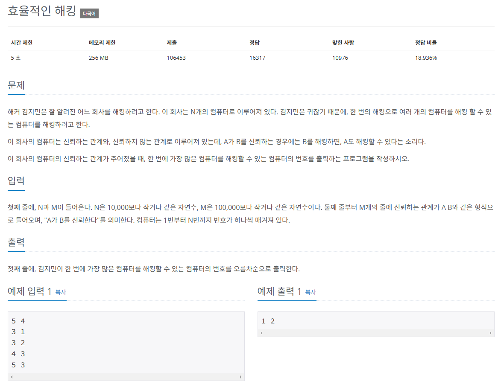

## 문제
   
[백준 온라인 저지 1325번](https://www.acmicpc.net/problem/1325)

### 1. 문제 분석하기
* 시간 복잡도 제약은 크지 않음.
* 신뢰 관계가 `A, B`라고 했을 때, `A가 B를 신뢰한다.`
* 가장 많은 컴퓨터를 해킹할 수 있는 컴퓨터 : **신뢰를 가장 많이 받는 컴퓨터**
* `A`라는 노드에서 `B, C`를 를 방문한다면, `B, C`는 `A`에게 신뢰받는 컴퓨터이다.

### 2. 과정
#### 1) 인접 리스트로 컴퓨터와 신뢰 관계 데이터의 그래프를 표현한다.
#### 2) 모든 노드로 각각 BFS 탐색 알고리즘 적용해 탐색을 수행한다.
* 탐색을 수행하면서 탐색되는 노드들의 신뢰도 증가시키기
#### 3) 탐색 종료 후 신뢰도 리스트를 탐색해 신뢰도의 최댓값을 Max 값으로 지정
* 신뢰도 리스트를 다시 탐색하면서 Max 값을 지니고 있는 노드를 오름차순

## 결과
```python
from collections import deque

N, M = map(int, input().split())
A = [[] for _ in range(N + 1)]
answer = [0] * (N + 1)

# BFS 구현하기
def BFS(v):
    queue = deque()
    queue.append(v)
    visited[v] = True
    while queue:
        now_Node = queue.popleft()
        for i in A[now_Node]:
            if not visited[i]:
                visited[i] = True
                # 신규 노드 index의 정답 리스트값 증가
                answer[i] += 1
                queue.append(i)

for i in range(M):
    S, E = map(int, input().split())
    A[S].append(E)

# 모든 노드에서 BFS 실행
for i in range(1, N + 1):
    visited = [False] * (N + 1)
    BFS(i)

maxVal = 0
for i in range(1, N + 1):
    maxVal = max(maxVal, answer[i])

for i in range(1, N + 1):
    if maxVal == answer[i]:
        print(i, end=' ')
```
