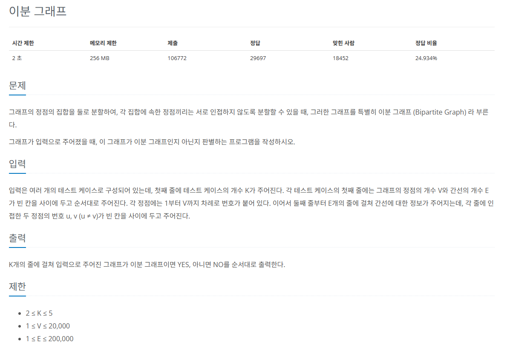
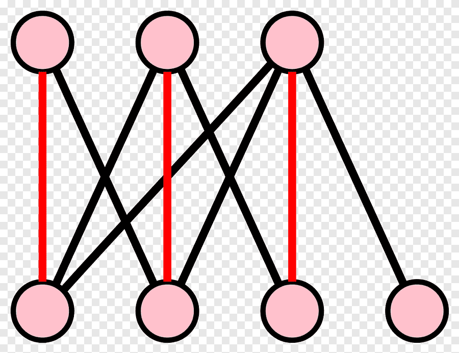

## 문제
   
[백준 온라인 저지 1707번](https://www.acmicpc.net/problem/1707)

### 1. 문제 분석하기

 

* 이분 그래프 : `서로 인접하지 않는 두 집합`으로 나눌 수 있는 그래프
* `트리`의 경우에는 항상 이분 그래프가 된다.
  * 사이클이 발생하지 않으면 탐색을 하면서 다음 노드를 이번 노드와 다른 집합으로 지정하면 됨.
* 사이클이 발생했을 때 이분 그래프가 불가능할 때가 있다.
  * 탐색 메커니즘에서 **탐색한 노드에 다시 접근하게 됐을 때** `현재 노드의 집합과 같으면` 이분 그래프가 불가능 한 것으로 판별

### 2. 과정
#### 1) 입력된 그래프를 인접 리스트로 구현합니다.
#### 2) 모든 노드로 각각 DFS 탐색 알고리즘 적용
* DFS를 실행할 때 **현재 노드에서 연결된 노드 중 이미 방문한 노드가 나와 같은 집합이면** 이분 그래프가 아닌 것으로 판별
* 이분 그래프가 아니면 이후 노드는 탐색하지 않는다.
* 모든 노드로 DFS를 실행하는 이유는 그래프의 모든 노드가 이어져 있지 않고, 여러 개의 부분 그래프로 이뤄진 케이스가 존재할 수 있기 때문이다.
#### 3) 이분 그래프 여부를 정답으로 출력한다.

## 결과
```python
# 테스트 케이스 개수
N = int(input())
# 이분그래프 판별 변수
IsEven = True

# DFS 구현하기
def DFS(node):
    global IsEven
    visited[node] = True
    for i in A[node]:
        if not visited[i]:
            # 인접 노드는 같은 집합이 아니므로 다른 집합으로 처리
            check[i] = (check[node] + 1) % 2
            DFS(i)
        # 이미 방문한 노드가 현재 내 노드와 같은 집합이면 이분 그래프 아님
        elif check[node] == check[i]:
            IsEven = False

for _ in range(N):
    V, E = map(int, input().split())
    A = [[] for _ in range(V + 1)]
    visited = [False] * (V + 1)
    check = [0] * (V + 1)
    IsEven = True
    
    # 인접 리스트로 그래프 저장
    for i in range(E):
        Start, End = map(int, input().split())
        A[Start].append(End)
        A[End].append(Start)

    # 주어진 그래프가 항상 1개가 아니므로 모든 노드에서 수행
    for i in range(1, V + 1):
        if IsEven:
            DFS(i)
        else:
            break

    if IsEven:
        print("YES")
    else:
        print("NO")
```

