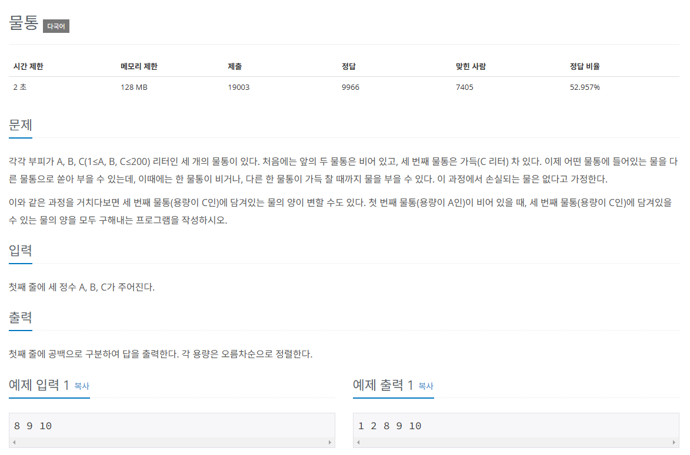

## 문제
   
[백준 온라인 저지 2251번](https://www.acmicpc.net/problem/2251)

### 1. 문제 분석하기
* 그래프의 원리를 적용해 그래프를 역으로 그리는 방식
* A, B, C의 특정 무게 상태를 1개의 노드로 가정
* 조건에 따라, **이 상태에서 변경할 수 있는 이후 무게 상태**가 에지로 이어진 `인접한 노드`

### 2. 과정
#### 1) 처음에 물통 A, B는 비어 있고, C는 꽉 차있으므로 최초 출발 노드를 (0, 0, 3번째 물통의 용량)으로 초기화한다.
#### 2) BFS 수행
(1) 노드에서 갈 수 있는 `6개의 경우`에 관해 `다음 노드로 정해 큐에 추가`한다. A, B, C 무게가 동일한 노드에 방문한 이력이 있을 때는 큐에 추가하지 않는다.
* 6개의 경우
  * `A -> B`, `A -> C`, `B -> A`, `B -> C`, `C -> A`, `C -> B`

(2) 보내는 물통의 모든 용량을 `받는 물통에 저장`하고, `보내는 물통에는 0`을 저장한다. 단, 받는 물통이 넘칠 때는 초과하는 값만큼 보내는 물통에 남긴다.

(3) 큐에 추가하는 시점에 1번째 물통(A)의 무게가 0일 때가 있으면 3번째 물통(C)의 값을 정답 리스트에 추가한다.

## 결과
```python
from collections import deque
# 두 리스트를 이용하여 6가지 이동 케이스를 간편하게 정의할 수 있다.
# 여기에서 0, 1, 2는 각각 A, B, C 물통을 뜻한다.
# 예시 : index = 0의 경우 Sender[0] : 0, Receiver[0] : 1이기 때문에 A -> B 케이스를 뜻한다.
# Sender, Receiver : 6가지 경우를 탐색하기 위한 리스트
Sender = [0, 0, 1, 1, 2, 2]
Receiver = [1, 2, 0, 2, 0, 1]
now = list(map(int, input().split()))
visited = [[False for j in range(201)] for i in range(201)]
answer = [False] * 201

def BFS():
    queue = deque()
    # 큐 자료구조에 출발 노드 더하기 -> A와 B가 0인 상태이므로 0, 0 노드에서 시작하기
    queue.append((0, 0))
    visited[0][0] = True
    # answer 리스트에 현재 C의 값 체크
    answer[now[2]] = True
    while queue:
        now_Node = queue.popleft()
        A = now_Node[0]
        B = now_Node[1]
        C = now[2] - A - B # C는 전체 물의 양에서 A와 B를 뺀 것
        for k in range(6): # A -> B, A -> C, B -> A, B -> C, C -> A, C -> B
            next = [A, B, C]
            next[Receiver[k]] += next[Sender[k]]
            next[Sender[k]] = 0
            # 물이 넘칠 때
            if next[Receiver[k]] > now[Receiver[k]]:
                # 초과하는 만큼 다시 이전 물통에 넣어주기
                next[Sender[k]] = next[Receiver[k]] - now[Receiver[k]]
                # 대상 물통 최대로 채우기
                next[Receiver[k]] = now[Receiver[k]]
            # A와 B의 물의 양으로 방문 리스트 체크
            if not visited[next[0]][next[1]]:
                visited[next[0]][next[1]] = True
                queue.append((next[0], next[1]))
                # A의 물의 양이 0일 때 C의 물의 무게를 정답 변수에 저장
                if next[0] == 0:
                    answer[next[2]] = True

BFS()

for i in range(len(answer)):
    if answer[i]:
        print(i, end=' ')
```