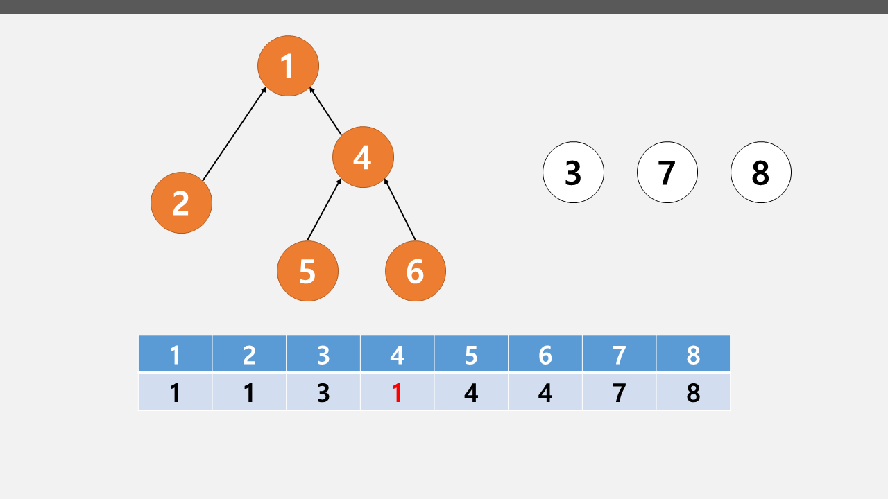
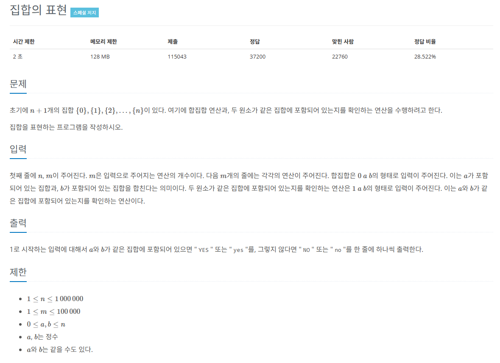

## 유니온 파인드
* 여러 노드가 있을 때 특정 2개의 노드를 연결해 1개의 집합으로 묶는 `union 연산`
* 두 노드가 같은 집합에 속해 있는지를 확인하는 `find 연산`

### 핵심
* `union 연산` : 각 노드가 속한 집합을 1개로 합치는 연산이다. 노드 a, b가 $a \in A$, $b \in B$일 때 `union(a, b)`는 $A \cup B$ 를 말한다.
* `find 연산` : 특정 노드 a에 관해 `a가 속한 집합의 대표 노드를 반환하는 연산`이다. 노드 a가 $a \in A$ 일 때 `find(a)`는 `A 집합의 대표 노드`를 반환한다.

   

### 유니온 파인드의 원리
#### 1) 1차원 리스트를 이용하여 각 노드가 모두 대표 노드가 되어 리스트를 자신의 인덱스값으로 초기화

#### 2) 2개의 노드를 선택해 각각의 대표 노드를 찾아 연결하는 union 연산을 수행한다.
* `1, 4`와 `5, 6`을 union 연산으로 연결
* `union(1, 4)` -> 4의 대표 노드 1 : **리스트[4] = 1**
* `union(5, 6)` -> 6의 대표 노드 5 : **리스트[6] = 5**
* `union(4, 6)` -> 4, 6은 대표 노드가 아니므로 `find 연산`을 이용하여 `대표 노드 (1, 5)를 찾아 연결`

#### 3) find 연산은 자신이 속한 집합의 대표 노드를 찾는 연산이다.
* 그래프를 정돈하고 시간 복잡도를 줄인다.

### 작동 원리
#### 1) 대상 노드 리스트에 index 값과 value 값이 동일한지 확인한다.
#### 2) 동일하지 않으면 value값이 가리키는 index 위치로 이동한다.
#### 3) 이동 위치으 index 값과 value 값이 같을 때까지 반복한다. 재귀 함수로 구현한다.
#### 4) 대표 노드에 도달하면 재귀 함수를 빠져나오면서 거치는 모든 노드값을 대표 노드값으로 변경한다.

## 문제
   
[백준 온라인 저지 1717번](https://www.acmicpc.net/problem/1717)

### 1. 문제 분석하기
* 최대 원소의 개수 1,000,000이고 질의 개수 100,000 이므로 `경로 압축`이 필요한 전형적인 문제

### 2. 과정
#### 1) 처음에는 노드가 연결돼 있지 않으므로 각 노드의 대표 노드는 자기 자신이다.
* 각 노드를 자기 인덱스값으로 초기화

#### 2) find 연산으로 특정 노드의 대표 노드를 찾고, union 연산으로 2개의 노드를 이용해 각 대표 노드를 찾아 연결한다, 그리고 질의한 값에 따라 결과를 반환한다.

### 3. 자주 실수하는 부분
* find 연산 할 때 재귀 함수에서 나오면서 탐색한 `모든 노드의 대표 노드값`을 `이번 연산에서 발견한 대표 노드로 변경`하는 부분
* union 연산에서 선택된 노드끼리 연결하는 것이 아닌 선택된 `노드의 대표 노드끼리 연결하는 부분`

## 결과
```python
sys.setrecursionlimit(100000)
N, M = map(int, input().split())
parent = [0] * (N + 1)

# find 연산
def find(a):
    # a가 대표 노드면 리턴
    if a == parent[a]:
        return a
    else:
        # 대표 노드가 아니면 a의 대표 노드값을 find(parentp[a]) 값으로 저장
        # 재귀 형태로 구현 -> 경로 압축 부분
        parent[a] = find(parent[a])
        return parent[a]

# union 연산 대표 노드끼리 합치기
def union(a, b):
    # 대표 노드 찾기
    a = find(a)
    b = find(b)
    # 두 원소의 대표 노드끼리 연결
    if a != b:
        parent[b] = a

# 두 원소가 같은 집합에 속해 있는지 확인하는 함수
def checkSame(a, b):
    a = find(a)
    b = find(b)
    if a == b:
        return True
    return False

# 대표 노드를 자기 자신으로 초기화
for i in range(0, N + 1):
    parent[i] = i

# 질의가 0이면 집합 합치기
# 1이면 같은지 확인
for i in range(M):
    question, a, b = map(int, input().split())
    if question == 0:
        union(a, b)
    else:
        if checkSame(a, b):
            print("YES")
        else:
            print("NO")
```