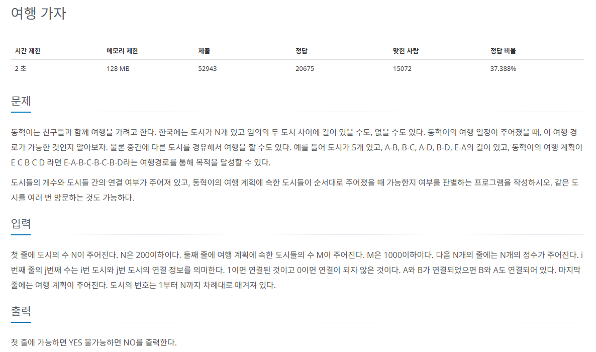

## 문제
   
[백준 온라인 저지 1976번](https://www.acmicpc.net/problem/1976)

### 1. 문제 분석하기
* `단독`으로 활용하는 `유니온 파인드`
* 도시 간 연결 데이터가 `인접 행렬`의 형태로 주어짐.
* 인접 행렬을 탐색하면서 연결할 때마다 `union` 연산을 수행

### 2. 과정
#### 1) 도시와 여행 경로 데이터 저장, 대표 노드 리스트 값 초기화
#### 2) 인접 행렬 탐색하면서 1일 때 union 연산 수행
#### 3) 여행 경로에 포함된 도시의 대표 노드가 모두 같은지 확인한 후 결괏값을 출력
* 재귀 함수를 빠져나가면서 리스트의 값을 대표 노드로 변경
  * 경로 압축
  * 여행 경로에 있는 모든 도시의 대표 도시가 3으로 같으므로 YES 출력

## 결과
```python
N = int(input())
M = int(input())
dosi = [[0 for j in range(N+1)] for i in range(N+1)]

def find(a):
    if a == parent[a]:
        return a
    else:
        parent[a] = find(parent[a])
        return parent[a]

def union(a, b):
    a = find(a)
    b = find(b)
    if a != b:
        parent[b] = a

# 도시 연결 데이터 저장
for i in range(1, N+1):
    dosi[i] = list(map(int, input().split()))
    dosi[i].insert(0,0)

route = list(map(int, input().split()))
route.insert(0,0)

parent = [0] * (N+1)

# 대표 노드를 자기 자신으로 초기화
for i in range(1, N+1):
    parent[i] = i

# 인접 행렬에서 도시가 연결되어 있으면 union 실행
for i in range(1, N+1):
    for j in range(1, N+1):
        if dosi[i][j] == 1:
            union(i, j)

# 여행 계획 도시들의 1개의 대표 도시로 연결되어 있는지 확인
index = find(route[1])
isConnect = True
for i in range(2, len(route)):
    if index != find(route[i]):
        isConnect = False
        break

if isConnect:
    print("YES")
else:
    print("NO")
```