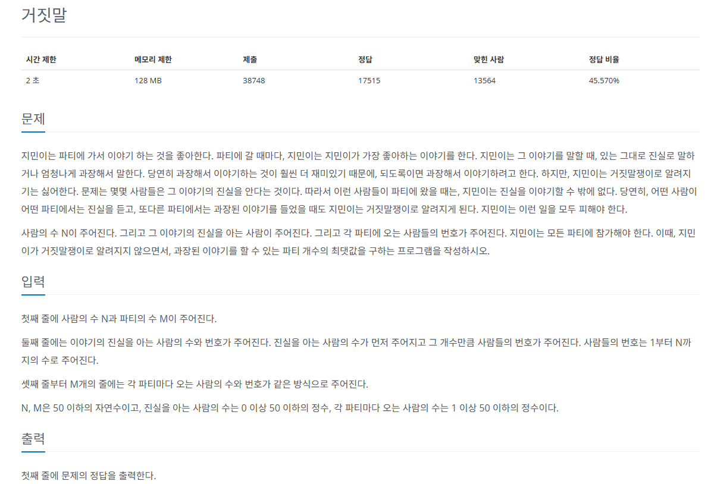

## 문제
   
[백준 온라인 저지 1043번](https://www.acmicpc.net/problem/1043)


### 1. 문제 분석하기
* 파티에 참석한 사람들을 1개의 `집합`으로 생각
* 1개의 파티에 있는 모든 사람은 같은 `대표 노드`를 바라봄
* 각 파티의 대표 노드와 진실을 알고 있는 사람들의 `대표 노드가 동일`한지 find연산으로 판단

### 2. 과정
#### 1) 진실을 아는 사람 데이터, 파티 데이터, 유니온 파인드를 위한 대표 노드 자료구조를 초기화
#### 2) union 연산을 수행해 각 파티에 참여한 사람들을 1개의 그룹으로 만든다.
#### 3) find 연산을 수행해 각 파티의 대표 노드와 진실을 아는 사람들이 같은 그룹에 있는지 확인한다.
* 파티 사람 노드는 모두 연결되어 있으므로 아무 사람이나 지정해 find 연산을 수행
#### 4) 모든 파티에 반복 수행, 모든 파티의 대표 노드가 진실을 아는 사람들과 다른 그룹에 있담녀 결괏값을 증가시킨다.
#### 5) 과장할 수 있는 파티의 개수를 결괏값으로 출력


## 결과
```python
N, M = map(int, input().split())
# 진실을 아는 사람 저장
trueP = list(map(int, input().split()))
T = trueP[0]
# 맨 앞은 사람 수라서 삭제
del trueP[0]
result = 0
party = [[] for _ in range(M)]

# find 연산
def find(a):
    if a == parent[a]:
        return a
    else:
        parent[a] = find(parent[a])
        return parent[a]

# union 연산
def union(a,b):
    a = find(a)
    b = find(b)
    if a != b:
        parent[b] = a

# 두 원소가 같은 집합인지 확인
def checkSame(a, b):
    a = find(a)
    b = find(b)
    if a == b:
        return True
    return False

for i in range(M):
    # 파티 데이터 저장
    party[i] = list(map(int, input().split()))
    # 맨 앞은 사람 수라서 삭제
    del party[i][0]

parent = [0] * (N + 1)

# 대표 노드를 자기 자신으로 초기화
for i in range(N + 1):
    parent[i] = i

# 각 파티에 참여한 사람들을 1개의 그룹으로 만들기
for i in range(M):
    firstPeople = party[i][0]
    for j in range(1, len(party[i])):
        union(firstPeople, party[i][j])

# 각 파티의 대표 노드와 진실을 아는 사람들을 대표 노드가 같다면 과장할 수 없음
for i in range(M):
    isPossible = True
    firstPeople = party[i][0]
    for j in range(len(trueP)):
        if find(firstPeople) == find(trueP[j]):
            isPossible = False
            break
    if isPossible:
        result += 1

print(result)
```