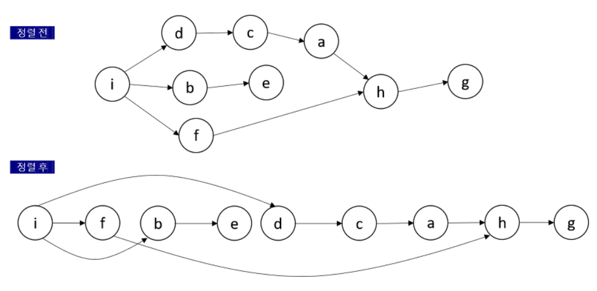
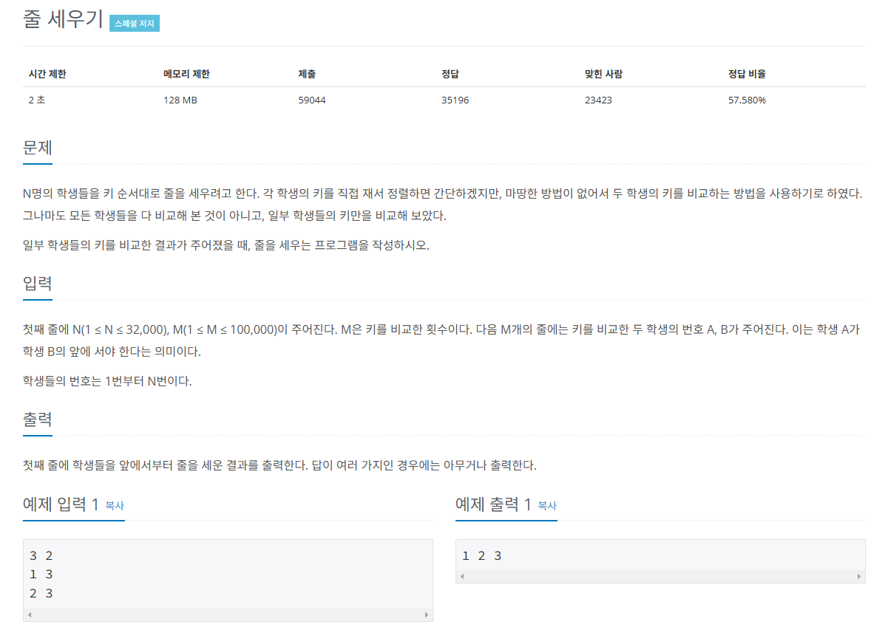
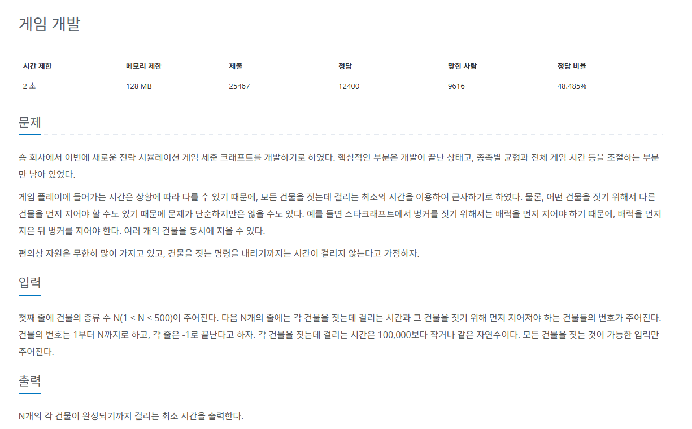
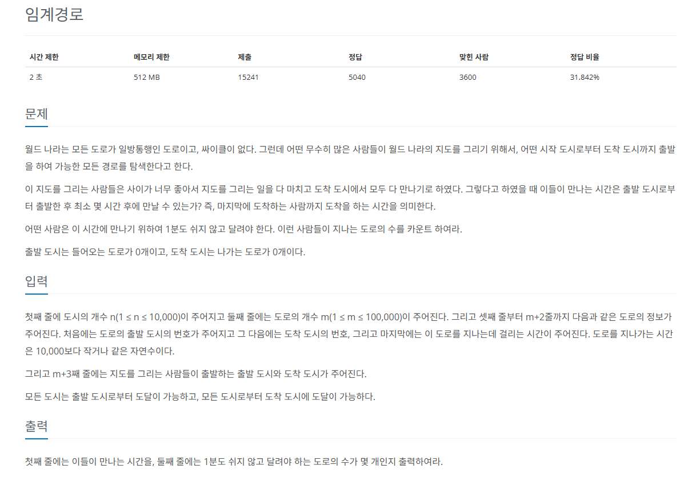

# 위상 정렬

사이클이 없는 방향 그래프에서 노드 순서를 찾는 알고리즘이다.

* 기능 : **노드 간의 순서**를 결정
* 특징 : **사이클**이 없어야 함
* 시간 복잡도 (노드 수 : V, 에지 수 : E): O(V + E)



## 위상 정렬의 핵심 이론

### 1. 진입 차수

* `진입 차수` : **자기 자신을 가리키는 에지의 개수**
* 진입 차수 리스트 `D` : 1에서 2, 3을 가리키고 있으면 **D[2], D[3]을 1만큼 증가**

### 2. 진입 차수가 0인 노드를 선택

* **선택된 노드**를 정렬 리스트에 저장
* **인접 리스트**에서 **선택된 노드가 가리키는 노드**들의 진입 차수를 1씩 뺀다.
* 다음 노드를 선택하여 반복

> 진입 차수가 0인 다른 노드를 선택했다면 결과가 달라진다. 위상 정렬이 늘 같은 정렬 결과를 보장하지 않는다는 것이 바로 이런 경우이다.

## 문제 1


[백준 온라인 저지 2252번](https://www.acmicpc.net/problem/2252)

### 1. 문제 분석하기

**학생**들을 **노드**로 생각하고, **키 순서 비교 데이터**로 **에지**를 만든다고 생각했을 때 **노드의 순서**를 도출하는 가장 기본적인 문제이다.

>"답이 여러 개일 때 아무것이나 출력해도 된다" => `위상 정렬`의 결괏값이 항상 유일하지 않다는 전제와 동일

### 2. 과정

#### 1) `인접 리스트`에 노드 데이터를 저장하고, `진입 차수` 배열값을 업데이트한다.

```python
A = [[] for _ in range(N+1)]
```

#### 2) 위상 정렬 수행 과정

1. **진입 차수가 0인 노드**를 `큐`에 저장한다.

2. 큐에서 데이터를 뽑아와서 **해당 노드**를 `탐색 결과`에 추가하고, **해당 노드가 가리키는 노드의 진입 차수**를 1씩 감소한다.

3. 감소했을 때 **진입 차수가 0이 되는 노드**를 **큐에 삽입**한다.

4. 큐가 빌 때까지 1~3을 반복한다.

## 결과

```python
from collections import deque
N, M = map(int, input().split())
A = [[] for _ in range(N+1)]
# 진입 차수 리스트
indegree = [0] * (N+1)

for i in range(M):
    S, E = map(int, input().split())
    A[S].append(E)
    indegree[E] += 1

# 위상 정렬 수행
queue = deque()

for i in range(1, N+1):
    if indegree[i] == 0:
        queue.append(i)

# 큐가 빌 때까지
while queue:
    now = queue.popleft()
    print(now, end=" ")
    for next in A[now]:
        indegree[next] -= 1
        if indegree[next] == 0:
            queue.append(next)
```

## 문제 2


[백준 온라인 저지 1516번](https://www.acmicpc.net/problem/1516)

### 1. 문제 분석하기

>어떤 건물을 짓기 위해 먼저 지어야 하는 건물이 있을 수 있다.

➡️ `각 건물`을 `노드`라고 생각

➡️ `그래프`형태에서 **노드 순서를 정렬**하는 알고리즘

➡️ `위상 정렬`

### 2. 과정

1. `인접 리스트`로 그래프 표현, `건물의 생산 시간` 따로 저장, `진입 차수 리스트`는 **[0, 1, 1, 2, 1]**, `정답 리스트` **모두 0**으로 초기화
2. `위상 정렬`을 수행하면서 **각 건물을 짓는데 걸리는 최대 시간**을 업데이트한다.

* `진입 차수 리스트`와 `위상 정렬 리스트`, `정답 리스트` 업데이트 방법

```python
Math.max(현재 건물(노드)에 저장된 최대 시간, 이전 건물(노드)에 저장된 최대 시간 + 현재 건물(노드)의 생산 시간)
```

3. 정답 리스트에 **자기 건물을 짓는 데 걸리는 시간을 더한 후** 정답 리스트를 차례로 출력

## 결과

```python
from collections import deque
# 건물 수
N = int(input())
# 건물 데이터 저장 인접 리스트
A = [[] for _ in range(N+1)]
# 진입 차수 리스트
indegree = [0] * (N + 1)
# 자기 자신을 짓는 데 걸린 시간
selfBuild = [0] * (N + 1)

# 건물의 개수
for i in range(1, N+1):
    inputList = list(map(int, input().split()))
    # 건물을 짓는데 걸리는 시간 저장
    selfBuild[i] = (inputList[0])
    index = 1
    # 인접 리스트 만들기
    while True:
        preTemp = inputList[index]
        index += 1
        if preTemp == -1:
            break
        A[preTemp].append(i)
        # 진입 차수 리스트 데이터 저장
        indegree[i] += 1

# 위상 정렬 수행
queue = deque()

# 진입 차수 리스트의 값이 0인 건물(노드)을 큐에 삽입
for i in range(1, N+1):
    if indegree[i] == 0:
        queue.append(i)

result = [0] * (N + 1)

# 큐가 빌 때까지
while queue:
    now = queue.popleft()
    for next in A[now]:
        # 타깃 노드 진입 차수 리스트 1 감소
        indegree[next] -= 1
        # 시간 업데이트
        # 결과 노드 업데이트 = max(현재 저장된 값, 현재 출발 노드 + 비용)
        result[next] = max(result[next], result[now] + selfBuild[now])
        # 타깃 노드의 진입 차수가 0이면
        if indegree[next] == 0:
            queue.append(next)

for i in range(1, N+1):
    print(result[i] + selfBuild[i])
```

## 문제 3


[백준 온라인 저지 1948번](https://www.acmicpc.net/problem/1948)

### 1. 문제 분석하기

>출발 도시와 도착 도시가 주어지기 때문에, 일반적인 위상 정렬이 아니다.

* `시작점`을 **출발 도시**로 지정하고 `위상 정렬`을 수행
* **출발 도시**에서 **도착 도시**까지 거치는 모든 도시와 관련된 `임계 경로값`을 구할 수 있다.

> `문제의 핵심`
> 1분도 쉬지 않고 달려야 하는 도로의 수를 구하기

#### 💡핵심 아이디어

`에지 뒤집기`

에지를 뒤집어, **역방향 인접 리스트**를 만들고 역방향으로 위상 정렬하는 것

### 2. 과정

1. `인접 리스트`에 노드 데이터를 저장하고, `진입 차수 리스트` 값을 업데이트한다. 이때 **에지의 방향이 반대**인 `역방향 인접 리스트`도 함께 생성하고 저장한다.
2. 시작 도시에서 `위상 정렬`을 수행해 각 도시와 관련된 `임계 경로`를 저장한다.
3. 도착 도시에서 `역방향`으로 `위상 정렬`을 수행한다.

* `'이 도시의 임계 경로값 + 도로 시간(에지) == 이전 도시의 임계 경로값'`일 경우
  *   이 도로를 **1분도 쉬지 않고 달려야 하는 도로로 카운팅**하고, **이 도시를 큐에 삽입**하는 로직으로 구현해야 한다.
* 노드를 큐에 삽입할 때 주의점
  * **1분도 쉬지 않고 달려야 하는 도로로 이어진 노드와 연결된 다른 도로**만이 1분도 쉬지 않고 달려야 하는 도로의 후보
  * 중복 카운트하지 않기 위해 이미 방문한 적이 있는 한 노드는 큐에 넣어 주지 않는다.