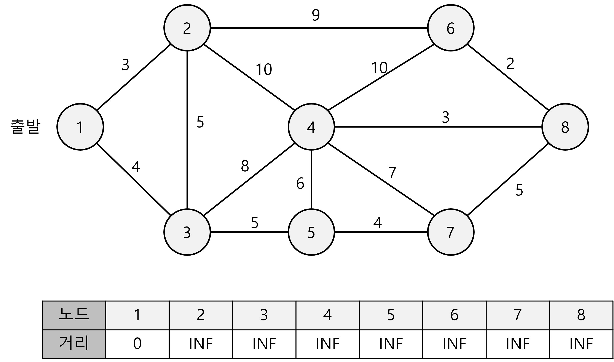
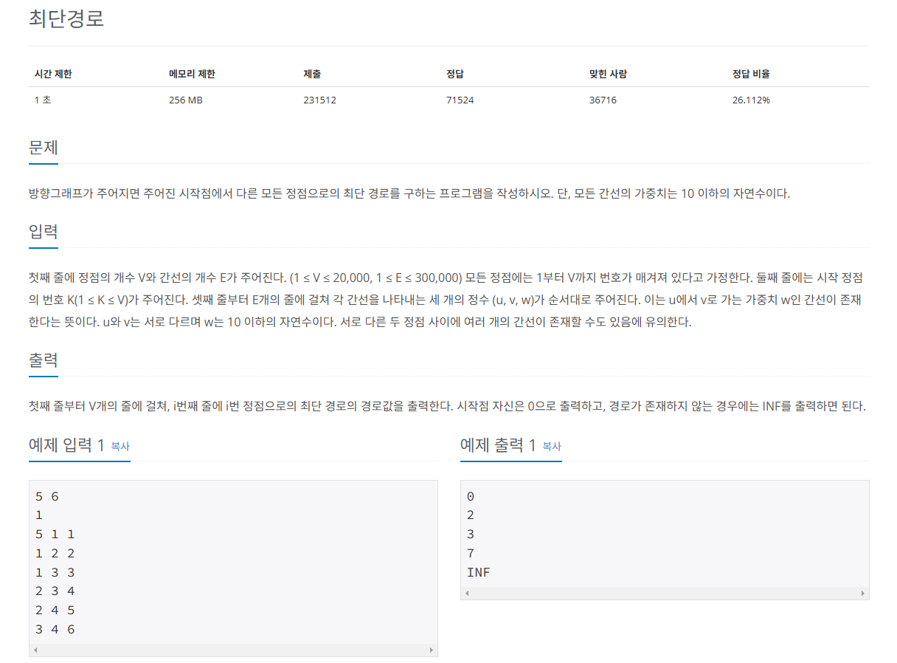
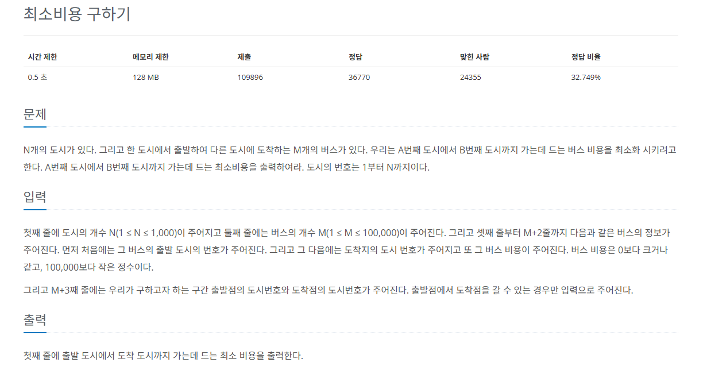
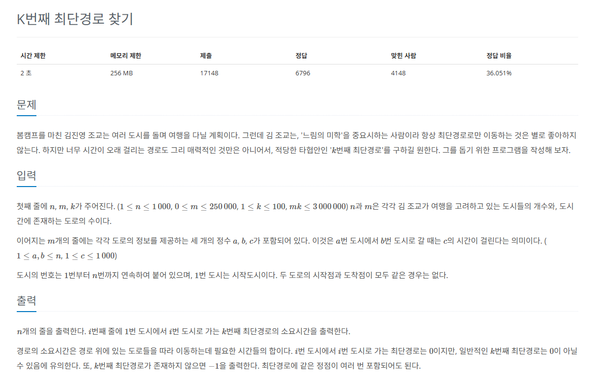

# 다익스트라

그래프에서 `최단 거리`를 구하는 알고리즘

* 기능 : **출발 노드**와 **모든 노드**간의 `최단 거리` 탐색
* 특징 : **에지**는 모두 **양수**
* 시간 복잡도 (노드 수 : V, 에지 수 : E): O(ElogV)



## 다익스트라 알고리즘의 핵심 이론

### 1. 인접 리스트로 그래프 구현하기

* `인접 리스트` : 시간 복잡도 측면, N의 크기가 클 것을 대비해 인접 리스트를 선택하여 구현
* input 데이터 자료형 : (노드, 가중치)와 같은 형태로 선언

### 2. 최단 거리 리스트 초기화하기

* 최단 거리 리스트 생성 : **출발 노드**는 **0**, **이외의 노드**는 **무한**으로 초기화
* 실제 구현 시 무한은 아주 큰 값으로 정하면 됨.

### 3. 값이 가장 작은 노드 고르기

* 최단 거리 리스트에서 **현재 값이 가장 작은 노드**를 고름
* 값이 0인 `출발 노드`에서 시작하면 됨

### 4. 최단 거리 리스트 업데이트하기

1단계에서 저장해 놓은 `연결 리스트`를 이용해 현재 선택된 노드의 에지들을 탐색하고 업데이트하면 된다.
* 연결 노드의 최단 거리는 다음 두 값 중 더 작은 값

```python
Min(선택 노드의 최단 거리 리스트의 값 + 에지 가중치, 연결 노드의 최단 거리 리스트)
```

### 5. 과정 3~4를 반복해 최단 거리 리스트 완성하기

* 과정 4에서 선택 노드가 될 때마다 다시 선택되지 않도록 `방문 리스트`를 만들어서 처리한다.
* 모든 노드가 선택될 때까지 반복

## 문제


[백준 온라인 저지 1753번](https://www.acmicpc.net/problem/1753)

### 1. 문제 분석하기

* **시작점**과 **다른 노드**와 관련된 `최단 거리`
* `다익스트라` 알고리즘을 코드로 구현

### 2. 과정

1. `인접 리스트`에 노드를 저장하고 거리 리스트를 초기화한다.
   
* **출발 노드**는 **0**, **나머지**는 **무한**

2. **최초 시작점**을 `우선순위 큐`에 삽입하고, 다음 과정에 따라 다익스트라 알고리즘을 수행한다.
   1. 거리 리스트에서 **아직 방문하지 않은 노드** 중 **현재 값이 가장 작은 노드**를 선택한다. 즉, `우선순위 큐`에서 데이터를 뽑아온다.
   2. 해당 노드와 연결된 노드들의 **최단 거릿값**을 다음 공식을 이용해 업데이트한다.
   * ``[연결 노드 거리 리스트 값]``보다 `[선택 노드의 거리 리스트 값 + 에지 가중치]` 가 **더 작은 경우** 업데이트 수행
   * **업데이트가 수행되는 경우 연결 노드를 우선순위 큐에 삽입**
   3. 큐가 빌 때까지 1~2를 반복한다.

3. 완성된 거리 리스트의 값을 출력한다.

## 결과
```python
from queue import PriorityQueue
# 노드 개수, 에지 개수
V, E = map(int, input().split())
# 출발 노드
K = int(input())
# 거리 저장 리스트
# 충분히 큰 수로 초기화
distance = [sys.maxsize] * (V + 1)
# 방문 여부 저장 리스트
visited = [False] * (V + 1)
# 에지 데이터 저장 인접 리스트
myList = [[] for _ in range(V + 1)]
# 다익스트라를 위한 우선순위 큐
q = PriorityQueue()

# 에지 개수만큼 반복
# 인접 리스트에 에지 정보 저장
for _ in range(E):
    # 가중치가 있는 인접 리스트 저장
    u, v, w = map(int, input().split())
    myList[u].append((v, w))

# 다익스트라 수행
# 출발 노드는 우선순위 큐에 넣고 시작
# 자동으로 거리가 최소인 노드를 선택
# 거리 리스트에 출발 노드의 값을 0으로 설정

# K를 시작점으로 설정
q.put((0, K))
distance[K] = 0

# 큐가 빌 때까지
while q.qsize() > 0:
    # 우선순위 큐에서 노드 가져오기
    current = q.get()
    # (current에서 v로 가는 거리, 노드 인덱스)
    c_v = current[1]
    # 현재 선택된 노드를 방문한 적이 있는지 확인
    if visited[c_v]:
        continue

    # 현재 노드를 방문 노드로 업데이트
    visited[c_v] = True

    # 현재 선택 노드의 에지 개수
    for tmp in myList[c_v]:
        next = tmp[0]
        value = tmp[1]
        # 연결 노드 방문 전 and 현재 선택 노드 최단 거리 + 비용 < 연결 노드의 최단 거리
        if distance[next] > distance[c_v] + value:
            # 최소 거리로 업데이트
            distance[next] = distance[c_v] + value
            # 가중치가 정렬 기준이므로 순서를 가중치, 목표 노드 순으로 우선순위 큐 설정
            # 연결 노드 최단 거리 업데이트
            # 우선순위 큐에 연결 노드 추가
            q.put((distance[next], next))

# 완성된 거리 리스트를 탐색해 출력
for i in range(1, V+1):
    if visited[i]:
        print(distance[i])
    else:
        print("INF")
```

## 문제


[백준 온라인 저지 1916번](https://www.acmicpc.net/problem/1916)


### 1. 문제 분석하기

* **시작점**과 **도착점**이 주어지고, 이 목적지까지 가는 `최소 비용(최단 거리)`를 구한다.
* **버스 비용이 음수가 아니기 때문에** `다익스트라 알고리즘` 이용
* 시간 복잡도, 공간 효율성 위해 `인접 리스트` 구현

### 2. 과정

1. 주어진 예제 데이터르르 기반으로 그래프를 그린다.
* **도시**는 `노드`, **도시 간 버스 비용**은 `에지`로 나타낸다.

2. **첫째 숫자(도시 개수)**의 크기만큼 인접 리스트 크기 설정
* **버스의 비용(가중치)**는 인접 리스트 input 데이터 형태를 구성
* 데이터는 `(목표 노드, 가중치)` 형태로 설정
* **둘째 숫자(버스 개수)**의 크기 만큼 **반복문**을 돌면서 그래프를 인접 리스트에 저장

3. 다익스트라 알고리즘 수행

## 결과
```python
from queue import PriorityQueue
N = int(input())
M = int(input())
# 에지 데이터 저장 인접 리스트
myList = [[] for _ in range(N + 1)]
# 거리 저장 리스트
# 충분히 큰 수로 초기화
dist = [sys.maxsize] * (N + 1)
# 방문 여부 저장 리스트
visit = [False] * (N + 1)

# 에지 개수만큼 반복
# 인접 리스트에 에지 정보를 저장
for _ in range(M):
    start, end, weight, = map(int, input().split())
    myList[start].append((end, weight))

start_index, end_index = map(int, input().split())

# 다익스트라 함수 구현
def dijkstra(start, end):
    pq = PriorityQueue()
    # 출발 노드를 우선순위 큐에 넣고 시작
    # 자동으로 거리가 최소인 노드를 가져오는 자료구조
    # 우선순위에 데이터를 최단 거리, 노드 순으로 삽입
    pq.put((0, start))
    dist[start] = 0

    # 큐가 빌 때까지
    while pq.qsize() > 0:
        nowNode = pq.get()
        now = nowNode[1]

        # 현재 선택된 노드가 방문한 적이 있는지 확인
        if not visit[now]:
            # 현재 노드를 방문 노드로 업데이트
            visit[now] = True

            # 현재 선택 노드의 에지 개수만큼 반복
            for n in myList[now]:
                # 타깃 노드 최단 거리 업데이트
                # 타깃 노드 방문 전 and 현재 선택 노드 최단 거리 + 비용 < 타깃 노드의 최단 거리
                if not visit[n[0]] and dist[n[0]] > dist[now] + n[1]:
                    dist[n[0]] = dist[now] + n[1]
                    # 우선순위 큐에 타깃 노드 추가
                    pq.put((dist[n[0]], n[0]))
    # 종료 인데스의 최종 거리 리턴
    return dist[end]

# 다익스트라 수행하고 결괏값 출력
print(dijkstra(start_index, end_index))
```

## 문제


[백준 온라인 저지 1854번](https://www.acmicpc.net/problem/1854)


### 1. 문제 분석하기

* **시작점**과 **도착점**이 주어지고 이 목적지까지 가는 `K번째 최단 경로`를 구하는 문제
* `K번째 최단 경로 해결 방법`
  * 최단 경로를 표현하는 리스트를 **K개의 row를 갖는 2차원 리스트의 형태**로 변경하고자 한다. 이렇게 하면 최단 경로뿐 아니라 최단 경로 ~ K번째 최단 경로까지 표현할 수 있지 않을까?
  * 기존 다익스트라 로직에서 사용한 노드를 **방문 리스트**에 체크해 두고 다음 도착 시 해당 노드를 다시 사용하지 않도록 설정하는 부분은 **삭제**가 필요해 보인다. K번째 경로를 찾기 위해서는 노드를 여러 번 쓰는 경우가 생기기 때문이다. 

### 2. 과정
1. 주어진 예제 데이터를 기반으로 그래프를 그린다. **도시**는 **노드**로, **도로**는 **에지**로 나타낸다.
2. 변수를 선언하고, 그래프 데이터를 받는 부분은 모두 다익스트라 알고리즘 준비 과정과 동일하다.
3. 유일하게 다른 점은 `최단 거리 리스트`를 **1차원이 아닌 K개의 row를 갖는 2차원 리스트**로 선언한다는 것이다.
* `최초 시작 노드`의 **첫 번째 경로는 0**, **그 외의 경로는 모두 무한대로 초기화**한다. 그 후 다음에서 설명하는 규칙을 토대로 거리 리스트를 채운다.
* `최단 거리 리스트` 채우기 규칙
  1. **우선순위 큐**에서 **연결된 노드**와 **가중치** 데이터를 가져온다.
  2. 연결 노드의 **K번째 경로**와 **신규 경로**를 비교해 **신규 경로가 더 작을 때 업데이트**한다. 이때 경로가 업데이트되는 경우 **거리 배열을 오름차순으로 정렬**하고 **우선순위 큐에 연결 노드를 추가**한다.
  3. 1~2 단계를 우선순위 큐가 비워질 때까지 반복한다. K번째 경로를 찾기 위해 노드를 여러 번 방문하는 경우가 있으므로 기존 다익스트라의 **방문 노드를 체크하여 재사용하지 않는 로직은 구현하지 않는다**.
  4. 최단 거리 리스트를 탐색하면서 K번째 경로가 무한이면 -1을 출력하고, 그 외에는 해당 경로 값을 출력한다.

* `우선순위 큐`로 선언하면 편리한 점
  * 새로운 노드가 삽입됐을 때 별도의 정렬을 해주지 않아도 자동으로 정렬된다.

## 결과
```python
import heapq
# 노드 개수, 에지 개수, 몇 번째 최단 경로를 구해야 하는지 나타내는 변수
N, M, K = map(int, input().split())

# 그래프 정보 저장 인접 리스트
W = [[] for _ in range(N+1)]

# 거리 리스트를 충분히 큰 값으로 초기화
distance = [[sys.maxsize] * K for _ in range(N+1)]

# 에지 개수만큼, 인접 리스트에 에지 정보를 저장
for _ in range(M):
    a, b, c = map(int, input().split())
    W[a].append((b, c))

# 우선순위 큐에 시작 노드 저장
# 가중치 우선이기 때문에 가중치, 목표 노드 순서로 저장
pq = [(0, 1)]
# 1번 노드 거리 0으로 저장
# 시작점이기 때문에 0으로 저장
distance[1][0] = 0

# 변형된 다익스트라 수행
# 큐가 빌 때까지
while pq :
    # 우선순위 큐에서 데이터 가져오기(거리, 노드)
    cost, node = heapq.heappop(pq)

    # 현재 노드에서 연결된 에지 탐색
    for nNode, nCost in W[node]:
        # 새로운 총 거리 = 현재 노드의 거리 + 에지 가중치
        sCost = cost + nCost

        # 새로운 노드의 K번째 최단 거리 > 새로운 총 거리
        if distance[nNode][K-1] > sCost:
            # 새로운 노드의 K번째 최단 거리를 새로운 총 거리로 변경하고 거리 순으로 정렬
            distance[nNode][K-1] = sCost
            distance[nNode].sort()

            # 우선순위 큐에 새로운 데이터 추가 (거리, 노드)
            heapq.heappush(pq, [sCost, nNode])

# 노드 개수
for i in range(1, N+1):
    # 다음은 최초 값이라면 K번째 거리가 없다는 뜻
    # 각 노드이 거리 리스트에 K번째 값이 최초 설정값
    if distance[i][K-1] == sys.maxsize:
        print(-1)
    else:
        print(distance[i][K-1])
```