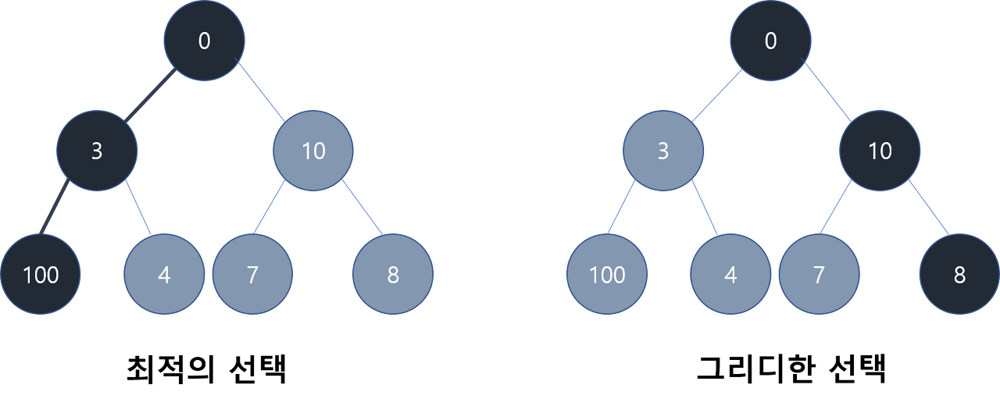
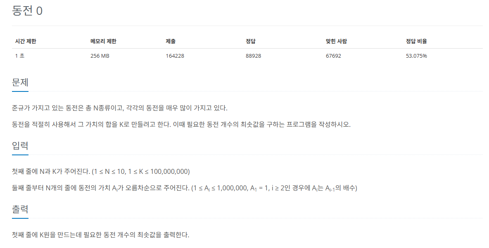

## 그리디 알고리즘
* `그리디 알고리즘`은 `현재 상태`에서 보는 선택지 중 `최선의 선택지`가 `전체 선택지` 중 최선의 선택지라고 가정하는 알고리즘이다.

* 동적 계획법보다 구현하기 쉽고 시간 복잡도가 우수하다.
* 항상 최적의 해를 보장하지 못하므로 논리 유무를 충분히 살펴야 한다.

   

### 핵심 이론
#### 1) 해 선택 : `현재 상태`에서 `가장 최선`이라고 생각되는 해를 선택한다.
#### 2) 적절성 검사 : 현재 선택한 해가 `전체 문제의 제약 조건`에 벗어나지 않는지 검사한다.
#### 3) 해 검사 : 현재까지 선택한 `해 집합`이 `전체 문제를 해결할 수 있는지 `검사한다. 전체 문제를 해결하지 못한다면 1로 돌아가 같은 과정을 반복한다.

### 우선순위 큐
* 그리디 알고리즘에서 자주 사용하는 자료구조
* PriorityQueue
```
# import
from queue import PriorityQueue

# 생성 방법
myqueue = PriorityQueue() # myqueue를 우선순위 큐로 생성

# 기본 함수
put(data) # 원소 추가
get() # 큐에서 데이터 꺼내기
qsize() # 큐 사이즈 가져오기
empty() # 큐가 비어 있는지 확인
```
* 힙큐(heapq)
  * 힙이란 A가 B의 부모노드이면 A의 키값과 B의 키값 사이에는 대소 관계가 성립하는 자료구조
  * 최소 힙, 최대 힙이 있음음
```
# import
import heapq

# 생성 방법
mylist = [] # 리스트 생성
heapq.headpush(mylist, 1) # 리스트에 데이터를 넣을 때 heapq 이용하여 저장

# 기본 함수
heappush(mylist, data) # data를 list(heap 자료구조) 형태로 저장
heappop(mylist) # list(heap 자료구조)에서 데이터 꺼내기
heapify(mylist) # 일반적인 list를 heap 자료구조로 변환

```
## 문제
   
[백준 온라인 저지 11047번](https://www.acmicpc.net/problem/11047)


### 1. 문제 분석하기
* Ai가 앞에 나오는 동전 가격 Ai-1의 배수
  * 그리디 알고리즘으로 풀기 위한 조건
  * 가장 가격이 큰 동전부터 차례대로 사용하면 됨

### 2. 과정
#### 1) 가격이 큰 동전부터 내림차순
* k보다 가격이 작거나 같은 동전이 나올때까지 탐색

#### 2) k값 갱신
* 탐색을 멈춘 동전의 가격으로 k를 나눔
* 몫은 동전 개수에 더하고, 나머지는 k값으로 갱신

#### 3) 나머지가 0이 될 때까지 반복

## 결과
```
N, K = map(int, input().split())
A = [0] * N

for i in range(N):
    A[i] = int(input())

count = 0

for i in range(N - 1, -1, -1):
    if A[i] <= K: # 현재 동전의 가치가 K보다 작거나 같으면 구성에 추가
        count += int(K / A[i])
        K = K % A[i] # K를 현재 동전을 사용하고 남은 금액으로 갱신

print(count)
```

