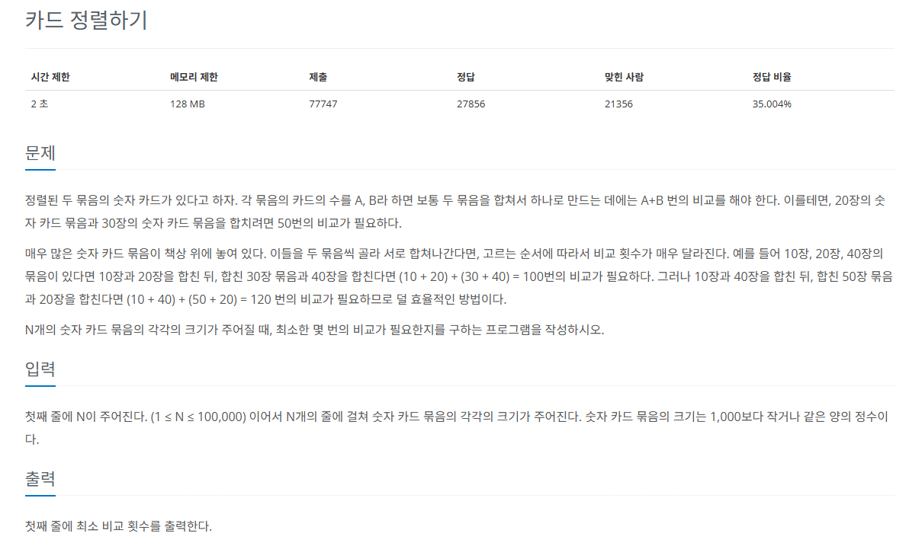

## 문제
   
[백준 온라인 저지 1715번](https://www.acmicpc.net/problem/1715)

### 1. 문제 분석하기
* 먼저 선택된 카드 묶음이 비교 횟수에 더 많은 영향
* 개수가 `작은 순서대로` 먼저 합치는 것이 전체 비교 횟수를 줄일 수 있다.
  * 가장 작은 카드의 개수 묶음 2개 뽑기
  * 이 2개를 기준으로 합친 새로운 카드 묶음을 다시 데이터에 넣고 정렬
* 데이터의 `삽입`, `삭제`, `정렬`이 자주 일어남.
* `우선순위 큐`를 이용해야 한다.

### 2. 손으로 플어 보기
#### 1) 현재 카드의 개수가 `가장 작은 묶음 2개`를 선택해 합친다. 
#### 2) 합친 카드 묶음을 다시 전체 카드 묶음 속에 넣는다.
#### 3) 1~2 과정을 카드 묶음이 1개만 남을 때까지 반복한다.

## 결과
```
from queue import PriorityQueue
N = int(input())
pq = PriorityQueue()

for _ in range(N):
    date = int(input())
    pq.put(date)

data1 = 0
data2 = 0
sum = 0

# 자동 정렬에 따라 작은 카드 묶음 2개를 쉽게 뽑을 수 있음
while pq.qsize() > 1:
    data1 = pq.get()
    data2 = pq.get()
    temp = data1 + data2
    sum += temp
    pq.put(temp)

print(sum)
```