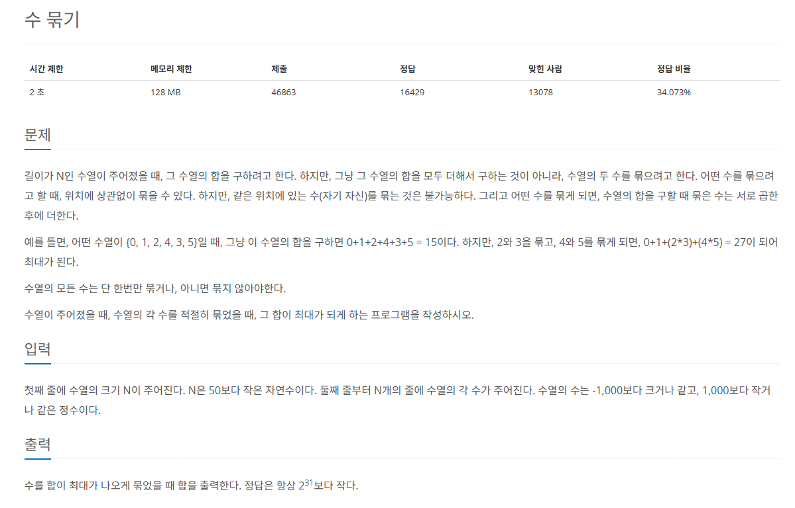

## 문제
   
[백준 온라인 저지 1744번](https://www.acmicpc.net/problem/1744)

### 1. 문제 분석하기
* N의 최대 범위가 10,000이므로 시간 복잡도와 관련된 제약은 적음.
* `수를 곱해서 최댓값`을 만들어야 함.
  * 가능한 한 `큰 수`들끼리 묶어야 함.
  * `음수끼리 곱`하면 양수로 변함.

### 2. 과정
#### 1) 수의 집합을 `1보다 큰 수`, `1`, `0`, `음수` 네 가지 유형으로 나눈다.
  * 1보다 큰 양수(우선순위 큐) : 2, 3, 6
  * 1의 개수 : 2
  * 0의 개수 : 1
  * 음수(우선순위 큐) : -1, -5, -8

#### 2) 1보다 큰 수의 집합을 `정렬`
* `최댓값`부터 `차례대로 곱`한 후에 더한다.
* 원소의 개수가 `홀수`일 때, `마지막 남은 수`는 그대로 더한다. 

### 3) 음수의 집합을 `정렬`
* `최솟값`부터 `차례대로 곱`한 후에 더함.
* 원소의 개수가 `홀수`일 때, `0`이 있다면 1개 남는 음수를 0와 곱해 0을 만든다.
  * 수열에 0이 없다면 그대로 더한다.
  
## 결과
```
from queue import PriorityQueue
N = int(input())
plusPq = PriorityQueue()
minusPq = PriorityQueue()
one = 0
zero = 0

for i in range(N): # 4가지로 데이터 분리 저장
    data = int(input())
    if data > 1:
        # 양수 우선순위 큐는 내림차순 정렬을 위해 -1을 곱하여 저장
        plusPq.put(data * -1)
    elif data == 1:
        one += 1
    elif data == 0:
        zero += 1
    else:
        minusPq.put(data)

sum = 0

# 양수 우선순위 큐 처리
while plusPq.qsize() > 1:
    # 내림차순에서 순서대로 뽑아서 -1 곱해 원상복귀
    first = plusPq.get() * -1
    second = plusPq.get() * -1
    sum += first * second

# 남은 수가 있다면 결과값에 더함
if plusPq.qsize() > 0:
    sum += plusPq.get() * -1

# 음수 우선순위 큐 처리
while minusPq.qsize() > 1:
    first = minusPq.get()
    second = minusPq.get()
    sum += first * second

# 남은 수가 있고 데이터 0이 한개도 없으면 결과값에 더함
# 데이터 0이 있으면 남은 음수를 곱해서 어차피 곱해서 0됨
if minusPq.qsize() > 0:
    if zero == 0:
        sum += minusPq.get()

sum += one # 1 처리
print(sum)
```
