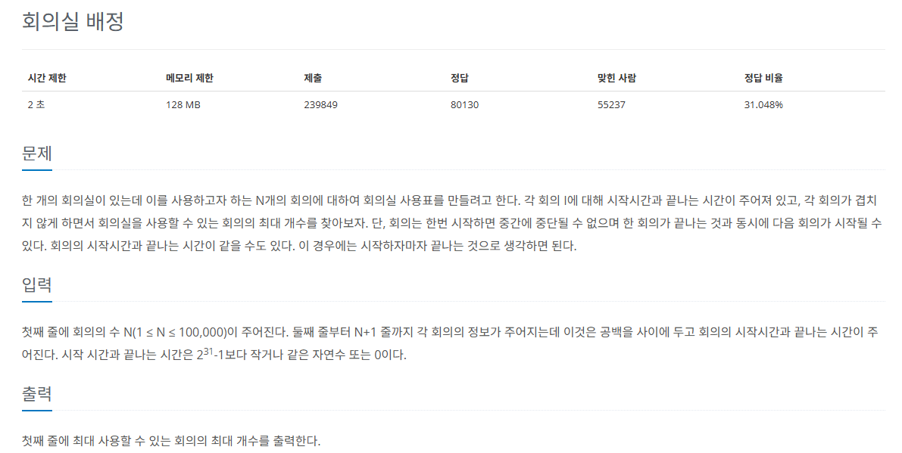

## 문제
   
[백준 온라인 저지 1931번](https://www.acmicpc.net/problem/1931)

### 1. 문제 분석하기
* 회의가 겹치지 않게 최대한 많은 회의를 배정해야 한다.
* 현재 회의의 `종료 시간이 빠를수록` 다음 회의와 겹치지 않게 시작하는 데 유리
* `종료 시간`이 `빠른 순서대로` 정렬해 겹치지 않는 회의실을 선택

* `종료 시간이 같은 경우`
  * 종료 시간이 같을 때는 `시작 시간이 빠른 순으로 정렬`한다는 기준이 포함되어야 함.
  * 회의 시간과 종료 시간이 같은 경우 (2,2):
    * (2,2)와 (1,2)를 겹치지 않게 할 수 있음.
    * 그러나 로직상 (2,2)가 먼저 나오면 불가능하게 됨.

### 2. 과정
#### 1) 회의 정보 데이터를 저장한 후 `종료 시간 순으로 정렬`
  * `종료 시간이 같을 때`는 `시작 시간`을 기준으로 다시 한 번 정렬

#### 2) 순차적으로 탐색하다가 시간이 겹치지 않는 회의 선택

## 결과
```
N = int(input())
# [종료 시간, 시작 시간] * 회의 N개
# 종료 시각 기준으로 정렬, 종료 시간이 같으면 시작 시간 기준 정렬
A = [[0] * 2 for _ in range(N)]

# 회의실 개수만큼 반복
for i in range(N):
    S, E = map(int, input().split())
    # 종료 시각 우선 정렬이 먼저이므로 0번째에 종료 시각을 먼저 저장
    A[i][0] = E
    A[i][1] = S

A.sort()
count = 0
end = -1

for i in range(N):
    # 겹치지 않는 다음 회의가 나온 경우
    if A[i][1] >= end:
        # 종료 시각 업데이트
        end = A[i][0]
        count += 1

print(count)
```
