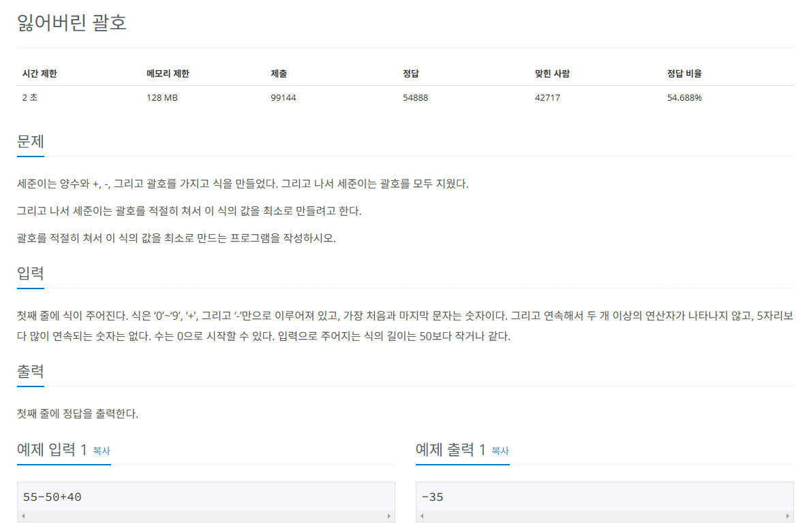

## 문제
   
[백준 온라인 저지 1541번](https://www.acmicpc.net/problem/1541)

### 1. 문제 분석하기
* 그리디의 관점에서, 가장 작은 최솟값을 만들기 위해서는 `가능한 한 큰 수`를 `빼야 함`.
* `더하기`가 해당하는 부분에 `괄호`를 쳐서 먼저 모두 계산한 후 빼기를 실행.
* 빼기 되는 숫자가 최대한 커지게 하는 것것

### 2. 과정
#### 1) 가장 먼저 `더하기` 연산 진행
* 100 - (40 + 50 + 74) - (30 + 29) - (45 + 43 + 11)
* 100 - 164 - 59 - 99

#### 2) `가장 앞에 있는 값`에서 더하기 연산으로 나온 `결괏값`들을 모두 뺀다.

## 결과
```
answer = 0
# 들어온 데이터를 "-" 기호를 기준으로 split
# 100-40+50+74-30+29-45+43+11
# ['100', '40+50+74', '30+29', '45+43+11\n']
A = list(map(str, input().split('-')))

# 현재 String에 있는 수를 모두 더하는 함수 구현
# 현재 들어온 String 값을 "+"기호 기준으로 split() 수행
def mySum(i):
    sum = 0
    temp = str(i).split("+") # ['40', '50', '74']
    for i in temp:
        sum += int(i)
    return sum

for i in range(len(A)):
    temp = mySum(A[i])
    if i == 0:
        # 가장 앞에 있는 값 더하기
        answer += temp
    else:
        # 뒷부분의 값은 합쳐서 빼기
        answer -= temp

print(answer)
```