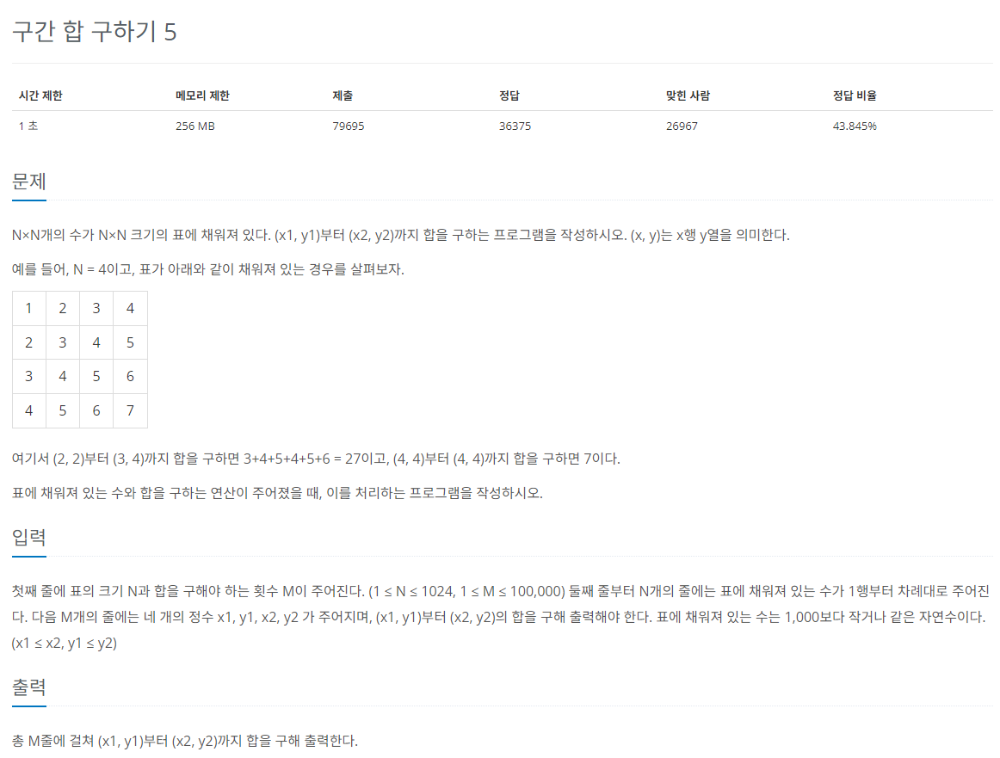

# 구간 합 구하기 5

## 1. 합 배열 S의 정의
```
S[i] = A[0] + A[1] + A[2] + A[3] + ... + A[i]
```

## 2. 합 배열 S를 만드는 공식
```
S[i] = S[i-1] + A[i]
```

## 3. i부터 j까지 구간 합을 구하는 공식
```
S[j] - S[i-1]
```

## 4. 2차원 구간 합 배열 D[X][Y] 정의
```
D[X][Y] = 원본 배열의 (0,0)부터 (X,Y)까지의 사각형 영역 안에 있는 수의 합
```

## 5. D[i][j]의 값을 채우는 구간 합 공식
```
D[i][j] = D[i][j-1] + D[i-1][j] - D[i-1][j-1] + A[i][j]
```

## 6. 질의 X1. Y1, X2, Y2에 대한 답을 구간 합으로 구하는 방법
```
D[X2][Y2] - D[X1-1][Y2] - D[X2][Y1-1] + D[X1-1][Y1-1]
```

## 문제
   
[백준 온라인 저지 11660번](https://www.acmicpc.net/problem/11660)

## 정답
```
import sys
input = sys.stdin.readline()
n, m = map(int, input().split())
A = [[0] * (n + 1)] # 인덱스를 편하게 하기 위해 0번째를 0으로 초기화
D = [[0] * (n + 1) for _ in range(n + 1)]

# 입력한 행을 A 배열에 하나씩 넣어서 2차원 배열 만들기
for i in range(n):
  A_row = [0] + [int(x) for x in input().split()]
  A.append(A_row)

for i in range(1, n + 1): # 배열의 0번째들은 다 0으로 초기화했으니 범위를 이렇게
  for j in range(1, n + 1):
    # 합 배열 구하기
    D[i][j] = D[i][j-1] + D[i-1][j] - D[i-1][j-1] + A[i][j]

for _ in range(m):
  x1, x2, y1, y2 = map(int, input().splist())
  # 구간 합 배열로 질의에 답변
  result = D[x2][y2] - D[x1-1][y2] - D[x2][y1-1] + D[x1-1][y1-1]
  print(result)
```