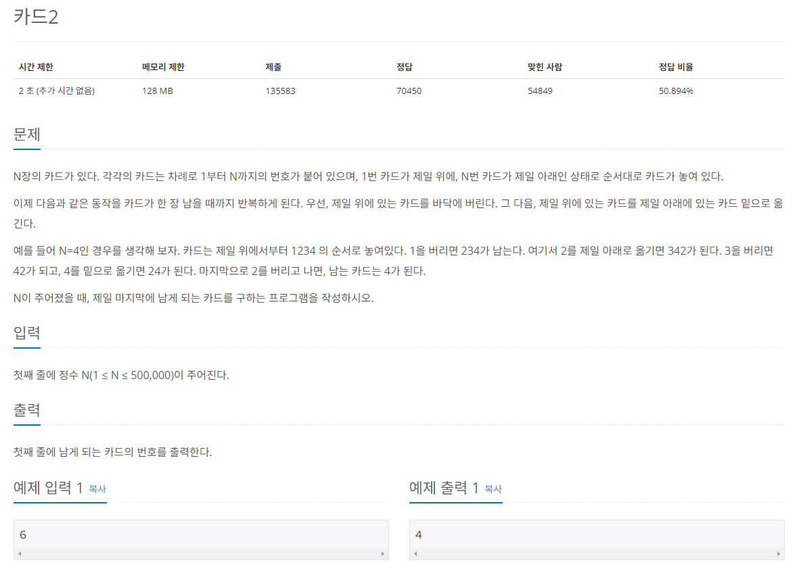

## 문제
   
[백준 온라인 저지 2164번](https://www.acmicpc.net/problem/2164)

## 핵심 아이디어
### 1. 큐의 선입선출 성질
* 가장 위의 카드를 가장 아래에 있는 카드 밑으로 옮기는 것


## 풀이 스킬
### 1. popleft()
* 맨 앞의 카드를 버리는 것

### 2. popleft() -> append()
* 가장 위의 카드 빼기
* 가장 아래로 옮기기


## 정답
```
from collections import deque
N = int(input())
myQueue = deque()

for i in range(1, N+1):
  myQueue.append(i)

while len(myQueue) > 1:
  # 카드가 1장 남을 때까지
  myQueue.popleft() # 맨 위의 카드를 버림
  myQueue.append(myQueue.popleft()) # 맨 위의 카드를 가장 아래 카드 밑으로 이동

# 마지막으로 남은 카드 출력
print(myQueue[0])
```