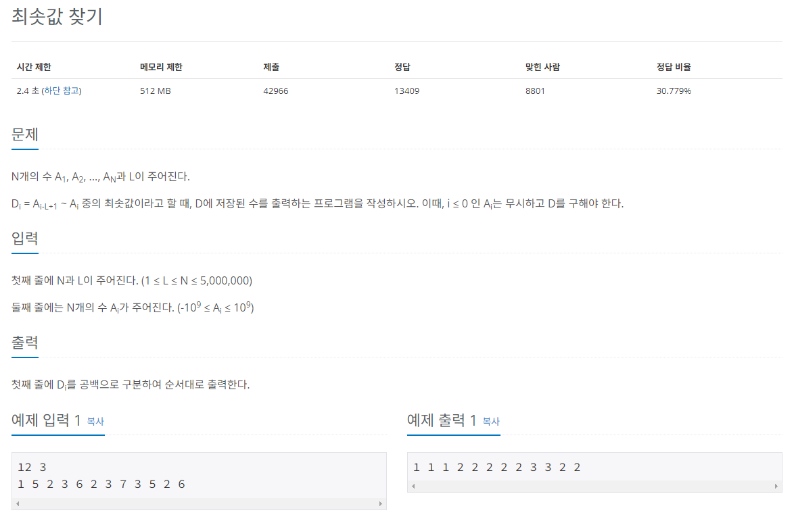

## 문제
   
[백준 온라인 저지 11003번](https://www.acmicpc.net/problem/11003)

## 핵심 아이디어
### 1. 슬라이딩 윈도우
* 일정 범위 안에서 최솟값을 구하는 문제
* 최솟값의 범위는 i-L+1부터 i까지이므로 L로 생각하면 됨.

### 2. 최솟값을 찾기 위한 정렬
* 일반적으로 정렬은 O(nlogn)
* N, L의 최대 범위가 5,000,000인 문제에서는 O(N)으로 해결해야 함
* 슬라이딩 윈도우를 덱으로 구현하여 정렬 효과를 볼 수 있다.

   

### 3. 덱(deque)
* 양방향 큐
* 양 끝에서 데이터를 삽입하거나 삭제할 수 있다.
* 왼쪽 : appendleft(), popleft()
* 오른쪽 : append(), pop()

## 풀이 스킬
### 1. 덱을 이용하여 정렬
#### 1.1. (인덱스, 숫자) 형태로 저장
* 덱에서는 (인덱스, 숫자) 형태의 노드로 저장함.

#### 1.2. 새 노드가 저장될 때 뒤에서부터 비교
* 새 노드 (3, 2)가 저장될 때 덱 맨 뒤에 있는 (2, 5)와 비교
* (2, 5)는 (3, 2)보다 숫자가 크므로 (2, 5)는 pop처리
* 이어서 (1, 1)은 (3, 2)보다 숫자가 작으므로 탐색을 멈추고 (3, 2)를 append처리
* 인덱스 범위는 1~3으로 슬라이딩 윈도우의 크기인 3과 같다.
* 최솟값은 덱 처음에 있는 (1, 1)의 숫자값인 1

#### 1.3. 인덱스 범위가 슬라이딩 윈도우를 벗어남
* 새 노드 (4, 3)은 덱 뒤에서부터 비교했을 때 (3, 2)보다 숫자가 크므로 덱에 저장
* 인덱스 범위에 의해 덱 앞쪽 노드가 제거
* (1, 1)은 덱에서 제거 해야함.
* 제거가 끝난 후 최솟값은 (3, 2)의 숫자값인 2

### 2. 정답을 출력하는 과정
#### 2.1. 최초 (1, 1)이 덱에 추가되면 비교 대상이 없고 범위 내이므로 1을 출력
#### 2.2. (2, 5)는 (1, 1)과 숫자를 비교했을 때 더 크므로 탐색을 멈춤.
* 인덱스 범위 내이므로 다시 1을 출력한다.
#### 2.3. (3, 2)는 (2, 5)보다 작으므로 (2, 5)를 덱에서 제거한다.
* 범위를 초과하면 맨 앞을 제거하고 새로운 맨 앞 최솟값을 출력한다.

## 정답
```
from collections import deque
N, L = map(int, input().split())
mydeque = deque()
now = list(map(int, input().split()))

# 새로운 값이 들어올 때마다 정렬 대신 현재 수보다 큰 값을 덱에서 제거해 시간 복잡도를 줄임
for i in range(N):
  while mydeque and mydeque[-1][0] > now[i]: 
  # 덱 안의 숫자는 3개로 유지됨
  # 현재 처리하는 now의 숫자보다 mydeque 맨 뒤 숫자값이 큼.
    mydeque.pop()
  # now[i] 가 mydeque 맨 뒤 숫자값보다 크면 탐색을 멈추고 덱에 추가
  mydeque.append((now[i], i))
  # 범위에서 벗어난 값은 덱에서 제거
  # 맨 앞 노드의 인덱스가 현재 i번째에서 L만큼 뺀 번호보다 같거나 작으면 
  if mydeque[0][1] <= i - L:
    mydeque.popleft()
  print(mydeque[0][0], end=' ')
  
```