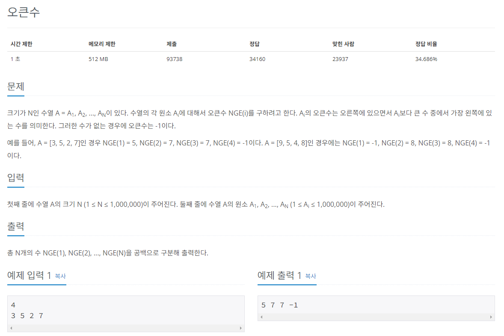

## 문제
   
[백준 온라인 저지 17298번](https://www.acmicpc.net/problem/17298)

## 핵심 아이디어
### 1. N의 최대 크기가 1,000,000
* 매번 반복해서 찾으면 시간 초과함.

### 2. 스택에 수를 넣고 top과 새로 들어오는 수를 비교함.
* 스택에 새로 들어오는 수가 top에 존재하는 수보다 크면 그 수는 오큰수가 된다.
* 오큰수가 존재하면 pop 시킴
* pop은 은 새로 들어오는 수가 top보다 클 때까지 반복함.

### 3. 스택에 남은 수는 오큰수가 없다.
* 오큰수를 구한 후 수열에서 오큰수가 존재하지 않는 숫자에 -1을 출력해야 한다. 

## 풀이 스킬
### 1. 스택에 인덱스를 저장.
 * 오큰수를 만족하는 상황에서 top을 pop하여 그 인덱스에 새로 들어오는 수의 값을 저장함.
 * result[top] = A[index]
 * 현재 인덱스를 스택에 append 하고 다음으로 넘어감
 * 남아있는 인덱스의 result 값은 -1

## 정답
```
n = int(input())
ans = [0] * n
A = list(map(int, input().split()))
myStack = []

for i in range(n):
  # 스택이 비어 있지 않고, 현재 수열이 스택 top 인덱스가 가리키는 수열보다 클 경우
  while myStack and A[myStack[-1]] < A[i]:
    ans[myStack.pop()] = A[i] # 정답 리스트에 오큰수를 현재 수열로 저장하기
  
  # top 이 가리키는 수보다 작거나 스택이 비었을 때
  myStack.app0end(i)

# 반복문을 다 돌고 나왔는데 스택이 비어 있지 않다면 빌 때까지
while myStack:
  ans[myStack.pop()] = -1

result = ""

for i in range(n):
  result += str(ans[i]) + " "

print(result)    
```