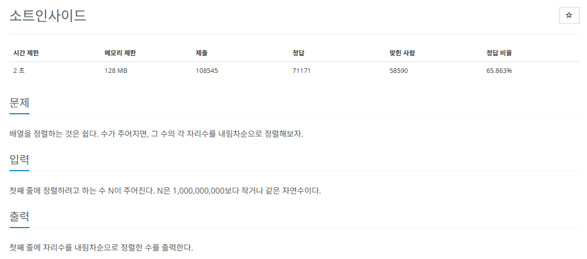
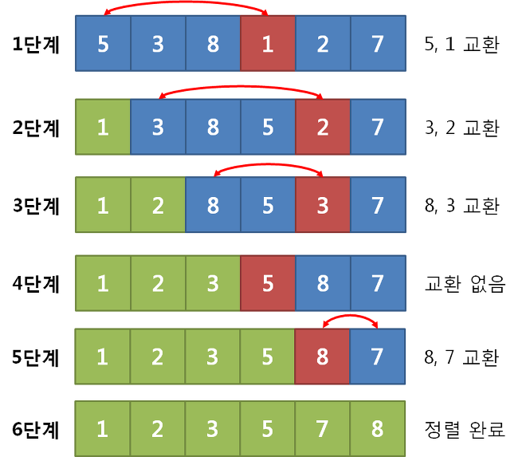

## 문제
   
[백준 온라인 저지 1427번](https://www.acmicpc.net/problem/1427)

### 1. 선택 정렬
`선택 정렬`은 정렬되지 않은 데이터들에 대해 최솟값 혹은 최댓값을을 찾아 가장 앞의 데이터와 교환해나가는 방식이다.
* 시간 복잡도 O(n^2)
* 루프를 돌면서 최솟값 혹은 최댓값을 남은 정렬 부분의 가장 앞의 데이터와 swap
  

### 2. 과정
#### 1) 남은 정렬 부분에서 최솟값 또는 최댓값을 찾는다.
#### 2) 남은 정렬 부분에서 가장 앞에 있는 데이터와 선택된 데이터를 swap 한다.
#### 3) 가장 앞에 있는 데이터의 위치를 변경해(index++) 남은 정렬 부분의 범위를 축소한다.
#### 4) 전체 데이터 크기만큼 index가 커질 때까지, 즉 남은 정렬 부분이 없을 때까지 반복한다.

## 정답
```
A = list(input())

for i in range(len(A)):
  Max = i
  for j in range(i+1, len(A)):
    if A[j] > A[Max]: # 내림차순이므로 최댓값을 찾음
      Max = j
  if A[i] < A[Max]: # 정렬 구간의 맨 앞과 비교해서 최댓값과 swap
    temp = A[i]
    A[i] = A[Max]
    A[Max] = temp

for i in range(len(A)):
  print(A[i])
```