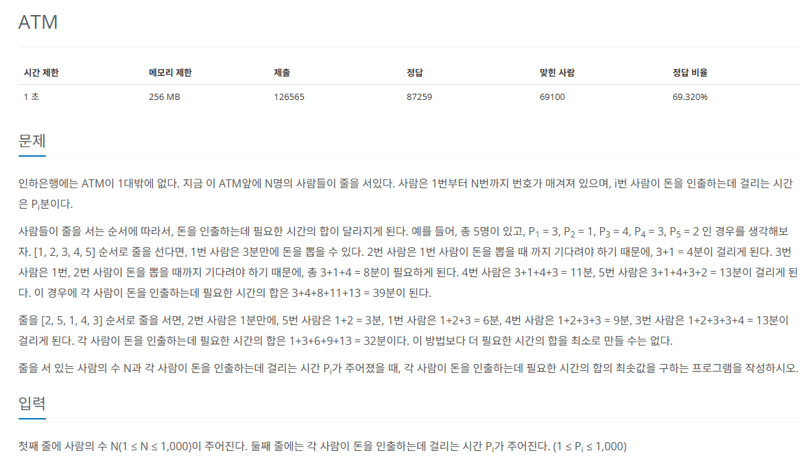
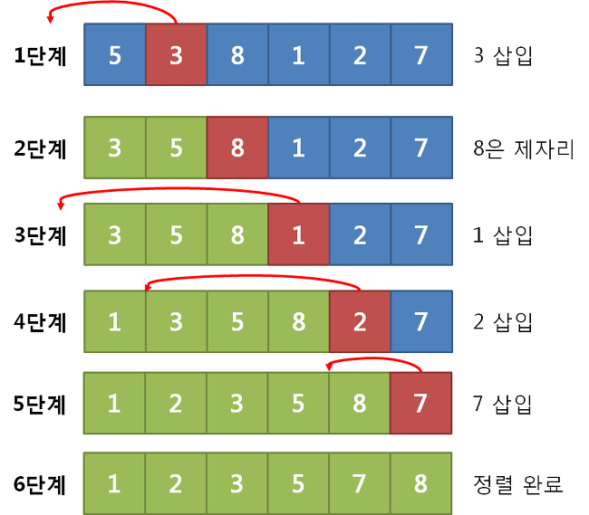

## 문제
   
[백준 온라인 저지 11399번](https://www.acmicpc.net/problem/11399)

### 1. 삽입 정렬
`삽입 정렬`은 이미 정렬된 데이터 범위에 정렬되지 않은 데이터를 적절한 위치에 삽입시켜 정렬하는 방식이다.
* 시간 복잡도 O(n^2)
* 모든 요소를 앞에서부터 차례대로 이미 정렬된 배열 부분과 비교하여 자신의 위치를 찾아 삽입
  

* 정렬된 앞 부분이 `부분집합 S`, 정렬되지 않은 나머지 요소들이 `부분집합 U`
* U에서 요소를 하나씩 꺼내서 이미 정렬된 부분집합 S의 마지막 원소부터 비교하면서 위치를 찾아 삽입
* 적절한 삽입 위치를 탐색하는 부분에서 이진 탐색 등과 같은 탐색 알고리즘을 사용하면 시간 복잡도를 줄일 수 있다.

### 2. 과정
#### 1) 현재 index에 있는 데이터 값을 선택한다.
#### 2) 현재 선택한 데이터가 정렬된 데이터 범위에 삽입될 위치를 탐색한다.
#### 3) 삽입 위치부터 index에 있는 위치까지 shift 연산을 수행한다.
#### 4) 삽입 위치에 현재 선택한 데이터를 삽입하고 index++ 연산을 수행한다.
#### 5) 전체 데이터의 크기만큼 index가 커질 때까지, 즉 선택할 데이터가 없을 때까지 반복한다.

### 3. 풀이 스킬
* 그리디 방식
  * ATM에 모든 사람이 가장 빠른 시간에 인출하는 방법
  * 시간이 가장 적게 걸리는 사람이 먼저 인출하기

## 정답
```
N = int(input())
A = list(map(int, input().split()))
S = [0] * N

for i in range(1, N): # 삽입 정렬
  insert_point = i # 정렬할 대상의 맨 앞
  insert_value = A[i]
  for j in range(i-1, -1, -1): # i - 1부터 0까지 감소 정렬 
    # 정렬된 부분집합을 맨 뒤부터 탐색
    if A[j] < A[i]: # 현재 정렬 대상이 정렬된 값 중 어떠한 값보다 크다면
      insert_point = j + 1 # 정렬된 값 중 어떠한 값의 뒤로 간다.
      break
    if j == 0: # 현재 정렬 대상이 정렬된 값들 중 가장 작은 경우
      insert_point = 0
  for j in range(i, insert_point, -1):
    # insert_point부터 i까지 뒤쪽에 있는 원소들을 한 칸씩 오른쪽으로 밀어주는 작업
    # A[j-1]이 A[j] 자리에 덮어쓰여지면 결국 오른쪽으로 미는 거임임
    A[j] = A[j-1]
  A[insert_point] = insert_value

S[0] = A[0]

for i in range(1, N):
  S[i] = S[i-1] + A[i]

sum = 0

for i in range(0, N):
  sum += S[i]

print(sum)
```