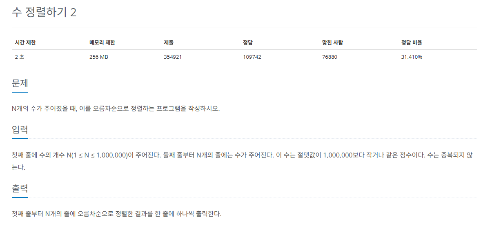
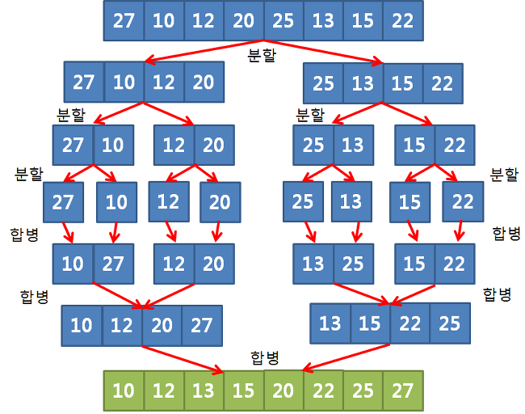

## 문제
   
[백준 온라인 저지 2751번](https://www.acmicpc.net/problem/2751)

### 1. 병합 정렬
`병합 정렬`은 분할 정복 방식을 사용해 데이터를 분할하고 분할한 집합을 정렬하며 합치는 알고리즘.
* 시간 복잡도 O(nlogn)
* 하나의 리스트를 두 개의 균등한 크기로 분할
* 분할된 부분 리스트들을 정렬
* 정렬된 부분 리스트들을 하나로 합치면서 전체를 정렬
* `분할 정복`과 `재귀 알고리즘`을 이용하여 정렬
  

### 2. 과정
* 투 포인터 개념을 활영하여 왼쪽, 오른쪽 그룹을 병합
* 왼쪽과 오른쪽의 값을 비교하여 작은 값을 결과 배열에 추가
* 포인터를 오른쪽으로 1칸 이동

#### 1) 정렬할 그룹을 최소 길이로 나눈다. (길이가 5이면 2,2,1 길이로 나눔)
#### 2) 각 그룹마다 index1, index2로 비교하며 tmp 배열에 병합 정렬 결과를 저장
#### 3) 병합된 그룹을 대상으로 하여 또 정렬

### 3. 결과
```
def merge_sort(s, e):
    if e - s < 1: return # 최소 단위로 쪼개지면 끝

    # (e - s)는 s와 e 사이의 차이를 나타냅니다.
    # (e - s) / 2는 그 차이를 절반으로 나누어, s로부터 중간값까지의 거리를 계산합니다.
    # s + (e - s) / 2는 s에서 그 절반만큼 더한 값으로, 중간값을 구합니다.
    m = int(s + (e - s) / 2)
    merge_sort(s, m)
    merge_sort(m+1, e) # 재귀로 쪼개기
    for i in range(s, e + 1):
        tmp[i] = A[i] # 원본 건들지 않고 tmp 배열 사용

    k = s # 임시값 k : 임시 정렬 배열에 저장할 자릿값
    index1 = s
    index2 = m + 1
    while index1 <= m and index2 <= e:
        # 두 그룹으로 나누어 index1은 왼쪽 그룹 내에서, index2는 오른쪽 그룹 내에서
        if tmp[index1] > tmp[index2]:
            # index2가 더 작으니까 임시 정렬 배열에 index2값 추가
            A[k] = tmp[index2]
            k += 1 # 임시 정렬 배열에 하나 추가했으니까 자리수도 1 추가
            index2 += 1
        else:
            A[k] = tmp[index1]
            k += 1
            index1 += 1
    while index1 <= m: # 한쪽 그룹이 모두 선택된 후 남아있는 값 정리
        A[k] = tmp[index1]
        k += 1
        index1 += 1
    while index2 <= e:
        A[k] = tmp[index2]
        k += 1
        index2 += 1

N = int(input())
A = [0] * int(N + 1)
tmp = [0] * int(N + 1)

for i in range(1, N+1):
    A[i] = int(input())

merge_sort(1, N)

for i in range(1, N+1):
    print(str(A[i]) + '\n')
```