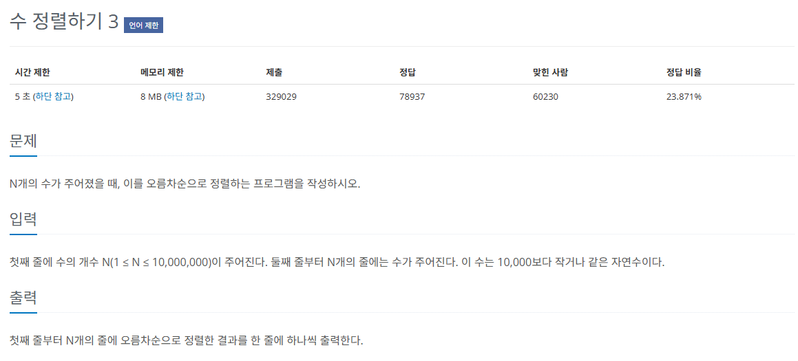

## 문제
   
[백준 온라인 저지 10989번](https://www.acmicpc.net/problem/10989)

### 1. 기수 정렬
* 값을 놓고 비교할 자릿수를 정한 다음 자릿수만 비교한다.
* 시간 복잡도 : O(kn)
* k는 데이터의 자릿수를 말한다.
  * 먼저 일의 자릿수를 기준으로 정렬
  * 그 다음 십의 자릿수로 정렬
  * 이렇게 자릿수를 늘려가며 정렬함.

### 2. 과정
#### 1) 10개를 큐를 이용함.
#### 2) 일의 자릿수를 기준으로 데이터 저장
#### 3) 일의 자리에서 정렬된 순서 기준으로 십의 자리에 저장하는 것이 중요

### 3. 계수 정렬
#### 1) 숫자 크기가 10,000보다 작기 때무네 10,001 크기의 리스트 선언
#### 2) 문제에서 입력하는 수를 차례로 받아 해당 인덱스의 값을 1 증가
#### 3) 리스트를 전체 탐색하면서 값이 0이 아닌 인덱스를 값만큼 반복하여 출력

### 3. 결과
```
N = int(input())
count = [0] * 10001

for i in range(N):
    count[int(input())] += 1

for i in range(10001):
    if count[i] != 0:
        for _ in range(count[i]):
            print(i)
```