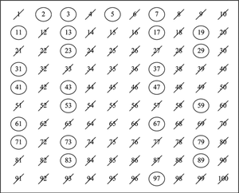
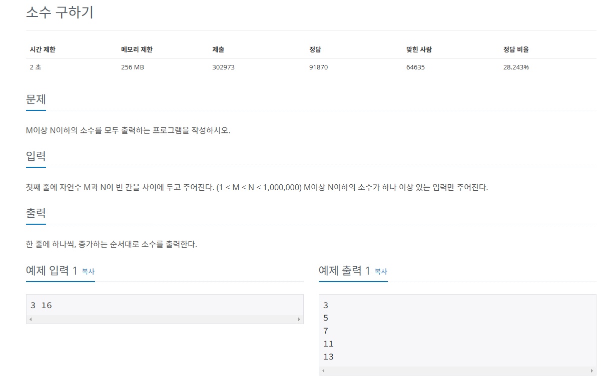

## 소수 구하기
* `소수(prime number)`는 자신보다 작은 2개의 자연수를 곱해 만들 수 없는 1보다 큰 자연수
* 수학에서 1과 그수 자신 이외의 자연수로는 나눌 수 없는, 1보다 큰 자연수
* 시간 복잡도 : 이론상 O(N^2) 이지만, 삭제되는 수를 고려하면 일반적으로 O(Nlog(logN))
### 에라토스테네스의 체
* `소수 구하기의 핵심 이론`
#### 1) 구하고자 하는 소수의 범위만큼 1차원 리스트를 생성한다.
* 1은 소수가 아니므로 삭제하고, 리스트는 2부터 시작한다.
#### 2) 2부터 시작하고 현재 숫자가 지워진 상태가 아닌 경우 현재 선택된 숫자의 배수에 해당하는 수를 리스트에서 끝까지 탐색하며 지운다.
* 선택한 수의 배수를 삭제 : 현재 2의 배수 모두 삭제
#### 3) 리스트의 끝까지 2를 반복한 후 리스트에서 남아있는 모든 수를 출력한다.
* 다음 지워지지 않은 수 선택 : 3
* 3의 배수 모두 삭제
* 4는 지워졌으니, 5 선택

   

## 문제
   
[백준 온라인 저지 1929번](https://www.acmicpc.net/problem/1929)

### 1. 문제 분석하기
* N의 최대 범위 : 1,000,000
* 일반적인 소수 구하기 방식
  * 2 이상부터 자기 자신보다 작은 수로 나눴을 때 나머지가 0이 아닌 수를 찾음.
* 시간 초과 방지를 위해 `에라토스테네스의 체` 방법으로 풀어야 함.

### 2. 과정
#### 1) 크기가 N + 1인 리스트를 선언한 후 값은 각각의 인덱스값으로 채운다.
* 소수 구하기에서는 0번째 사용하지 않음.

#### 2) 1은 소수가 아니므로 삭제.

#### 3) 2부터 N의 제곱근까지 값을 탐색
* 값이 인덱스값이면 그대로
* `그 값의 배수`를 탐색해 `0`으로 변경
* N의 `제곱근까`지만 탐색하는 이유
  * N의 제곱근이 n일 때, `N = a * b`를 만족하는 **a와 b가 모두 n보다 클 수는 없다.**
  * a가 n보다 크다면 b는 n보다 작아야 한다.
  * N보다 작은 수 가운데 소수가 아닌 수는, n보다 작은 약수를 가짐.
  * 따라서 n보다 작은 수들의 배수를 제거하면 소수가 아닌 수들이 모두 제거됨.

## 결과
```
import math
M, N = map(int, input().split())
A = [0] * (N+1)

for i in range(2, N + 1):
    A[i] = i

# 제곱근 까지만 수행
for i in range(2, int(math.sqrt(N)) + 1):
    if A[i] == 0:
        continue
    # 배수 지우기
    for j in range(i + i, N + 1, i):
        A[j] = 0

for i in range(M, N+1):
    if A[i] != 0:
        print(A[i])
```
