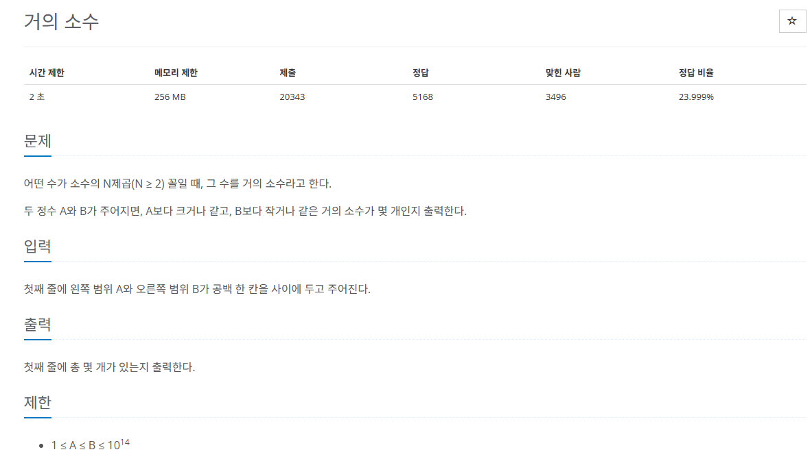

## 문제
   
[백준 온라인 저지 1456번](https://www.acmicpc.net/problem/1456)

### 1. 문제 분석하기
* 최대 범위에 해당하는 **모든 소수를 구해 놓고**, 이 소수들의 N제곱값이 입력된 A,B사이에 존재하는지 판단하기
* 입력에서 주어진 범위의 최댓값 `10^14`
  * 제곱근 10^7 까지 탐색

### 2. 과정
#### 1) 2 ~ 10,000,000 사이에 존재하는 모든 소수 구하기
* 2, 3, 5, 7, 11, 13, 17, 19, 23, 29, 31 ...

#### 2) 각각의 소수에 대해, `소수를 N제곱한 값`이 **B를 넘어갈 때까지** 반복문 실행
* 반복하는 중에 N제곱한 값이 A보다 크거나 같으면 거의 소수
* N제곱 값을 구하는 도중, 값이 `변수 표현 범위를 초과`하는 경우 발생
  * N^k과 B값이 아니라 `N과 B / N^k-1`을 비교
  * N^k를 직접 구하면 수가 너무 커져서 계산할 수 없을 때가 있기 때문에, N^k의 크기를 조작
    * `N^k <= B`가 성립하려면 `N^(k-1)과 B / N`을 비교하는 방법으로 풀 수 있음.

## 결과
```
import math
Min, Max = map(int, input().split())
A = [0] * (1000001)

# 10^14의 제곱근인 10^7까지 반복
for i in range(2, len(A)):
    # 각각의 인덱스값으로 초기화
    A[i] = i

# 제곱근까지만 수행
for i in range(2, int(math.sqrt(len(A)) + 1)):
    if A[i] == 0:
        continue
    for j in range(i + i, len(A), i): # 배수 지우기
        A[j] = 0

count = 0

for i in range(2, 1000001):
    if A[i] != 0:
        temp = A[i]
        # 변수 표현 범위를 넘어갈 수 있어 이항 정리로 처리
        # 제곱수임을 판별 (A[i])^2 <= Max
        while A[i] <= Max / temp:
            # (A[i])^2 <= Min
            if A[i] >= Min / temp:
                count += 1
            # 제곱해가며 [Min, Max] 범위에 포함되는지 확인
            temp = temp * A[i]

print(count)
```