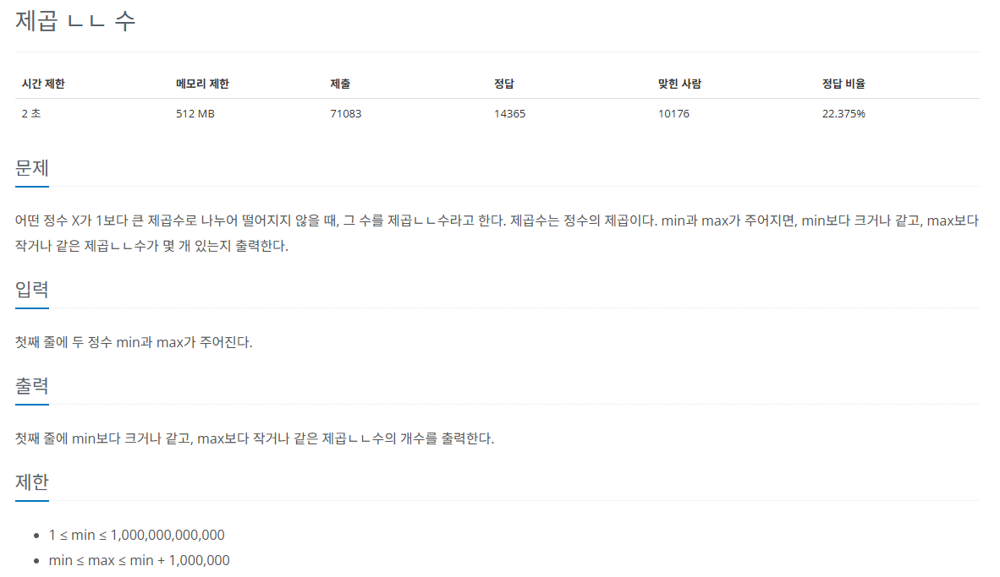

## 문제
   
[백준 온라인 저지 1016번](https://www.acmicpc.net/problem/1016)

### 1. 문제 분석하기
* min 최댓값이 매우 큰 것 같지만 min과 max 사이의 데이터만 확인하면 된다.
* 데이터를 순차적으로 탐색하지 않고 `에라토스테네스의 체` 알고리즘 방식을 제곱수 판별 로직에 적용한다.

### 2. 과정
#### 1) 2의 제곱수인 4부터 max값인 10까지 제곱수를 찾는다.
* 제곱수 4(2*2)
* start_index = 1 (min 값)
  * (4 * 1) - (최솟값 1) = 3번 인덱스는 제곱수
  * (4 * 2) - (최솟값 1) = 7번 인덱스는 제곱수수
  * (4 * 3) - (최솟값 1) = 11 (제곱수가 max = 10 넘으면 반복문 종료)

* 제곱수 9(3*3)
  * start_index = 1 (min 값)
  * (9 * 1) - 1 = 8번 인덱스는 제곱수
  * (9 * 2) max = 10 넘으므로 반복문 종료

* 제곱수 6(4*4)
  * 제곱수가 max보다 크므로 종료

#### 2) 탐색한 리스트에서 제곱수로 확인되지 않은 수의 개수를 센 후 출력한다.
* 3번, 7번, 8번 지우면 7개

## 결과
```python
import math
Min, Max = map(int, input().split())
# Min ~ Max 사이에 제곱수 판별 리스트
Check = [False] * (Max - Min + 1)

# 2 ~ Max 제곱근
for i in range(2, int(math.sqrt(Max) + 1)):
    pow = i * i
    # 나머지가 있는 경우 1을 더합니다.
    # start_index * pow = Min
    start_index = int(Min / pow)
    if Min % pow != 0:
        # 나머지가 있는 경우 1을 더해 Min 보다 큰 제곱수에서 시작하도록 설정
        start_index += 1
    for j in range(start_index, int(Max / pow) + 1):
        # 제곱수를 True로 변경
        Check[int((j * pow) - Min)] = True

count = 0

for i in range(0, Max - Min + 1):
    if not Check[i]:
        count += 1

print(count)
```

## ⌨️ ChatGPT
주어진 코드는 `[Min, Max]` 범위 내에서 **제곱수 차이로 표현될 수 있는 수**를 찾는 문제입니다. 주어진 코드에서 핵심적인 부분을 하나씩 설명하면서 `start_index`와 `Check` 배열을 사용하는 부분을 상세히 설명해 드리겠습니다.

### 1. **전체 코드 개요**

코드는 `[Min, Max]` 범위 내에서 각 수가 제곱수의 차이로 표현될 수 있는지를 판별하고, 그 수가 나타낼 수 없으면 카운트를 세는 방식입니다. 제곱수 차이로 나타낼 수 있는 수는 `p² - q²` 형태로 나타낼 수 있는 수이므로 이를 이용해 구간 내의 수들을 처리하려고 합니다.

---

### 2. **`start_index` 부분 설명**

```python
start_index = int(Min / pow)
if Min % pow != 0:
    start_index += 1
```

#### (1) `start_index = int(Min / pow)` 설명

이 부분은 `Min` 값 이상인 `pow = i * i`의 배수 중 가장 작은 값을 찾으려고 합니다.

- `Min / pow`는 `Min`이 `pow`로 나누어 떨어질 때, 최소 몇 번째 배수부터 시작할지를 계산하는 것입니다.
- 예를 들어, `Min = 10`이고 `pow = 9`일 때, `Min / pow = 10 / 9 = 1.11`이 되며, `int(Min / pow)`는 1이 됩니다. 즉, `pow = 9`의 배수로는 9, 18, 27, ... 이런 값들이 나오는데, 여기서 `Min`인 10 이상으로 시작하려면 2번째 배수인 18부터 시작해야 합니다.

#### (2) `if Min % pow != 0: start_index += 1` 설명

- 이 부분은 `Min`이 `pow`로 나누어 떨어지지 않으면, `start_index`를 한 번 더 증가시켜서 **`Min` 이상인 가장 작은 제곱수부터 시작**하도록 조정하는 부분입니다.
- 예를 들어, `Min = 10`이고 `pow = 9`일 때, `Min % pow != 0`이므로 `start_index`는 2가 되어야 합니다. 왜냐하면 9부터 시작하면 9가 작고 18부터 시작해야 하므로 `start_index += 1`로 보정해 줍니다.

---

### 3. **`for j in range(start_index, int(Max / pow) + 1)` 부분 설명**

```python
for j in range(start_index, int(Max / pow) + 1):
    # 제곱수를 True로 변경
    Check[int((j * pow) - Min)] = True
```

#### (1) `for j in range(start_index, int(Max / pow) + 1)` 설명

이 반복문은 `start_index`부터 `Max`까지 `pow`의 배수를 찾는 부분입니다. 여기서 `j`는 `pow`의 배수 인덱스를 나타냅니다. 

- `start_index`는 첫 번째 제곱수의 배수부터 시작하고, `int(Max / pow)`는 `pow`의 배수 중에서 `Max` 이하인 값들을 모두 처리합니다.
- 예를 들어, `Max = 50`이고 `pow = 9`일 때, `Max / pow = 50 / 9 ≈ 5.55`이므로, `int(Max / pow) = 5`가 됩니다. 따라서 `j`는 2부터 5까지 반복됩니다.

#### (2) `Check[int((j * pow) - Min)] = True` 설명

이 부분은 `Min`과 `Max` 구간 내에서 제곱수의 배수들이 **제곱수 차이로 표현될 수 있는 수**임을 `Check` 배열에 `True`로 표시하는 부분입니다.

- `j * pow`는 현재 `j` 번째 `pow`의 배수입니다. 예를 들어, `j = 2`일 때 `j * pow = 2 * 9 = 18`입니다.
- `Check[int((j * pow) - Min)] = True`는 `j * pow` 값이 `[Min, Max]` 구간 내에 있을 경우, 그 값을 `Check` 배열에서 표시하는 것입니다. `j * pow - Min`은 `[Min, Max]` 구간 내에서 `j * pow`가 어느 인덱스에 해당하는지를 나타냅니다.
  
  예를 들어:
  - `Min = 10`, `Max = 50`, `pow = 9`
  - `j = 2`일 때, `j * pow = 18`, `Check[18 - 10] = Check[8] = True`로 설정됩니다.
  - 즉, `[Min, Max]` 범위 내에서 18, 27, 36, 45, 54 등이 `pow = 9`의 배수이므로, 이 값들이 제곱수 차이로 표현될 수 있는 수로 표시됩니다.

---

### 4. **전체 흐름 요약**

1. **`start_index` 계산**: `Min` 이상인 `pow`의 배수를 찾아서 `start_index`를 결정합니다. 만약 `Min`이 `pow`의 배수로 정확히 나누어 떨어지지 않으면, 그 다음 배수부터 시작합니다.
2. **배수 처리**: `start_index`부터 시작해서 `pow`의 배수를 하나씩 증가시켜가며, 각 배수가 `[Min, Max]` 구간 내에 있는지 확인하고, 해당 인덱스를 `Check` 배열에서 `True`로 표시합니다.
3. **제곱수 차이로 표현될 수 있는 수 찾기**: 마지막으로 `Check` 배열에서 `False`인 값들은 제곱수 차이로 표현될 수 없는 수들이므로, 그 개수를 세어 출력합니다.

---

### 5. **코드 전체 동작 예시**

- 예를 들어, `Min = 10`과 `Max = 50`이 주어졌다면:
  - 제곱수의 배수(9, 16, 25, 36, 49 등)를 체크하고, 그 배수들이 `[10, 50]` 범위 내에서 제곱수 차이로 표현될 수 있는 수임을 표시합니다.
  - 마지막으로 `Check` 배열에서 `False`인 값의 개수를 세면 제곱수 차이로 표현될 수 없는 수들의 개수를 알 수 있습니다.

---

### 6. **요약**

이 코드는 `[Min, Max]` 구간 내에서 제곱수 차이로 표현될 수 있는 수들을 `Check` 배열을 사용하여 판별하고, 제곱수 차이로 표현될 수 없는 수의 개수를 출력합니다. 핵심 아이디어는 `pow = i²`의 배수를 찾아서 해당 범위 내에서 제곱수 차이로 표현될 수 있는 수들을 걸러내는 것입니다.