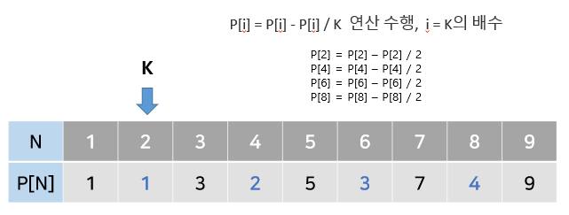
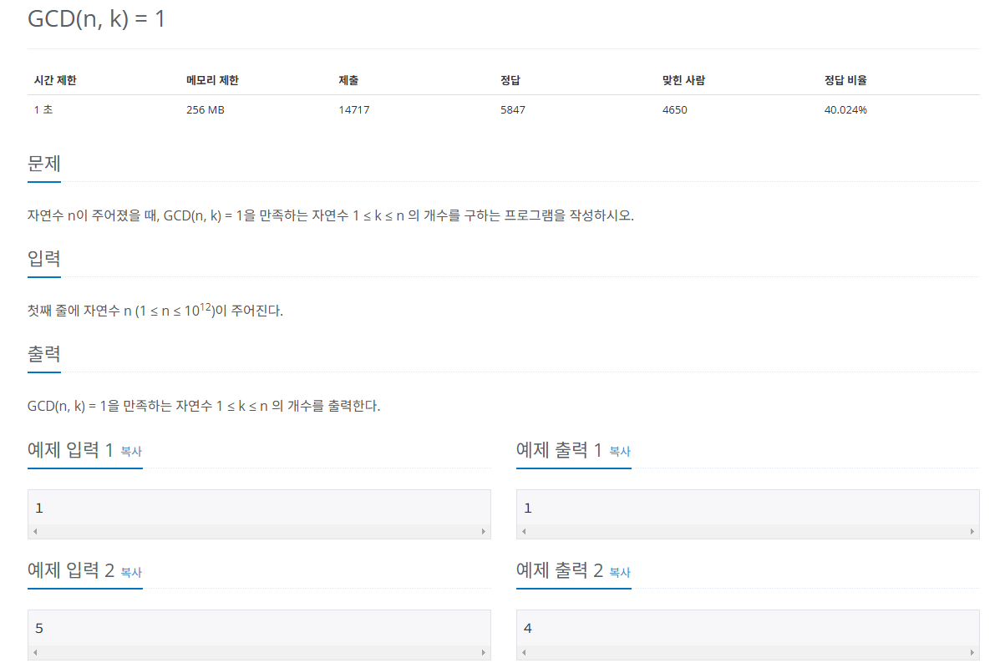

## 오일러 피
오일러 피 함수는 P[N] 정의는 1부터 N까지 범위에서 N과 `서로소`인 자연수의 개수

* 원리
#### 1) 구하고자 하는 오일러 피의 범위만큼 리스트를 `자기 자신의 인덱스`값으로 초기화한다,
#### 2) 2부터 시작해 현재 리스트의 값과 인덱스가 같으면 (=소수일 때) 현재 선택된 숫자(K)의 배수에 해당하는 수를 리스트에 끝까지 탐색하여 P[i] = P[i] - P[i] / K 연산을 수행한다. (i는 K의 배수)



## 문제
   
[백준 온라인 저지 11689번](https://www.acmicpc.net/problem/11689)

### 1. 문제 분석하기
* `GCD(n,k) = 1`을 만족하는 자연수의 개수가 오일러 피 함수의 정의이다.

### 2. 과정
#### 1) `서로소의 개수`를 표현하는 변수 result와 현재 `소인수 구성`을 표시하는 변수 n을 선언한다. 
  * 예제 입력 4의 경우 변수 초기화는 n = 45, result = 45

#### 2) 2 ~ N 제곱근까지 탐색하면서 소인수일 때 result = result - (result / 소인수) 연산으로 result 값 업데이트
* 이때 n에서 이 소인수는 나누기 연산으로 삭제
* P(현재 수) = 2 => n(45) % P(2) != 0 => 소인수가 아님
* P(현재 수) = 3 => n(45) % P(3) == 0 => 소인수이므로 값 업데이트
* result = 45 - 45 / 3 = 30
* n = 45 / 3^2
* P(현재 수) = 4 => 현재 n(5)의 제곱근보다 4가 크므로 반복문 종료

## 결과
```python
import math
N = int(input())
result = N

# 2 ~ n의 제곱근까지만 진행
for p in range(2, int(math.sqrt(N)) + 1):
    # 현재 p가 소인수인지
    if N % p == 0:
        result -= result / p
        # N에서 현재 소인수 내역을 제거
        # 2^7*11 이라면 2^7을 없애고 11만 남김
        while N % p == 0:
            N /= p

# 반복문에서 제곱근까지만 탐색했으므로 1개의 소인수가 누락되는 케이스 처리
# N이 마지막 소인수일때
if N > 1:
    result -= result / N

print(int(result))
```