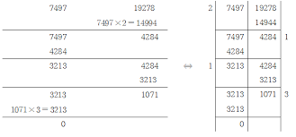
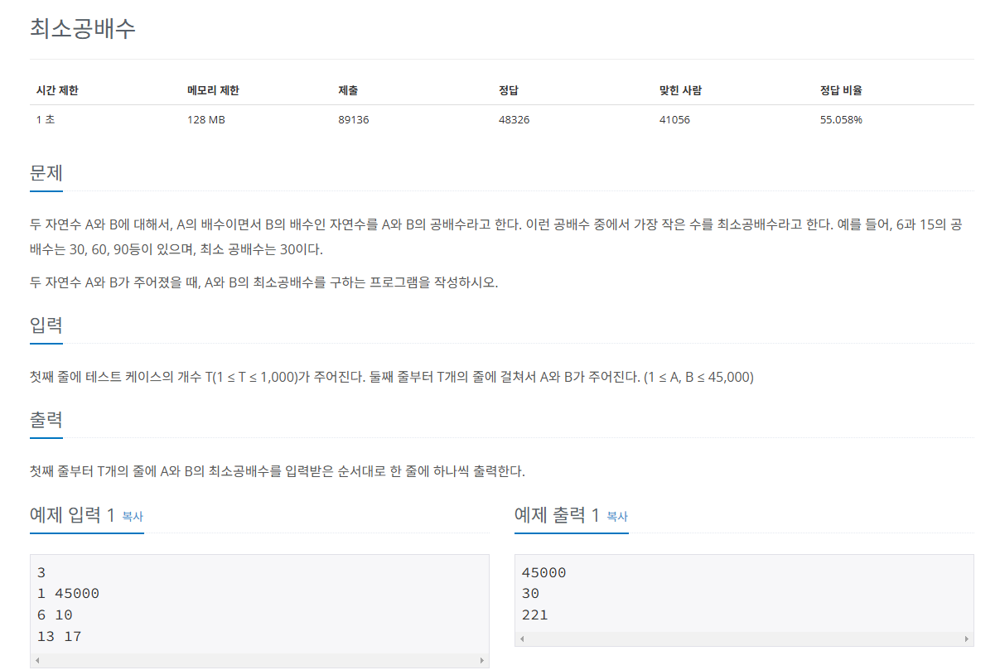

## 유클리드 호제법
`최대공약수`를 구하는 알고리즘

* `MOD` 연산이 핵심
* 큰 수를 작은 수로 나누는 MOD 연산을 수행한다.
* 앞 단계에서 작은 수와 MOD 연산 결괏값(나머지)으로 MOD연산을 수행한다.
* 반복하다가 나머지가 0이 되는 순간의 작은 수를 최대공약수로 선택한다.



## 문제
   
[백준 온라인 저지 1934번](https://www.acmicpc.net/problem/1934)

### 1. 문제 분석하기
* `최소 공배수 = A * B / 최대 공약수`

### 2. 과정
#### 1) 유클리드 호제법을 이용해 A, B의 최대 공약수를 구합니다.
#### 2) 두 수의 곱을 최대 공약수로 나눈 값을 정답으로 출력합니다.
* 최대 공약수가 2이므로 최소 공배수는 6 * 10 / 2 = 30

## 결과
```python
# 최대 공약수 gcd(a, b) 함수 구현
def gcd(a, b):
    if b == 0:
        return a
    else:
        return gcd(b, a % b) # 재귀 형태로 구현

t = int(input())

for i in range(t):
    a, b = map(int, input().split())
    result = a * b / gcd(a, b)
    print(int(result))
```