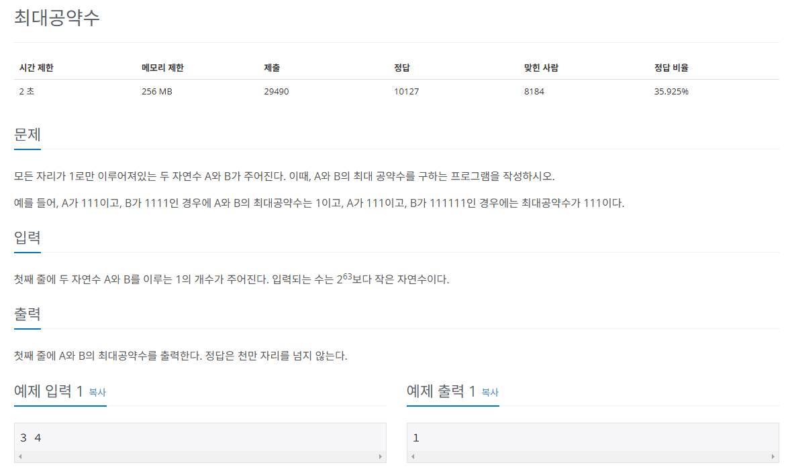

## 문제
   
[백준 온라인 저지 1850번](https://www.acmicpc.net/problem/1850)

### 1. 문제 분석하기
* 입력값이 크면 단순한 방법으로 찾을 수 없음.
* 규칙 찾기
  * 수의 길이를 나타내는 두 수의 최대 공약수는 `A와 B의 최대 공약수를 길이`를 나타낸다.
  * 3, 6의 최대 공약수 3은 111이다.

### 2. 과정
#### 1) `유클리드 호제법`을 통해 A, B의 최대 공약수를 구합니다.
#### 2) 공약수의 길이만큼 1을 반복해 출력합니다.

## 결과
```python
# gcd(작은 수, 큰 수)
def gcd(a, b):
    if b == 0:
        return a
    else:
        return gcd(b, a % b)

a, b = map(int, input().split())
result = gcd(a, b)

while result > 0:
    print(1, end='')
    result -= 1
```
