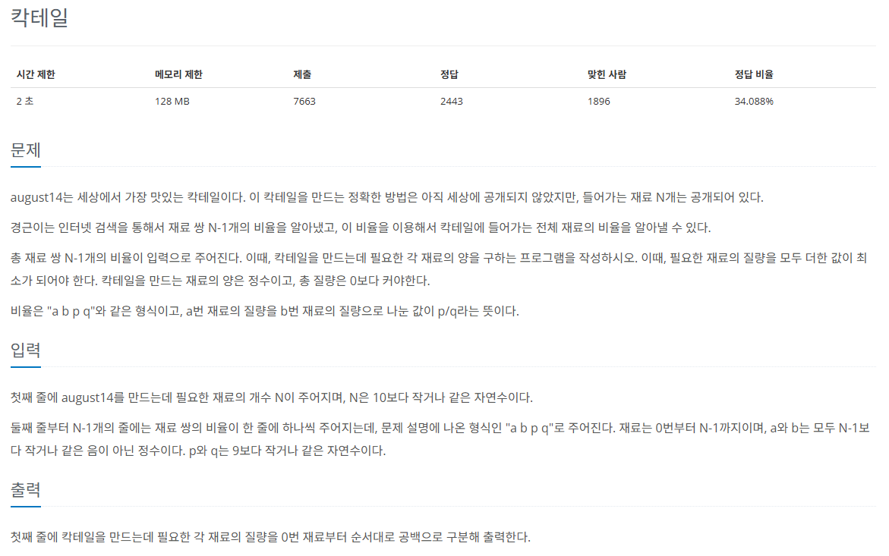
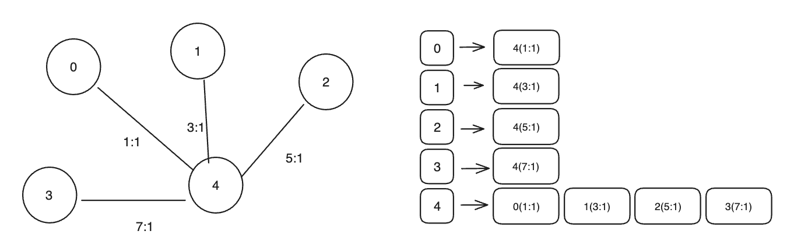

## 문제
   
[백준 온라인 저지 1033번](https://www.acmicpc.net/problem/1033)

### 1. 문제 분석하기
* `N - 1개의 비율`로 `N개의 재료와 관련된 전체 비율`을 알아낼 수 있다.
* 그래프 관점으로 생각하면 `사이클이 없는 트리` 구조
* 임의의 노드에서 DFS를 진행하고 그 과정에서 `유클리드 호제법` 사용
  * `최대 공약수`와 `최소 공배수`를 구한다.

### 2. 과정
#### 1) `인접 리스트`를 이용해 각 재료의 비율 자료를 그래프로 구현


#### 2) 데이터를 저장할 때마다 비율과 관련된 수들의 `최소 공배수` 업데이트
* A, B의 최소 공배수는 A * B / 최대 공약수
* 비율을 통일된 기준으로 계산하여 모든 재료들의 정확한 값을 구하기 위함

#### 3) `임의의 시작점`에 `최소 공배수` 값을 저장한다.

#### 4) `임의의 시작점`에서 `DFS`로 탐색을 수행하면서 `각 노드의 값`을 `이전 노드의 값과의 비율 계산`을 통해 계산하고 저장한다.
* 0을 임의의 점으로 선전 => 0에서 DFS로 탐색을 수행하면 0 -> 4-> 1-> 2-> 3 순으로 탐색
* 4 = 0번 노드값 * 1/1 = 105
* 1 = 4번 노드값 * 1/3 = 35
* 2 = 4번 노드값 * 1/5 = 21
* 3 = 4번 노드값 * 1/7 = 15

#### 5) 각 노드의 값을 모든 노드의 최대 공약수로 나눈 뒤 출력한다.
* 105, 35, 21, 15의 `최대 공약수`는 1
* 각 리스트의 밗을 1로 나눈 뒤 출력
* 105 35 21 15 105

## 결과
```python
N =  int(input()) # 재료의 개수
A = [[] for _ in range(N)] # 인접 리스트
visited = [False] * (N) # 방문 리스트
D = [0] * (N) # 각 노드값 저장 리스트
lcm = 1 # 최소 공배수

def gcd(a, b): # 최대 공약수 함수 구현
    if b == 0:
        return a
    else:
        return gcd(b, a % b)

def DFS(v): # DFS 탐색 함수 구현
    visited[v] = True
    for i in A[v]:
        next = i[0] # 다음 노드의 인덱스
        if not visited[next]:
            # 다음 노드의 값 = 현재 노드의 값 * 비율
            D[next] = D[v] * i[2] // i[1]
            DFS(next)

for i in range(N-1):
    a, b, p, q = map(int, input().split())
    A[a].append((b, p, q))
    A[b].append((a, q, p))
    # 비율 간의 최소 공배수를 저장
    lcm *= (p * q // gcd(p, q))

# 임의의 시작점에 최소 공배수를 저장
D[0] = lcm
DFS(0)
# D 리스트 값들의 최대 공약수 계산
mgcd = D[0]
for i in range(1, N):
    mgcd = gcd(mgcd, D[i])

for i in range(N):
    print(int(D[i] // mgcd), end=' ')
```