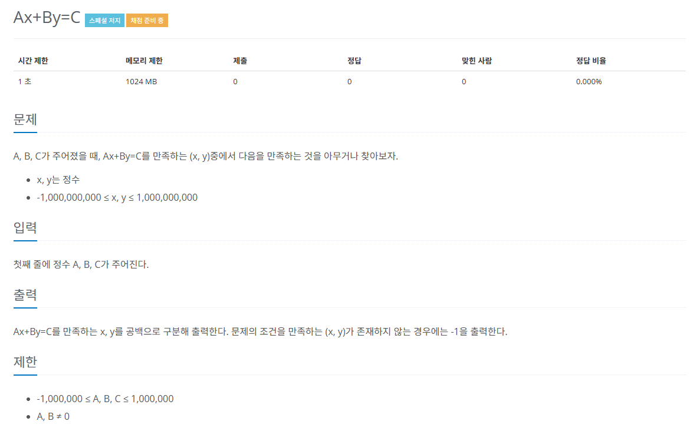

## 확장 유클리드 호제법
* 유클리드 호제법의 목적 : 두 수의 `최대공약수` 구하기
* 확장 유클리드 호제법 : `방정식의 해` 구하기

### 핵심 이론
* 해를 구하고자 하는 방정식
$$ax + by = c (a, b, c, x, y는 정수)$$

* c % gcd(a, b) = 0 인 경우에만 `정수해`를 가진다.
* $ax + by = c$가 `정수해를 갖게 하는 c의 최솟값`이 `gcd(a, b)` 이다.

$$5x + 9y = 2$$

#### 1) 5x + 9y가 정수해를 갖게 하는 c의 최솟값이 $gcd(5, 9)$라는 것을 적용한다.
* $gcd(5, 9) = 1$
* $5x + 9y = 1$

#### 2) a, b로 유클리드 호제법을 반복 실행하며 몫, 나머지를 저장한다. 나머지가 0이 되면 중단한다.
|유클리드 호제법 실행|나머지|몫|
|:---:|:---:|:---:|
|5 % 9 = 5|5|0|
|9 % 5 = 4|4|1|
|5 % 4 = 1|1|1|
|4 % 1 = 0|0|4|

#### 3) 반복으로 구한 나머지와 몫을 이용하여 거꾸로 올라가며 계산
* `x'는 이전 x`, `y'는 이전 y`, `q는 현재 보고 있는 몫`
* x = y'
* y = x' - y' * q
* 처음 x, y는 이전이 없으므로 1, 0으로 지정하여 역계산

|나머지|몫|`x = y'` `y = x' - y' * q` 역순 계산|
|:---:|:---:|:---:|
|5|0|x = 2, y = -1 - (2 * 0) = -1|
|4|1|x = -1, y = 1 - (-1 * 1) = 2|
|1|1|x = 1, y = 0 - (1 * 1) = -1|
|0|4|x = 0, y = 1 - (0 * 4) = 1|

#### 4) 재귀 방식으로 알아낸 최종 x, y는 ax + by = gcd(a, b)를 만족한다.
* $a = 5$, $b = 9$일 때, 구한 해는 $x = 2$, $y = -1$
$$5(2) + 9(-1) = 1$$
* 이 식을 만족하는 $x = 2$, $y = -1$ 는 **gcd(5, 9) = 1**일 때의 해이다.
* 주어진 C값인 2에 맞게 해를 확장해야 한다.
* 구한 해에 `c / gcd(a, b)`를 곱해줘야 한다.
  * c / gcd(a, b) = K를 가정하면 `최초 방정식의 해`는 Kx, Ky
  * 과정 3에서 찾은 x = 2, y = -1
  * K값은 2(c값) / 1(최대 공약수) = 2 
  * 2의 값을 기존의 x(2), y(-1)에 각각 곱한다.
* 최초 방정식의 해 : 4, -2

## 문제
   
[백준 온라인 저지 21568번](https://www.acmicpc.net/problem/21568)

### 1. 문제 분석하기
* `확장 유클리드 호제법`을 그대로 구현하면 됨.

### 2. 과정
#### 1) C의 값이 A와 B의 `최대 공약수의 배수 형태`인지 확인.
* 최대 공약수의 배수 형태라면 C의 값을 최대 공약수로 변경
* 최대 공약수의 배수 형태가 아니라면 -1 을 출력하고 프로그램 종료.
```
3x + 4y = 5
```
* 3과 4의 최대 공약수는 1
* 5는 1의 배수이므로 C를 1로 변경
```
3x + 4y = 1
```

#### 2) A와 B에 관해 0이 나올 때까지 유클리드 호제법을 수행한다.
|유클리드 호제법 실행|나머지|몫|
|:---:|:---:|:---:|
|3 % 4 = 3|3|0|
|4 % 3 = 1|1|1|
|3 % 1 = 0|0|3|

#### 3) 나머지가 0이 나오면 x = 1, y = 0으로 설정한 후 과정 2에서 구한 몫들을 식(`x = y'` `y = x' - y' * q`)에 대입하면서 역순으로 계산

|나머지|몫|`x = y'` `y = x' - y' * q` 역순 계산|
|:---:|:---:|:---:|
|3|1|x = -1, y = 1 - (-1 * 0) = 1|
|1|1|x = 1, y = 0 - (1 * 1) = -1|
|0|3|x = 0, y = 1 - (0 * 3) = 1|

#### 4) 최종으로 계산된 x, y 값에 C를 x와 y의 최대 공약수로 나눈 값을 각각 곱해 방정식의 해를 구한다.
* 최종 x, y => -1, 1
* `c / gcd(a, b)` = 5 / 1 = 5
* 최초 방정식의 해 : $x = -5$, $y = 5$

## 결과
```python
a, b, c = map(int, input().split())

def gcd(a, b):
    if b == 0:
        return a
    else:
        return gcd(b, a % b)

# 유클리드 호제법 함수 구현
def Excute(a, b):
    ret = [0] * 2
    # 재귀 함수를 중단하고, x, y를 각각 1, 0으로 설정하여 return
    if b == 0:
        ret[0] = 1
        ret[1] = 0
        return ret
    q = a // b
    # 재귀 함수로 유클리드 호제법 수행
    v = Excute(b, a % b)
    # x = y', y = x' - y' * q 몫을 계산하는 역산 로직 구현
    # 재귀에서 빠져나오는 영역에서 실행하면 자연스럽게 역순이 됨
    ret[0] = v[1]
    ret[1] = v[0] - v[1] * q
    return ret

mgcd = gcd(a, b)

if c % mgcd != 0:
    print(-1)
else:
    mok = int(c / mgcd)
    ret = Excute(a, b)
    print(ret[0] * mok, end=' ')
    print(ret[1] * mok)
```