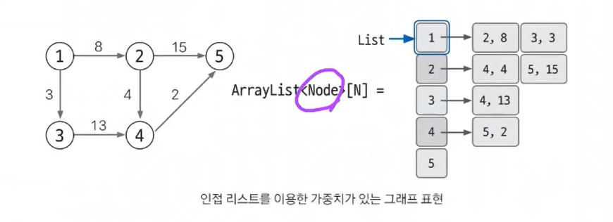

## 그래프의 개념
  * 정점과 간선으로 이루어진 자료구조의 일종. G = (V, E)

## 그래프의 표현

* `2차원 리스트 생성`
  * 0으로 초기화한 행(row) 개수 3, 열(column) 개수 4인 2차원 리스트
  * 리스트로 객체를 생성하는 방법 <- **이 방법을 써야 함!**
  ```
  A = [[0 for col in range(4)] for row in range(3)]
  ```
  * ~~얕은 복사를 일으켜 생성하는 방법~~ <- **이 방법은 쓰면 안됨!**
  ```
  A = [[0] * 4] * 3
  # 복사를 하는 것이기 때문에 A[0][0] 값을 바꾸면 A[1][0], A[2][0]도 바뀜.
  ```

### 1. 에지 리스트
  * `에지를 중심`으로 그래프를 표현한다.
  * 리스트에 `출발 노드`, `도착 노드`를 저장하여 에지를 표현한다.
  * 특정 노드와 관련되어 있는 에지를 탐색하기는 쉽지 않다.
  * 에지 리스트는 노드 사이의 최단 거리를 구하는 `벨만-포드`나 최소 신장 트리를 찾는 `크루스칼 알고리즘`에 사용용

#### 1) 에지 리스트로 가중치 없는 그래프 표현하기
* 가중치가 없는 그래프는 출발 노드와 도착 노드만 표현한다.
* 리스트의 열은 `2개`

   

* 1에서 2로 뻗어나가는 에지는 [1,2] 로 표현
* 4에서 5로 뻗어나가는 에지는 [4,5] 로 표현
* 만약 방향이 없는 그래프면 [1,2]와 [2,1]는 같은 표현임

#### 2) 에지 리스트로 가중치 있는 그래프 표현하기
* 열을 `3개`로 늘려 3번째 열에 가중치를 저장


* 1에서 2로 향하는 가중치가 8인 에지는 [1,2,8]로 표현

### 2. 인접 행렬
* 2차원 리스트로 이용
* 에지 리스트와 다르게 `노드 중심`으로 그래프 표현
* `에지의 여부`와 `가중치값`을 리스트에 `직접 접근`하면 바로 확인할 수 있음
* 노드와 관련되어 있는 에지를 탐색하려면 N번 접근해야 하므로 시간 복잡도와 효율성 떨어짐.

#### 1) 인접 행렬로 가중치 없는 그래프 표현하기
* 1에서 2를 향하는 에지는 1행 2열에 1을 저장
* 1을 저장하는 이유는 가중치가 없기 때문
* 노드 중심이라고 이해하면 됨.


#### 2) 인접 행렬로 가중치 있는 그래프 표현하기
* 2에서 5로 향하는 에지의 가중치를 2행 5열에 기록한다.


### 3. 인접 리스트 **(가장 선호되는 방식)**
* 파이썬의 리스트를 이용하여 그래프를 표현
* `노드 개수`만큼 리스트를 선언
* 구현은 복잡하지만, 시간 복잡도와 공간 효율이 좋다.

#### 1) 인접 리스트로 가중치 없는 그래프 표현하기
* **N번 노드와 연결되어 있는 노드**를 리스트의 **index N**에 연결된 노드 개수만큼 리스트에 append
* 노드 1과 연결된 2,3 노드는 A[1]에 [2,3]을 연결하는 방식으로 표현


#### 2) 인접 리스트로 가중치 있는는 그래프 표현하기

* 가중치가 있는 경우 inpurt data를 2개`(도착 노드, 가중치)`로 사용



* A[1]에 [(2,8), (3,3)]이 연결되어 있다. 노드 1과 2가 가중치 8 에지로, 노드 1과 3이 가중치 3 에지로 연결되어 있다는 것이다.
