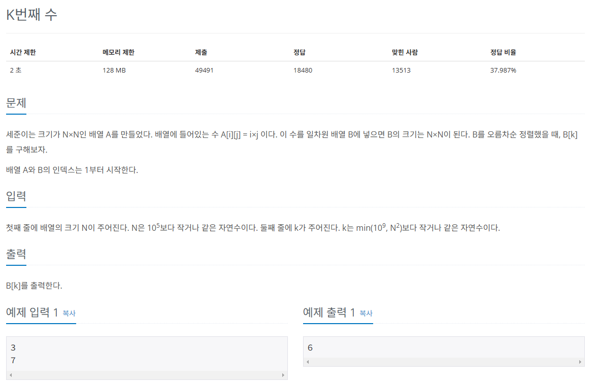

## 문제

   
[백준 온라인 저지 1300번](https://www.acmicpc.net/problem/1300)

### 1. 문제 분석하기
* 시간 복잡도가 N^2인 알고리즘은 사용할 수 없다.
* `이진 탐색`으로 중앙값보다 작은 수의 개수를 세면서 범위를 절반씩 줄임
* `작은 수의 개수`가 k-1개인 중앙값이 정답
* 이진 탐색을 떠올리는 것이 가장 어려운 문제

### 2. 과정
#### 1) 2차원 리스트 : N행이 N의 배수로 구성
* k번째 수는 k를 넘을 수 없음.
* N = 1 이어도 k번째는 1밖에 될 수 없음.
* N = 2 이어도 구성요소가 1,2,2,4 니까 k를 안 넘음.
* 2차원 리스트의 `1 ~ k번째`안에 정답이 있다.

#### 2) 이진 탐색의 `시작 인덱스를 1`, `종료 인덱스를 k`로 지정
* N = 3, k = 7
* [[1,2,3],[2,4,6],[3,6,9]]
* 최초의 `중앙값은 4`
  * 중앙값보다 `작거나 같은 수`, 즉 k가 될 가능성의 수
  * `중앙값을 N으로 나눈 값`
  * 단, 나눈 값이 N보다 크면 N임
    * 4 / 1 = (4이지만 N이 3이므로) 3
    * 4 / 2 = 2
    * 4 / 3 = 1
    * 1 + 2 + 3 = 6
* Math.min(middle / i, N)
* 중앙값 4는 6번째 수보다 큰 수가 될 수 없다.
  * k는 7이니까 중앙값 4보다 큰 범위에 있다.
* 이진 탐색 조건
  * 중앙값 크기보다 작은 수가 k보다 작으면 시작 인덱스 = 중앙값 + 1
  * 중앙값 크기보다 작은 수가 k보다 크거나 같으면 종료 인덱스 = 중앙값 - 1, 정답 변수 = 중앙값

## 결과
```
N = int(input())
K = int(input())
start = 1
end = K
ans = 0

# 이진 탐색 수행
while start <= end:
    middle = int((start + end) / 2)
    cnt = 0
    # 중앙값보다 작은 수 계산
    for i in range(1, N+1):
        cnt += min(int(middle / i), N) # 작은 수 카운트 핵심 로직
    if cnt < K:
        start = middle + 1
    else:
        ans = middle
        end = middle - 1

print(ans)
```