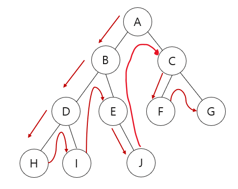

## 깊이 우선 탐색(DFS)
* 그래프 `완전 탐색 기법` 중 하니아다.
* 그래프의 `시작 노드`에서 출발하여 탐색할 한 쪽 분기를 정함.
* `최대 깊이까지 탐색`을 마친 후 다른 쪽 분기로 이동하여 다시 탐색함.
  * 미로를 탐색할 때 한 방향으로 갈 수 있을 때까지 계속 가다가 더 이상 갈 수 없게 되면 다시 가장 가까운 갈림길로 돌아와서 이곳으로부터 다른 방향으로 다시 탐색을 진행하는 방법과 유사

  

* 기능
  * 그래프 완전 탐색
* 특징
  * `재귀 함수`로 구현
  * 스택 자료구조 이용
* 시간 복잡도 (노드 수 : V, 에지 수 : E)
  * O(V + E)
* 주의 사항
  * 재귀 함수를 이용하므로 스택 오버플로에 유의해야 한다.
* 응용 문제
  * 단절점 찾기, 단절선 찾기, 사이클 찾기, 위상 정렬

### 1. DFS를 시작할 노드를 정한 후 사용할 자료구조 초기화하기
* `인접 리스트`로 그래프 표현하기
* `방문 리스트` 초기화하기
* 시작 노드 스택에 삽입하기

### 2. 스택에서 노드를 꺼낸 후 꺼낸 노드의 인접 노드를 다시 스택에 삽입
* `방문 리스트` 체크

### 3. 스택 자료구조에 값이 없을 때까지 반복
* 이미 다녀간 노드는 방문 리스트를 바탕으로 `재삽입하지 않음`.

### 구현 예시
```
def dfs(graph, start):
    visited = [] # 방문한 노드를 저장할 리스트
    stack = [start] # 시작 노드를 스택에 저장
    while stack:
        node = stack.pop() # 스택에서 노드를 꺼냄
        if node not in visited:
            visited.append(node) # 방문한 노드를 저장
            # graph[node] : node와 연결된 모든 이웃 노드들의 집합이나 리스트
            # set(visited) : 방문한 노드들의 집합 중복 제거
            # graph[node] = {1, 2, 3, 4} visited = {2, 3}
            # graph[node] - set(visited)는 {1, 4}
            stack.extend(graph[node] - set(visited)) 
            # stack.extend(...) 리스트에 다른 리스트나 집합의 원소들을 추가하는 메서드
            # 방문하지 않은 인접 노드를 스택에 추가
    return visited
```
## 문제
   
[백준 온라인 저지 11724번](https://www.acmicpc.net/problem/11724)

### 1. 문제 분석
* `연결 요소`는 에지로 연결된 노드의 집합임
* 한 번의 DFS가 끝날 때까지 탐색한 노드의 집합이 연결 요소임.

### 2. 과정
#### 1) 그래프를 인접 리스트로 저장.
* 방문 리스트 초기화.
* `방향이 없는 그래프`이기 때문에 양쪽 방향으로 저장

#### 2) 임의의 시작점에서 DFS 시작해서 탐색을 마침.
* visited 리스트에 현재 노드 방문 기록
* 현재 노드의 연결 노드 중 방문하지 않은 노드로 DFS 실행. `재귀 함수 형태`
#### 3) 아직 방문하지 않는 노드가 있으면면 DFS 시작해서 탐색을 마침.
#### 4) 모든 노드를 방문하면 탐색을 종료.


### 결과
```
n, m = map(int, input().split())
A = [[] for _ in range(n+1)]
visited = [False] * (n+1)

def DFS(v):
    visited[v] = True
    for i in A[v]:
        if not visited[i]:
            DFS(i)

for _ in range(m):
    s,e = map(int, input().split())
    A[s].append(e) #양방향 에지이므로 양쪽에 에지를 더하기
    A[e].append(s)

count = 0

for i in range(1, n+1):
    if not visited[i]: # 연결 노드 중 방문하지 않았던 노드 탐색
        count += 1
        DFS(i)

print(count)
```