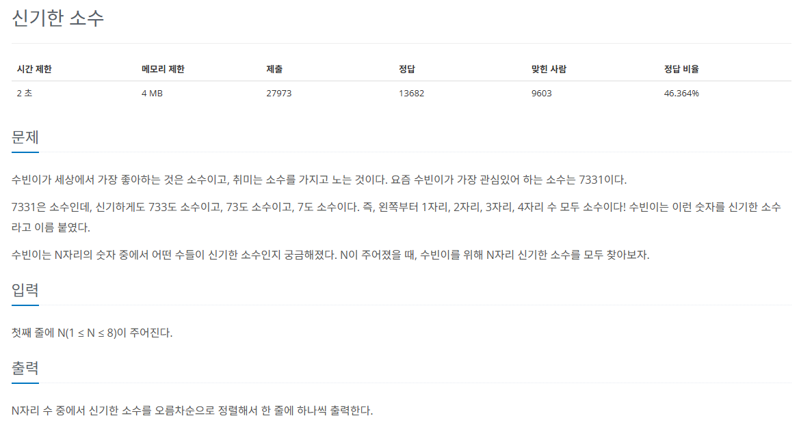

## 문제
   
[백준 온라인 저지 2023번](https://www.acmicpc.net/problem/2023)

### 1. 문제 분석하기
* `재귀 함수`를 이용한 DFS

### 2. 과정
* `소수`는 약수가 1과 자기 자신인 약수

#### 1) 자릿수가 한 개인 소수는 2, 3, 5, 7
* 4, 6, 8, 9를 제외한 `가지치기` 방식을 적용한 것

#### 2) 자릿수가 두 개인 현재 수 * 10 + a 계산
* 소수라면 `재귀 함수`로 자릿수를 하나 늘림
* a가 짝수인 경우는 항상 2를 약수로 가지므로 제외해야 함.

#### 3) 소수 판단
* 보통은 `에라토스테네스의 체`를 활용하여 소수 판단함. 여기서는 함수 사용해도 시간안에 가능
* 2,3,5,7부터 탐색 시작해서 뒷자리에 1,3,5,7,9를 N자리까지 붙여가며 소수인지 판단
* 짝수 가지치기
* 소수가 아니면 멈추는 가지치기

### 3. 결과과
```
N = int(input())

#  num을 2부터 num // 2 + 1까지 나누어보며, 그 중 하나라도 나누어떨어지면 False를 반환
# 이 부분에서 num // 2 + 1을 사용하는 이유는 소수 판별 범위를 num의 절반까지만 검사하면 되기 때문입니다. 
# 예를 들어, num = 10일 경우 2부터 5까지 나누어보면 됩니다. 더 큰 수는 이미 작은 수들의 곱으로 나타나기 때문에 검사할 필요가 없습니다.
def isPrime(num):
    for i in range(2, int(num / 2 + 1)): # range를 고려해서 1을 더한 거임
        if num % i == 0:
            return False
    return True

def DFS(number):
    # 현재 number의 자릿수가 N이 되면, 즉 N자리 신기한 소수를 찾으면 그 숫자를 출력
    if len(str(number)) == N:
        print(number)
    else:
        for i in range(1, 10):
            if i % 2 == 0: # 짝수라면 더는 탐색 불필요
                continue
            if isPrime(number * 10 + i) : # 소수이면 자릿수 늘림
                DFS(number * 10 + i)

# 일의 자리 소수 2,3,5,7이므로 4가지 수에서만 시작
DFS(2)
DFS(3)
DFS(5)
DFS(7)
```